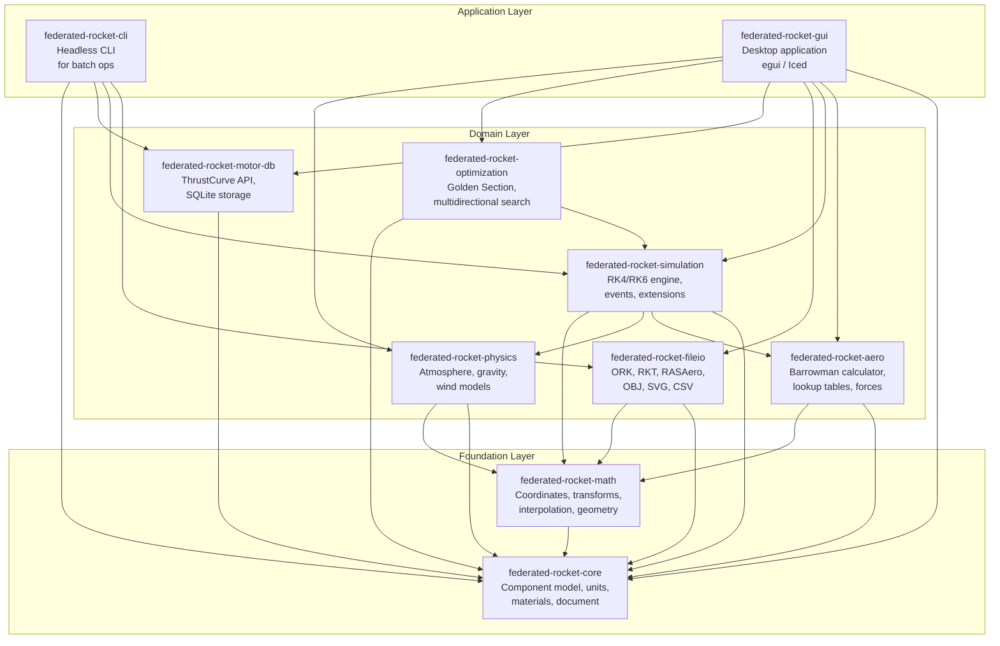

# Agile Implementation Plan — federated-rocket

| **Document Version** | 1.0 |
|---|---|
| **Date** | 2026-05-25 |
| **Status** | Draft |
| **Project** | federated-rocket — Rust port of OpenRocket |

---

| Revision | Date | Description | Author |
|---|---|---|---|
| 1.0 | 2026-05-25 | Initial Agile Implementation Plan | Abhishek Kumar |

---

## Table of Contents

1. [Overview](#1-overview)
   - 1.1 [Project Vision](#11-project-vision)
   - 1.2 [Development Methodology](#12-development-methodology)
   - 1.3 [Team Roles](#13-team-roles)
   - 1.4 [Definition of Done](#14-definition-of-done)
2. [Release Roadmap](#2-release-roadmap)
   - 2.1 [Release 1: Core Foundations (Alpha 1)](#21-release-1-core-foundations-alpha-1)
   - 2.2 [Release 2: Simulation Engine (Alpha 2)](#22-release-2-simulation-engine-alpha-2)
   - 2.3 [Release 3: Design Tools (Beta 1)](#23-release-3-design-tools-beta-1)
   - 2.4 [Release 4: Complete Application (GA)](#24-release-4-complete-application-ga)
   - 2.5 [Gantt Chart](#25-gantt-chart)
3. [Detailed Sprint Plans](#3-detailed-sprint-plans)
   - 3.1 [Release 1: Core Foundations — Sprints 1–6](#31-release-1-core-foundations--sprints-16)
   - 3.2 [Release 2: Simulation Engine — Sprints 7–12](#32-release-2-simulation-engine--sprints-712)
   - 3.3 [Release 3: Design Tools — Sprints 13–20](#33-release-3-design-tools--sprints-1320)
   - 3.4 [Release 4: Complete Application — Sprints 21–28](#34-release-4-complete-application--sprints-2128)
4. [Dependency Management](#4-dependency-management)
   - 4.1 [External Crate Dependencies](#41-external-crate-dependencies)
   - 4.2 [Feature Flag Strategy](#42-feature-flag-strategy)
   - 4.3 [MSRV Policy](#43-msrv-policy)
5. [Quality Assurance](#5-quality-assurance)
   - 5.1 [Code Review Requirements](#51-code-review-requirements)
   - 5.2 [Continuous Integration Pipeline](#52-continuous-integration-pipeline)
   - 5.3 [Test Coverage Targets](#53-test-coverage-targets)
   - 5.4 [Benchmark Regression Testing](#54-benchmark-regression-testing)
   - 5.5 [Validation Against OpenRocket Java Results](#55-validation-against-openrocket-java-results)
6. [Risk Mitigation](#6-risk-mitigation)
7. [Success Criteria](#7-success-criteria)

---

## 1. Overview

### 1.1 Project Vision

**federated-rocket** is a clean-slate Rust port of [OpenRocket](https://github.com/openrocket/openrocket), the leading open-source model rocket simulator. The project aims to deliver a **feature-complete replacement** that preserves OpenRocket's domain accuracy while leveraging Rust's memory safety, performance, and modern tooling.

The project name reflects the **federated crate architecture** — 8 library crates + 2 application crates that each own a distinct domain concern, communicating through well-defined public APIs.

The four architectural layers and their crate membership:



### 1.2 Development Methodology

The project follows **Scrum** with **2-week sprints**. Key practices:

| Practice | Implementation |
|---|---|
| **Sprint length** | 2 weeks (10 working days) |
| **Ceremonies** | Sprint Planning (2h), Daily Standup (15min), Sprint Review (1h), Retrospective (1h) |
| **Backlog** | Maintained as GitHub Issues with labels (epic, sprint-N, component) |
| **Estimation** | Story points using Fibonacci sequence (1, 2, 3, 5, 8, 13) |
| **Velocity tracking** | Running average over last 3 sprints |
| **Definition of Ready** | Acceptance criteria written, dependencies resolved, test plan drafted |
| **Branch strategy** | `main` (protected) ← `develop` (integration) ← `feature/*` (individual work) |

**Total estimated timeline: ~14 months / 28 sprints**

### 1.3 Team Roles

For a small core team of 2-4 developers, roles are assigned as follows:

| Role | Responsibilities | Allocation |
|---|---|---|
| **Tech Lead / Architect** | Crate architecture decisions, code review, CI/CD, sprint planning, OpenRocket Java cross-referencing | 1 person (100%) |
| **Simulation Engineer** | Math library, physics models, aerodynamics, simulation engine, optimization | 1 person (100%) |
| **Systems Engineer** | Component model, file I/O, motor database, CLI, plugin system | 1 person (100%) |
| **GUI Engineer** | egui application, 3D visualization, plotting, i18n, theming, packaging | 1 person (100%, starts Sprint 14) |

**Sprint 1–13**: 3 developers (Tech Lead + Simulation + Systems)
**Sprint 14–28**: 4 developers (+ GUI Engineer)

### 1.4 Definition of Done

Every sprint deliverable **MUST** satisfy all of the following criteria before it is considered complete:

| Criterion | Description |
|---|---|
| **Code complete** | All planned features implemented and merged to `develop` |
| **Unit tests pass** | `cargo test --workspace` passes with zero failures |
| **No regressions** | Existing tests still pass; no new clippy warnings |
| **Documentation** | Public API items have doc comments; crate-level docs updated |
| **Code review** | Every PR reviewed by at least one other team member |
| **Integration tested** | Crate-integration tests exercise the new functionality |
| **CI green** | GitHub Actions CI pipeline passes (build, test, lint, benchmark regressions) |

---

## 2. Release Roadmap

### 2.1 Release 1: Core Foundations (Alpha 1)

**Goal**: Working component model, unit system, motor database, file I/O (.ork import), and a CLI to load/inspect rockets.

| Deliverable | Sprints | FRs Covered | Crates |
|---|---|---|---|
| Project scaffolding, CI/CD | Sprint 1 | — | Workspace |
| Unit system + material system | Sprint 1–2 | FR-2, FR-3 | core |
| Component model (all 20+ types) | Sprint 2–5 | FR-1 | core |
| File I/O (.ork import/export) | Sprint 6 | FR-6.1, FR-6.2 | fileio |
| Motor database | Sprint 6 | FR-7 | motor-db |
| CLI info command | Sprint 6 | — | cli |

**Estimated**: 3 months / 6 sprints
**FR Coverage**: FR-1, FR-2, FR-3, FR-6.1, FR-6.2, FR-7

### 2.2 Release 2: Simulation Engine (Alpha 2)

**Goal**: Full 6-DOF simulation with Barrowman aerodynamics, physical models, event system, and CLI simulation pipeline.

| Deliverable | Sprints | FRs Covered | Crates |
|---|---|---|---|
| Math library (vectors, transforms, interpolation, integrators) | Sprint 7 | — | math |
| Physical models (atmosphere, gravity, wind) | Sprint 8 | FR-4 | physics |
| Barrowman aerodynamics | Sprint 9 | FR-5.1, FR-5.3 | aero |
| Simulation engine core (RK4/RK6, loop) | Sprint 10 | FR-8.1 | simulation |
| Event system, listeners, flight data | Sprint 11 | FR-8.2, FR-8.3, FR-8.6 | simulation |
| Motor integration + CLI simulate | Sprint 12 | FR-7.3, FR-8.7 | motor-db, cli |

**Estimated**: 3 months / 6 sprints
**FR Coverage**: FR-4, FR-5.1, FR-5.3, FR-7.3, FR-8.1, FR-8.2, FR-8.3, FR-8.6, FR-8.7

### 2.3 Release 3: Design Tools (Beta 1)

**Goal**: Optimization, advanced aerodynamics, remaining file formats, basic GUI with design workspace.

| Deliverable | Sprints | FRs Covered | Crates |
|---|---|---|---|
| Advanced aerodynamics (supersonic lookup, fin flutter) | Sprint 13 | FR-5.2, FR-5.4, FR-5.5 | aero |
| Optimization framework | Sprint 14 | FR-9 | optimization |
| Remaining file formats (RockSim, RASAero, OBJ, SVG) | Sprint 15 | FR-6.3, FR-6.4, FR-6.5, FR-6.6 | fileio |
| GUI boilerplate, component tree, 2D rendering | Sprint 16–17 | FR-11.1, FR-11.2 | gui |
| Component configuration panels | Sprint 18 | FR-11.4 | gui |
| Motor selection + flight configuration UI | Sprint 19 | FR-11.7 | gui |
| Simulation panel in GUI | Sprint 20 | FR-11.5 | gui |

**Estimated**: 4 months / 8 sprints
**FR Coverage**: FR-5.2, FR-5.4, FR-5.5, FR-6.3, FR-6.4, FR-6.5, FR-6.6, FR-9, FR-11.1, FR-11.2, FR-11.4, FR-11.5, FR-11.7

### 2.4 Release 4: Complete Application (GA)

**Goal**: Full GUI with 3D visualization, plotting, printing, plugin system, scripting, production polish.

| Deliverable | Sprints | FRs Covered | Crates |
|---|---|---|---|
| Simulation plotting | Sprint 21 | FR-11.6 | gui |
| 3D visualization | Sprint 22 | FR-11.3 | gui |
| Optimization UI | Sprint 23 | FR-9 | gui |
| Plugin system + scripting | Sprint 24 | FR-10 | gui, core |
| PDF printing | Sprint 25 | FR-11.9 | fileio |
| i18n + theming | Sprint 26 | FR-11.10 | gui |
| Polish + performance | Sprint 27 | NFR-1, NFR-2 | all |
| Testing, packaging, release | Sprint 28 | NFR-3, NFR-6 | all |

**Estimated**: 4 months / 8 sprints
**FR Coverage**: FR-10, FR-11.3, FR-11.6, FR-11.9, FR-11.10, FR-11.11 + all NFRs

### 2.5 Gantt Chart

```mermaid
gantt
    title federated-rocket Release Roadmap (28 Sprints / ~14 Months)
    dateFormat  YYYY-MM-DD
    axisFormat  %b Sprint %s

    section Release 1: Core Foundations (Alpha 1)
    Sprint 1: Project Scaffolding & Core Types    :r1s1, 2026-06-01, 14d
    Sprint 2: Materials & Basic Component Model   :r1s2, after r1s1, 14d
    Sprint 3: Body Components                     :r1s3, after r1s2, 14d
    Sprint 4: Fin Sets & External Components      :r1s4, after r1s3, 14d
    Sprint 5: Internal Components & Recovery      :r1s5, after r1s4, 14d
    Sprint 6: File I/O & Motor Database           :r1s6, after r1s5, 14d

    section Release 2: Simulation Engine (Alpha 2)
    Sprint 7: Math Library & Coordinate Systems   :r2s1, after r1s6, 14d
    Sprint 8: Physical Models                     :r2s2, after r2s1, 14d
    Sprint 9: Barrowman Aerodynamics              :r2s3, after r2s2, 14d
    Sprint 10: Simulation Engine Core             :r2s4, after r2s3, 14d
    Sprint 11: Events & Listeners                 :r2s5, after r2s4, 14d
    Sprint 12: Motor Integration & CLI Sim        :r2s6, after r2s5, 14d

    section Release 3: Design Tools (Beta 1)
    Sprint 13: Advanced Aerodynamics              :r3s1, after r2s6, 14d
    Sprint 14: Optimization Framework             :r3s2, after r3s1, 14d
    Sprint 15: Remaining File Formats             :r3s3, after r3s2, 14d
    Sprint 16: GUI Boilerplate & Workspace        :r3s4, after r3s3, 14d
    Sprint 17: 2D Rocket Rendering                :r3s5, after r3s4, 14d
    Sprint 18: Component Config Panels            :r3s6, after r3s5, 14d
    Sprint 19: Motor Selection & Flight Config    :r3s7, after r3s6, 14d
    Sprint 20: GUI Simulation Panel               :r3s8, after r3s7, 14d

    section Release 4: Complete Application (GA)
    Sprint 21: Simulation Plotting                :r4s1, after r3s8, 14d
    Sprint 22: 3D Visualization                   :r4s2, after r4s1, 14d
    Sprint 23: Optimization UI                    :r4s3, after r4s2, 14d
    Sprint 24: Plugin System & Scripting          :r4s4, after r4s3, 14d
    Sprint 25: PDF Printing                       :r4s5, after r4s4, 14d
    Sprint 26: i18n & Theming                     :r4s6, after r4s5, 14d
    Sprint 27: Polish & Performance               :r4s7, after r4s6, 14d
    Sprint 28: Testing, Packaging & Release       :r4s8, after r4s7, 14d
```

---

## 3. Detailed Sprint Plans

### 3.1 Release 1: Core Foundations — Sprints 1–6

---

#### Sprint 1: Project Scaffolding & Core Types

| Attribute | Detail |
|---|---|
| **Goal** | Initialize the Rust workspace with Cargo, set up CI/CD pipeline, implement the unit system foundation |
| **FR Coverage** | FR-2 (Unit System) |
| **Crates** | Workspace root, `federated-rocket-core` |

**Key Tasks:**

1. **Create Cargo workspace** at repo root [`federated-rocket/Cargo.toml`]
   - Define workspace members: `core`, `math`, `physics`, `aero`, `simulation`, `fileio`, `motor-db`, `optimization`, `cli`, `gui`
   - Set `edition = 2024`, `resolver = "2"`
   - Configure workspace-level `[workspace.dependencies]` for shared dependencies

2. **Create `federated-rocket-core` crate** at [`core/Cargo.toml`](federated-rocket/docs/sdd.md:337)
   - Add `thiserror`, `serde`, `serde_json`, `slotmap`, `uuid` dependencies
   - Create `core/src/lib.rs` with re-exports
   - Create module directories: `units/`, `material/`, `component/`, `flight_config/`, `document/`

3. **Implement unit types** in [`core/src/units/types.rs`](federated-rocket/docs/sdd.md:340)
   - `UnitType` enum: `Length`, `Mass`, `Angle`, `Temperature`, `Pressure`, `Velocity`, `Acceleration`, `Force`, `Density`, `Frequency`, `Impulse`
   - `Unit` enum with all supported units for each type
   - `UnitGroup` with grouped units per type

4. **Implement unit conversion** in [`core/src/units/converter.rs`](federated-rocket/docs/sdd.md:341)
   - Conversion factors from SI to each display unit
   - Bidirectional conversion functions
   - `fn convert(value: f64, from: Unit, to: Unit) -> f64`

5. **Implement unit groups** in [`core/src/units/groups.rs`](federated-rocket/docs/sdd.md:342)
   - Predefined unit groups matching OpenRocket's `UnitGroup.java`
   - Default unit selections per measurement type

6. **Set up CI** at `.github/workflows/ci.yml`
   - Trigger: push to `main`, PRs to `main`
   - Jobs: `build` (stable, nightly), `test` (stable), `lint` (clippy), `fmt` (rustfmt)
   - Caching for `~/.cargo` and `target/`

7. **Configure toolchain** — `rust-toolchain.toml`, `rustfmt.toml`, `.clippy.toml`
   - `rustfmt.toml`: `max_width = 120`, `use_small_heuristics = "Max"`
   - `.clippy.toml`: deny warnings in CI

**Acceptance Criteria:**
- `cargo build --workspace` compiles successfully
- `cargo test --workspace -p federated-rocket-core` passes
- Length (m, cm, mm, in, ft) and Mass (kg, g, oz, lb) convert correctly
- CI pipeline runs on PR creation

**Testing Requirements:**
- Unit conversion correctness tests for each UnitType
- Round-trip tests: convert A→B→A and verify within 1e-12 tolerance
- Edge cases: zero values, negative values, large values
- Property-based tests with `proptest` for conversion invariants

---

#### Sprint 2: Material System & Basic Component Model

| Attribute | Detail |
|---|---|
| **Goal** | Implement the material system and the core component tree structure with assembly components |
| **FR Coverage** | FR-3 (Material System), FR-1.1 (Component Tree Hierarchy) |
| **Crates** | `federated-rocket-core` |

**Key Tasks:**

1. **Implement material types** in [`core/src/material/material.rs`](federated-rocket/docs/sdd.md:345)
   - `MaterialType` enum: `Bulk`, `Surface`, `Line`
   - `Material` struct: `name`, `material_type`, `density`, `group`
   - Implement `Material::mass_for_volume()`, `mass_for_area()`, `mass_for_length()`

2. **Implement material registry** in [`core/src/material/registry.rs`](federated-rocket/docs/sdd.md:346)
   - `MaterialRegistry` with predefined materials (woods, metals, plastics, fiberglass, paper, finishing)
   - Methods: `get_by_name()`, `list_by_type()`, `add_user_material()`, `remove_user_material()`
   - Load predefined materials from bundled data file

3. **Implement `RocketComponent` enum** in [`core/src/component/component.rs`](federated-rocket/docs/sdd.md:536-571)
   - Define the top-level `RocketComponent` enum with all 21 variants
   - Define variant data structs: `RocketData`, `AxialStageData`, `ParallelStageData`, `PodSetData`, `SleeveData`

4. **Implement `ComponentTree`** in [`core/src/component/rocket.rs`](federated-rocket/docs/sdd.md:686-727)
   - SlotMap-based tree structure with `ComponentId` keys
   - `fn new(rocket: RocketData) -> Self`
   - `fn get()`, `fn get_mut()`, `fn add_child()`, `fn remove()`, `fn parent_of()`, `fn children_of()`

5. **Implement tree navigation** — `fn root()`, iteration over children, depth-first traversal

6. **Implement `ComponentVisitor` trait** in [`core/src/component/visitor.rs`](federated-rocket/docs/sdd.md:421-438)
   - `trait ComponentVisitor` with `fn visit() -> VisitAction`
   - `VisitAction` enum: `Continue`, `SkipChildren`, `Stop`
   - `TraversalOrder` enum: `PreOrder`, `PostOrder`
   - `fn traverse()` on `ComponentTree`

7. **Implement positioning types** in [`core/src/component/position.rs`](federated-rocket/docs/sdd.md:493-522)
   - `AxialMethod` enum: `Absolute`, `After`, `Top`, `Middle`, `Bottom`
   - `RadiusMethod` enum: `Absolute`, `Relative`, `Surface`, `Outside`, `Midpoint`
   - `AngleMethod` enum: `Absolute`, `Relative`

**Acceptance Criteria:**
- Can create a Rocket with stages (boosters, sustainer)
- Traverse the tree with `ComponentVisitor` (both pre-order and post-order)
- 10+ predefined materials load successfully
- Material registry operations work (add, lookup, remove)

**Testing Requirements:**
- Tree construction from scratch (Rocket → 2 stages → children)
- Tree traversal correctness (count, order, depth)
- Visitor pattern: collect names, compute bounds, find by type
- Material density lookup matches known values (aluminum: 2700 kg/m³, oak: 750 kg/m³)

---

#### Sprint 3: Body Components

| Attribute | Detail |
|---|---|
| **Goal** | Implement symmetric body components: BodyTube, Transition, NoseCone with all shape types and positioning |
| **FR Coverage** | FR-1.2 (Component Types — NoseCone, BodyTube, Transition) |
| **Crates** | `federated-rocket-core` |

**Key Tasks:**

1. **Implement `TransitionShape` enum** in [`core/src/component/symmetric/mod.rs`](federated-rocket/docs/sdd.md:636-644)
   - Variants: `Conical`, `Ogive`, `Elliptical`, `Parabolic`, `PowerSeries`, `HaackSeries`

2. **Implement `BodyTube` variant** — `BodyTubeData` struct with length, outer_radius, inner_radius, thickness, material
   - Add `BodyTube(BodyTubeData)` to `RocketComponent` enum

3. **Implement `Transition` variant** — `TransitionData` struct with fore_radius, aft_radius, length, shape, thickness
   - Shape parameter for PowerSeries/HaackSeries
   - Add `Transition(TransitionData)` to `RocketComponent` enum

4. **Implement `NoseCone` variant** — `NoseConeData` struct in [`core/src/component/symmetric/mod.rs`](federated-rocket/docs/sdd.md:578-631)
   - Full field set: shape, shape_parameter, is_flipped, aft_radius, fore_radius
   - Aft shoulder: enabled, length, thickness, radius
   - Inside color support
   - Add `NoseCone(NoseConeData)` to `RocketComponent` enum

5. **Implement positioning traits** in [`core/src/component/component.rs`](federated-rocket/docs/sdd.md:442-469)
   - `AxialPositionable` trait: get/set axial method and offset
   - `RadialPositionable` trait: get/set radial method and offset
   - `AnglePositionable` trait: get/set angle method and offset
   - Implement for all body component variants via match arms

6. **Implement `RocketComponent` trait for all body variants**
   - `fn length()`, `fn outer_radius()`, `fn inner_radius()`, `fn mass()`
   - `fn is_aerodynamic()`, `fn is_motor_mount()`

7. **Implement component bounds calculation**
   - `fn component_bounds(component: &RocketComponent) -> BoundingBox`
   - Absolute position computation from relative positioning

**Acceptance Criteria:**
- Can create body tubes, nose cones (all 6 shapes), and transitions
- Positioning works (ABSOLUTE, AFTER, TOP, MIDDLE, BOTTOM)
- Bounds calculation returns correct dimensions
- Nose cone with aft shoulder computes shoulder geometry correctly

**Testing Requirements:**
- Create all 6 nose cone shapes, verify length and radius properties
- Position a nose cone AFTER a body tube, verify absolute position
- Bounds calculation for nested components
- Aft shoulder geometry: enabled/disabled, length, thickness

---

#### Sprint 4: Fin Sets & External Components

| Attribute | Detail |
|---|---|
| **Goal** | Implement all four fin set types and external components (launch lugs, rail buttons) |
| **FR Coverage** | FR-1.2 (FinSet, LaunchLug, RailButton) |
| **Crates** | `federated-rocket-core` |

**Key Tasks:**

1. **Implement `FinSetBase` shared struct** in [`core/src/component/external/mod.rs`](federated-rocket/docs/sdd.md:652-671)
   - `fin_count`, `root_chord`, `tip_chord`, `sweep_angle`, `span`, `thickness`, `cant_angle`
   - `cross_section`: `FinCrossSection` enum (Square, Rounded, Airfoil)
   - `first_fin_offset`, `angle_method`

2. **Implement `TrapezoidFinSet` variant** — `TrapezoidFinSetData { base: FinSetBase }`
   - Add to `RocketComponent` enum

3. **Implement `EllipticalFinSet` variant** — `EllipticalFinSetData { base: FinSetBase }`
   - Add to `RocketComponent` enum

4. **Implement `FreeformFinSet` variant** — `FreeformFinSetData { base: FinSetBase, points: Vec<Point2d> }`
   - Add to `RocketComponent` enum

5. **Implement `TubeFinSet` variant** — `TubeFinSetData { fin_count, tube_length, tube_outer_radius, tube_thickness, cant_angle, radial_pattern }`
   - Add to `RocketComponent` enum

6. **Implement fin geometry calculations**
   - `fn planform_area(fin: &FinSetBase) -> f64`
   - `fn mean_aerodynamic_chord(fin: &FinSetBase) -> f64`
   - `fn aspect_ratio(fin: &FinSetBase) -> f64`
   - `fn fin_span_area(fin: &FinSetBase) -> f64`

7. **Implement `ExternalComponent` subtype**
   - `LaunchLug(LaunchLugData)`: outer_radius, inner_radius, length
   - `RailButton(RailButtonData)`: outer_radius, inner_radius, length, height
   - Add both to `RocketComponent` enum

**Acceptance Criteria:**
- All four fin set types can be created and queried for geometry
- Launch lugs and rail buttons can be created
- Fin geometry calculations (area, span, MAC) match known values

**Testing Requirements:**
- Fin area calculation for trapezoid fins (verify against Java OpenRocket)
- Fin set geometry: root chord, tip chord, span, sweep angle
- Launch lug / rail button dimensions
- Edge cases: 3-fin vs 4-fin configurations, zero-thickness fins

---

#### Sprint 5: Internal Components & Recovery

| Attribute | Detail |
|---|---|
| **Goal** | Implement all remaining component types: internal components, mass components, recovery devices |
| **FR Coverage** | FR-1.2 (all remaining component types) |
| **Crates** | `federated-rocket-core` |

**Key Tasks:**

1. **Implement internal components** in [`core/src/component/internal/mod.rs`](federated-rocket/docs/sdd.md:347-365)
   - `InnerTube(InnerTubeData)`: length, outer_radius, inner_radius (also implements `MotorMount`)
   - `CenteringRing(CenteringRingData)`: outer_radius, inner_radius, length, thickness (implements `RingComponent`)
   - `Bulkhead(BulkheadData)`: outer_radius, thickness (implements `RingComponent`)
   - `EngineBlock(EngineBlockData)`: outer_radius, inner_radius, length (implements `RingComponent`)
   - `TubeCoupler(TubeCouplerData)`: length, outer_radius, inner_radius (implements `RingComponent`)
   - Add all to `RocketComponent` enum

2. **Implement mass components**
   - `MassComponent(MassComponentData)`: mass, radius (implements `StructuralComponent`)
   - `MassObject(MassObjectData)`: mass, radius, length, shape (cylindrical, parabolic, custom)

3. **Implement `ShockCord`** — `ShockCordData`: length, mass, thickness

4. **Implement recovery devices** in [`core/src/component/recovery/mod.rs`](federated-rocket/docs/sdd.md:347)
   - `Parachute(ParachuteData)`: diameter, drag_coefficient, deployment_altitude, spill_hole_diameter
   - `Streamer(StreamerData)`: length, width, drag_coefficient, deployment_altitude
   - Add both to `RocketComponent` enum

5. **Implement `Configurable` trait** in [`core/src/component/component.rs`](federated-rocket/docs/sdd.md:471-489)
   - Flight-configuration-dependent overrides: `override_cd`, `override_mass`, `override_cg`
   - Implement for applicable component types

6. **Implement `RocketComponent` trait for all new variants**
   - Match arms in each trait method covering all 21+ enum variants

7. **Implement serialization round-trip** — `Serialize` + `Deserialize` derive for all data structs

**Acceptance Criteria:**
- All 20+ component types from FR-1.2 are implemented
- Components can be added to the tree, queried, and removed
- Serialization round-trip: serialize to JSON → deserialize → compare

**Testing Requirements:**
- Create each component type, verify all fields
- Component tree with all types mixed (body + internal + recovery)
- Structural vs non-structural component classification
- Motor mount identification (InnerTube, BodyTube)

---

#### Sprint 6: File I/O — .ork Import & Motor Database

| Attribute | Detail |
|---|---|
| **Goal** | Create fileio and motor-db crates, implement .ork import/export, motor database with SQLite, basic CLI |
| **FR Coverage** | FR-6.1, FR-6.2, FR-7.1, FR-7.2, FR-7.4 |
| **Crates** | `federated-rocket-fileio`, `federated-rocket-motor-db`, `federated-rocket-cli` |

**Key Tasks:**

1. **Create `federated-rocket-fileio` crate**
   - Module structure per SDD section 8.2
   - Dependencies: `zip`, `quick-xml`, `serde`, `csv`, `core`

2. **Implement .ork import** in [`fileio/src/openrocket/import.rs`](federated-rocket/docs/sdd.md:1976-2001)
   - ZIP container reader using `zip` crate
   - XML streaming parser using `quick-xml`
   - `OpenRocketLoader` struct with context stack

3. **Implement handler registry** in [`fileio/src/openrocket/handler/mod.rs`](federated-rocket/docs/sdd.md:2016-2049)
   - `ComponentHandler` trait: `open()`, `text()`, `close()`, `element_name()`
   - `HandlerRegistry` with all 30+ component handlers
   - One handler file per component type (nosecone.rs, body_tube.rs, etc.)

4. **Implement .ork export** in [`fileio/src/openrocket/export.rs`](federated-rocket/docs/sdd.md:1936-1955)
   - Component saver pattern — one saver per component type
   - ZIP output with XML entry
   - XML element ordering matching Java output

5. **Create `federated-rocket-motor-db` crate**
   - Module structure per SDD section 9.2
   - Dependencies: `rusqlite`, `reqwest`, `serde`, `csv`, `core`

6. **Implement motor types** in [`motor-db/src/motor.rs` and `thrust_curve.rs`](federated-rocket/docs/sdd.md:2179-2233)
   - `ThrustCurve`: time_points, thrust_points, interpolation, total_impulse, burn_time, peak_thrust
   - `Motor`: motor_id, manufacturer, designation, motor_type, diameter, length, delays, thrust_curve
   - `Manufacturer`: id, name, abbreviation
   - `MotorType`: Single, Reload, Hybrid, Unknown
   - `MotorSet`: grouping of related motors

7. **Implement SQLite database** in [`motor-db/src/database.rs`](federated-rocket/docs/sdd.md:2131-2175)
   - Schema: `motors`, `thrust_curves`, `manufacturers` tables
   - FTS5 full-text search index
   - CRUD operations: `add_motor()`, `get_motor()`, `search_motors()`, `delete_motor()`

8. **Create `federated-rocket-cli` crate**
   - Dependencies: `clap`, `fileio`, `motor-db`, `core`
   - CLI command hierarchy per SDD section 11.2
   - Implement `info` command: load .ork, print rocket summary

**Acceptance Criteria:**
- Can import a real .ork file from OpenRocket test suite
- Can export a .ork file that OpenRocket can re-import
- Motor database initializes with SQLite, motors are queryable
- CLI `info` command prints rocket name, component count, dimensions

**Testing Requirements:**
- Golden file tests: load .ork → verify component tree matches reference
- Round-trip: load → save → load, compare component trees
- Motor database: add motor, search by manufacturer, search by designation
- CLI `info` output matches expected format
- Edge cases: empty rocket, missing fields in XML, unsupported components (log warnings)

---

### 3.2 Release 2: Simulation Engine — Sprints 7–12

---

#### Sprint 7: Math Library & Coordinate Systems

| Attribute | Detail |
|---|---|
| **Goal** | Create the math crate with vector algebra, coordinate transforms, interpolation, and integrator templates |
| **FR Coverage** | Supporting FR-4, FR-5, FR-8 |
| **Crates** | `federated-rocket-math` |

**Key Tasks:**

1. **Create `federated-rocket-math` crate**
   - Module structure per SDD section 4.2
   - Dependencies: minimal (only `serde` for serialization)

2. **Implement `Vector3d`** in [`math/src/vector.rs`](federated-rocket/docs/sdd.md:851-878)
   - Fields: x, y, z (f64)
   - Operations: add, sub, mul (scalar), dot, cross, norm, normalize, rotate
   - Constants: ZERO, X_AXIS, Y_AXIS, Z_AXIS

3. **Implement `Matrix3d`** — 3x3 rotation matrix
   - Identity, from_axis_angle, from_euler
   - Multiplication, transpose, inverse, transform(vector)

4. **Implement `Quaternion`** — for 6-DOF orientation representation
   - From axis-angle, from euler angles, multiplication, inverse
   - Rotate vector, to rotation matrix
   - Addition and scalar multiplication (for RK integration)

5. **Implement `Transformation`** in [`math/src/coordinate.rs`](federated-rocket/docs/sdd.md:886-906)
   - Combines rotation + translation
   - Identity, translate, rotate_x/y/z, transform, inverse, then

6. **Implement coordinate frames** — body frame, world frame (NED: North-East-Down or ENU: East-North-Up)
   - Conversion functions between frames

7. **Implement interpolation** in [`math/src/interpolation.rs`](federated-rocket/docs/sdd.md:952-963)
   - Linear interpolation trait: `fn interpolate(x: f64, x0: f64, y0: f64, x1: f64, y1: f64) -> f64`
   - `LinearInterpolator` struct for table lookup
   - `CubicHermiteInterpolator` for thrust curves (C1 continuity)

8. **Implement pink noise generator** in [`math/src/pink_noise.rs`](federated-rocket/docs/sdd.md:968-986)
   - Voss-McCartney algorithm
   - Configurable octaves and sample rate

9. **Implement RK4/RK6 integration templates** in [`math/src/integrator.rs`](federated-rocket/docs/sdd.md:911-947)
   - `System<State>` trait: `fn derivatives(&self, state: &State, time: f64) -> State`
   - `fn rk4_step<State, S: System<State>>(...)` — generic over state type
   - `fn rk6_step<State, S: System<State>>(...)` — with Butcher tableau
   - State must implement `Clone + Add<Output=State> + Mul<f64, Output=State>`

**Acceptance Criteria:**
- Vector dot/cross products match analytical results
- Quaternion rotates vectors correctly
- Coordinate transforms round-trip (forward → inverse → identity)
- RK4 integration of simple ODE (dv/dt = -g) matches analytic solution within 0.1%
- Linear interpolation on a table works correctly

**Testing Requirements:**
- Vector arithmetic: addition, dot product, cross product, normalization
- Quaternion: identity rotation, axis-angle, composition, inverse
- RK4: integrate free-fall (constant acceleration), compare with `y = 0.5 * g * t^2`
- RK6: same test, verify higher-order accuracy
- Property-based tests: rotation inverse, unit quaternion norm

---

#### Sprint 8: Physical Models

| Attribute | Detail |
|---|---|
| **Goal** | Create the physics crate with atmosphere, gravity, and wind models |
| **FR Coverage** | FR-4 (Physical Models) |
| **Crates** | `federated-rocket-physics` |

**Key Tasks:**

1. **Create `federated-rocket-physics` crate**
   - Module structure per SDD section 5.2
   - Dependencies: `core`, `math`

2. **Implement `AtmosphericModel` trait** in [`physics/src/atmosphere/model.rs`](federated-rocket/docs/sdd.md:1034-1048)
   - Methods: `get_temperature()`, `get_pressure()`, `get_density()`, `get_speed_of_sound()`
   - Trait bounds: `Debug + Send + Sync`

3. **Implement `ExtendedISAModel`** in [`physics/src/atmosphere/isa.rs`](federated-rocket/docs/sdd.md:1073-1105)
   - 7-layer atmosphere: troposphere, tropopause, stratosphere (2 layers), mesosphere (2 layers), thermosphere
   - Temperature: piecewise linear with standard lapse rates
   - Pressure: hydrostatic equation integration per layer
   - Density: ideal gas law P = ρ × R_specific × T
   - Speed of sound: a = √(γ × R × T)

4. **Implement `InterpolatingAtmosphericModel`** in [`physics/src/atmosphere/interpolating.rs`](federated-rocket/docs/sdd.md:1016)
   - User-provided altitude/temperature/pressure table
   - Linear interpolation between table entries

5. **Implement `AtmosphericConditions`** in [`physics/src/atmosphere/conditions.rs`](federated-rocket/docs/sdd.md:1051-1068)
   - Convenience struct bundling temperature, pressure, density, speed of sound
   - Constructor from `AtmosphericModel` + altitude

6. **Implement `GravityModel` trait** in [`physics/src/gravity/model.rs`](federated-rocket/docs/sdd.md:1111-1113)
   - `fn get_gravity_acceleration(altitude_msl, latitude) -> f64`

7. **Implement `ConstantGravityModel`** in [`physics/src/gravity/constant.rs`](federated-rocket/docs/sdd.md:1118-1124)
   - Fixed: 9.80665 m/s² downward

8. **Implement `WGSGravityModel`** in [`physics/src/gravity/wgs84.rs`](federated-rocket/docs/sdd.md:1128-1146)
   - Somigliana formula for latitude-dependent gravity
   - Free-air correction for altitude

9. **Implement `WindModel` trait** in [`physics/src/wind/model.rs`](federated-rocket/docs/sdd.md:1153-1155)
   - `fn get_wind_velocity(time, altitude_msl, altitude_agl) -> Vector3d`
   - Returns 3D wind vector

10. **Implement `PinkNoiseWindModel`** in [`physics/src/wind/pink_noise.rs`](federated-rocket/docs/sdd.md:1158-1191)
    - Average speed, turbulence intensity, direction
    - Altitude scaling via power law profile
    - Pink noise turbulence overlay

**Acceptance Criteria:**
- ISA model: sea level temperature = 288.15K, pressure = 101325 Pa, density = 1.225 kg/m³
- ISA tropopause (11 km): temperature = 216.65K
- Constant gravity returns 9.80665 m/s²
- WGS84: equatorial gravity ≈ 9.7803 m/s², polar ≈ 9.8322 m/s²
- Wind model generates varying velocity over time

**Testing Requirements:**
- ISA table validation: compare against published values at 0, 11, 20, 32, 47 km
- Gravity: WGS84 at equator vs pole, free-air correction
- Wind: pink noise statistical properties (mean ≈ configured average)
- Property-based tests: altitude ranges, latitude bounds

---

#### Sprint 9: Aerodynamics — Barrowman Method

| Attribute | Detail |
|---|---|
| **Goal** | Create the aero crate with full Barrowman method implementation for CP and CD calculation |
| **FR Coverage** | FR-5.1, FR-5.3, FR-5.5 |
| **Crates** | `federated-rocket-aero` |

**Key Tasks:**

1. **Create `federated-rocket-aero` crate**
   - Module structure per SDD section 6.2
   - Dependencies: `core`, `math`

2. **Implement `BarrowmanCalculator`** orchestrator in [`aero/src/barrowman/calculator.rs`](federated-rocket/docs/sdd.md:1208)
   - `fn get_cp(config, conditions) -> AerodynamicResult`
   - `fn get_cd(config, conditions) -> AerodynamicResult`
   - Iterates over active component instances, delegates to per-component calculators

3. **Implement nose cone CP/CD** in [`aero/src/barrowman/nosecone.rs`](federated-rocket/docs/sdd.md:1285-1304)
   - CP position as fraction of length for each shape type
   - CNa = 2.0 (per radian) × shape factor
   - Pressure drag coefficient based on shape and fineness ratio

4. **Implement body tube drag** in [`aero/src/barrowman/body.rs`](federated-rocket/docs/sdd.md:1209)
   - Skin friction drag: laminar (Blasius) and turbulent (Schlichting) per [`aero/src/barrowman/drag.rs`](federated-rocket/docs/sdd.md:1327-1356)
   - Base drag: Mach-dependent formula
   - Wetted area calculation

5. **Implement fin set CP and CD** in [`aero/src/barrowman/fin.rs`](federated-rocket/docs/sdd.md:1253-1279)
   - CNa formula: 4n × (s/d)² / (1 + √(1 + (2s/CR)²))
   - Interference factor: 1 + r/(s+r)
   - CP at quarter-chord of mean aerodynamic chord
   - Profile drag based on fin cross-section and thickness ratio

6. **Implement transition CP/CD** in [`aero/src/barrowman/transition.rs`](federated-rocket/docs/sdd.md:1213)
   - CNa = 2.0 × (r₂² - r₁²) / r_ref²
   - CP at centroid of projected area

7. **Implement fin-body interference** in [`aero/src/barrowman/interference.rs`](federated-rocket/docs/sdd.md:1215)

8. **Implement total drag breakdown** in [`aero/src/barrowman/drag.rs`](federated-rocket/docs/sdd.md:1307-1356)
   - CD_total = CD_pressure + CD_base + CD_friction + CD_interference + CD_override
   - Reynolds number calculation

9. **Implement `AerodynamicResult`** in [`aero/src/results.rs`](federated-rocket/docs/sdd.md:1426-1463)
   - CP position, CNa, drag components, moments

10. **Implement stability calculation** in [`aero/src/stability.rs`](federated-rocket/docs/sdd.md:1219)
    - Static margin = (CP - CG) / reference_diameter (in calibers)
    - Recommended: 1.0–2.0 calibers

**Acceptance Criteria:**
- CP for a simple 3FNC rocket (nose cone + body tube + 4 fins) matches Java OpenRocket within 0.5%
- CD at subsonic speeds matches Java within 0.5%
- Static margin computed correctly
- Individual drag contributions sum to total

**Testing Requirements:**
- Compare CP position against Java OpenRocket for 3+ known rocket designs
- Compare CD vs Mach curve against Java for subsonic regime (Mach 0–0.8)
- Fin set CNa: verify against hand calculation for standard 4-fin configuration
- Nose cone CP: verify each shape type (conical: 0.466, ogive: 0.534, elliptical: 0.500)

---

#### Sprint 10: Simulation Engine Core

| Attribute | Detail |
|---|---|
| **Goal** | Create the simulation crate with FlightState, RK4/RK6 steppers, simulation loop, and basic force aggregation |
| **FR Coverage** | FR-8.1 (6-DOF Flight Simulation) |
| **Crates** | `federated-rocket-simulation` |

**Key Tasks:**

1. **Create `federated-rocket-simulation` crate**
   - Module structure per SDD section 7.2
   - Dependencies: `core`, `aero`, `physics`, `math`

2. **Implement `FlightState`** in [`simulation/src/integration/state.rs`](federated-rocket/docs/sdd.md:1514-1575)
   - Fields: position, velocity, orientation (Quaternion), angular_velocity, time, mass, cg_position, moment_of_inertia
   - Implement `Add`, `Mul<f64>`, `Clone` for RK integration generics

3. **Implement `SimulationStepper` trait** in [`simulation/src/integration/stepper.rs`](federated-rocket/docs/sdd.md:1581-1591)
   - `fn step(status, dt) -> Result<()>`
   - `fn get_recommended_step_size(status) -> f64`
   - `fn name() -> &str`

4. **Implement `RK4SimulationStepper`** in [`simulation/src/integration/rk4.rs`](federated-rocket/docs/sdd.md:1582)
   - 4-stage Runge-Kutta integration
   - Default step size: 0.001s during powered flight, 0.01s during coast

5. **Implement `RK6SimulationStepper`** in [`simulation/src/integration/rk6.rs`](federated-rocket/docs/sdd.md:1582)
   - 7-stage 6th-order Runge-Kutta
   - Higher accuracy for the same step size

6. **Implement `SimulationStatus`** in [`simulation/src/conditions.rs`](federated-rocket/docs/sdd.md:1597-1613)
   - Runtime state container: state, conditions, config, motor_states, flags

7. **Implement 6-DOF derivatives function**
   - Position derivative: velocity
   - Velocity derivative: F_total / mass (forces in world frame)
   - Quaternion derivative: 0.5 × ω_body × q
   - Angular velocity derivative: I⁻¹ × (M - ω × Iω)
   - Mass derivative: -mass flow rate (motor burning)

8. **Implement force/moment aggregation**
   - `TotalForces` struct
   - Sum aerodynamic + gravity + thrust forces
   - Sum aerodynamic + thrust misalignment + damping moments
   - Transform to world frame using orientation quaternion

9. **Implement basic simulation loop** — 13-step process from SDD section 7.4
   - Loop: compute conditions → aero forces → gravity → thrust → total forces → derivatives → step → check events → log data
   - Basic loop without event handling (event integration in Sprint 11)

10. **Implement `SimulationConfig`** in [`simulation/src/config.rs`](federated-rocket/docs/sdd.md:1503)
    - Simulation parameters: max_time, time_step, launch_rod_length, launch_angle, etc.

**Acceptance Criteria:**
- Simple vacuum simulation (no atmosphere, no aero) produces physically reasonable trajectory
- RK4 and RK6 both produce results that converge as step size decreases
- Flight time, altitude, velocity profiles are physically reasonable
- Mass decreases during motor burn

**Testing Requirements:**
- Vacuum trajectory: integrate vertical launch with constant thrust, compare with analytical solution
- Step size convergence: halve dt, verify error decreases by O(dt⁴) for RK4 and O(dt⁶) for RK6
- Zero-force test: no forces applied, rocket stays at rest (state unchanged)
- Mass depletion: full burn mass decreases by propellant mass

---

#### Sprint 11: Simulation Events & Listeners

| Attribute | Detail |
|---|---|
| **Goal** | Implement event system, simulation listeners, flight data logging, event handlers |
| **FR Coverage** | FR-8.2, FR-8.3, FR-8.6 |
| **Crates** | `federated-rocket-simulation` |

**Key Tasks:**

1. **Implement `FlightEventType` enum** in [`simulation/src/event/events.rs`](federated-rocket/docs/sdd.md:1666-1684)
   - All event types: Launch, Ignition, Liftoff, Launchrod, Burnout, EjectionCharge, StageSeparation, Apogee, RecoveryDeviceDeployment, GroundHit, Tumble, SimulationEnd, Altitude, SimWarn, SimAbort, Exception

2. **Implement `FlightEvent`** in [`simulation/src/event/events.rs`](federated-rocket/docs/sdd.md:1689-1717)
   - Struct: `id`, `event_type`, `time`, `source` (ComponentId), `data` (optional)

3. **Implement `SimulationEventQueue`** in [`simulation/src/event/queue.rs`](federated-rocket/docs/sdd.md:1727-1748)
   - BinaryHeap-based priority queue (sorted by time, then event type priority)
   - Methods: `push()`, `pop()`, `peek()`, `is_empty()`
   - `fn schedule_standard_events(config)` — schedule Launch, Ignition, SimulationEnd

4. **Implement `SimulationListener` trait** in [`simulation/src/listener/listener.rs`](federated-rocket/docs/sdd.md:1760-1771)
   - `fn pre_event(event, status)`, `fn post_event(event, status)`, `fn post_step(status)`, `fn simulation_end(data)`

5. **Implement `EventHandler` trait** in [`simulation/src/event/handler.rs`](federated-rocket/docs/sdd.md:1750-1755)
   - `fn handle(event, status)`, `fn handled_types() -> &[FlightEventType]`

6. **Implement event handlers** — one per key event type:
   - Launch handler: initialize state, configure rocket
   - Ignition handler: begin thrust application
   - Liftoff handler: record liftoff time
   - Launchrod handler: transition to free flight
   - Burnout handler: end thrust phase
   - Apogee handler: detect vz crossing zero, deploy recovery if configured
   - RecoveryDeviceDeployment handler: update drag area
   - GroundHit handler: end simulation
   - StageSeparation handler: update rocket mass/geometry

7. **Implement `FlightData` and `FlightDataBranch`** in [`simulation/src/results.rs`](federated-rocket/docs/sdd.md:1802-1853)
   - `FlightData`: branches, events, warnings, summary values (max_altitude, max_velocity, etc.)
   - `FlightDataBranch`: name, data_points, events
   - `DataPoint`: time, altitude, velocity, acceleration, mach, drag, orientation, thrust, mass, cg, cp, stability, reynolds, temperature, pressure, density, wind, event_flags

8. **Implement `FlightDataType` enum** in [`simulation/src/results.rs`](federated-rocket/docs/sdd.md:1857-1889)
   - All 20+ data types including Time, Altitude, Velocity, Acceleration, MachNumber, DragCoefficient, Thrust, Mass, CGLocation, CPLocation, StabilityMargin, etc.
   - `Custom(String)` variant for user-defined expressions

9. **Implement data logging** — `fn log_current_state(status, branch)` called after each integration step

**Acceptance Criteria:**
- Simulation with staging/deployment events works correctly
- Event queue processes events in correct chronological order
- Flight data is logged at each integration step
- Apogee is detected (vz crosses from positive to negative)
- Recovery deployment changes drag area

**Testing Requirements:**
- Event ordering: schedule multiple events, verify processing order
- Apogee detection: parabolic trajectory, apogee at expected time
- Recovery deployment: verify drag area change at event time
- Flight data: verify all 20+ data types are populated
- Multi-branch: stage separation creates new branch

---

#### Sprint 12: Motor Integration & CLI Simulate Command

| Attribute | Detail |
|---|---|
| **Goal** | Integrate motor database with simulation engine, complete CLI sim pipeline |
| **FR Coverage** | FR-7.3, FR-8.7 |
| **Crates** | `federated-rocket-motor-db`, `federated-rocket-simulation`, `federated-rocket-cli` |

**Key Tasks:**

1. **Implement thrust curve interpolation** in [`motor-db/src/interpolation.rs`](federated-rocket/docs/sdd.md:2189-2216)
   - Linear interpolation between thrust data points
   - Zero thrust before first point and after last point
   - `ThrustCurve::interpolate(time) -> f64`

2. **Implement thrust scaling** in [`motor-db/src/scaling.rs`](federated-rocket/docs/sdd.md:658)
   - Scale thrust curve by user factor: `scaled_thrust(t) = original_thrust(t) × factor`
   - Verify total impulse scales linearly

3. **Implement motor selection in simulation**
   - `FlightConfiguration` maps `FlightConfigurationId` → `MotorInstance`
   - Simulation queries current motor state for thrust at current time
   - Handle cluster configurations (multiple motors in one mount)

4. **Implement `MotorClusterState`**
   - Per-motor tracking: ignited, burned_out, ignition_time
   - Handle staging: motors in different stages ignite at different times

5. **Implement flight configuration in simulation**
   - Load active flight configuration from rocket document
   - Map motor mounts to motors
   - Resolve ignition delays for staged/air-started motors

6. **Implement CLI `sim` command** — `federated-rocket-cli sim <file.ork>`
   - Load .ork file
   - Select active flight configuration
   - Initialize simulation engine
   - Run simulation
   - Output results to stdout (summary) or CSV file

7. **Implement CSV export** in [`fileio/src/csv_export.rs`](federated-rocket/docs/sdd.md:1966)
   - Export all FlightDataType columns
   - Configurable delimiter
   - Header row with variable names

8. **End-to-end integration** — connect CLI pipeline:
   - Load → parse → assemble component tree → select config → run simulation → export results

**Acceptance Criteria:**
- Full pipeline: .ork file → simulation → CSV output
- CLI `sim` command runs without GUI
- CSV output contains all expected columns
- Motor thrust curve correctly applied during simulation
- Results match Java OpenRocket for the same rocket + motor configuration

**Testing Requirements:**
- End-to-end test with real .ork + motor file from OpenRocket test resources
- Compare 10+ output variables (max altitude, velocity, acceleration, Mach, time to apogee, flight time) against Java reference
- Motor interpolation: thrust at known time points, zero before/after burn
- Cluster configuration: multiple motors, verify total thrust is sum

---

### 3.3 Release 3: Design Tools — Sprints 13–20

---

#### Sprint 13: Advanced Aerodynamics

| Attribute | Detail |
|---|---|
| **Goal** | Implement supersonic lookup tables, fin flutter analysis, dynamic stability |
| **FR Coverage** | FR-5.2, FR-5.4, FR-5.5 |
| **Crates** | `federated-rocket-aero` |

**Key Tasks:**

1. **Implement `MachAoALookupTable`** in [`aero/src/lookup/table.rs`](federated-rocket/docs/sdd.md:1363-1389)
   - Fields: mach_values, aoa_values, cd_table, cp_table
   - `fn lookup(mach, aoa) -> (CD, CP)` with bilinear interpolation
   - `fn from_csv(path) -> Result<Self>` — load CSV data files

2. **Implement bilinear interpolation**
   - `fn bilinear(x, y, x0, x1, y0, y1, f00, f01, f10, f11) -> f64`
   - Handle out-of-bounds: clamp to nearest valid value

3. **Integrate lookup tables into aerodynamics pipeline**
   - `BarrowmanCalculator` checks Mach number
   - For Mach > 0.4: apply lookup table correction to CD and CP
   - Smooth transition between subsonic and supersonic regimes

4. **Implement fin flutter analysis** in [`aero/src/fin_flutter.rs`](federated-rocket/docs/sdd.md:1395-1420)
   - Formula: V_flutter = √(G × t³ / (3.5 × (AR+1) × ρ × s² × CR))
   - Material property lookup (shear modulus by fin material)
   - Return critical Mach number and velocity

5. **Implement CD override and surface finish effects**
   - Surface roughness correction for skin friction
   - CD override from FlightConfigurableComponent

6. **Implement dynamic stability computation** in [`aero/src/stability.rs`](federated-rocket/docs/sdd.md:1219)
   - Pitch damping coefficient
   - Yaw damping coefficient
   - Roll damping and roll forcing

**Acceptance Criteria:**
- Supersonic CD correction reduces CD compared to Barrowman-only at Mach > 1
- Fin flutter velocity is computed and is physically reasonable (balsa ~ 150 m/s, plywood ~ 300 m/s)
- Lookup table loads from CSV and interpolates correctly

**Testing Requirements:**
- Flutter velocity for known fin geometries: balsa fins, plywood fins, G10 fins
- Supersonic CD vs Mach curve: compare with published data
- Bilinear interpolation accuracy at table grid points and midpoints
- Smooth transition at Mach 0.4 boundary

---

#### Sprint 14: Optimization Framework

| Attribute | Detail |
|---|---|
| **Goal** | Create the optimization crate with Golden Section and multidirectional search |
| **FR Coverage** | FR-9 (Design Optimization) |
| **Crates** | `federated-rocket-optimization` |

**Key Tasks:**

1. **Create `federated-rocket-optimization` crate**
   - Module structure per SDD section 10.2
   - Dependencies: `core`, `simulation`

2. **Implement `GoldenSectionSearchOptimizer`** in [`optimization/src/golden_section.rs`](federated-rocket/docs/sdd.md:2300-2362)
   - `fn optimize<F: Fn(f64) -> f64>(f, a, b) -> OptimizationResult`
   - Golden ratio φ = (1 + √5) / 2 ≈ 1.618
   - Convergence on interval width < tolerance

3. **Implement `MultidirectionalSearchOptimizer`** in [`optimization/src/multi_search.rs`](federated-rocket/docs/sdd.md:2368-2398)
   - n-dimensional simplex method
   - Reflection, expansion, contraction, shrink operations
   - Configurable coefficients

4. **Implement `OptimizableParameter` trait** in [`optimization/src/parameter.rs`](federated-rocket/docs/sdd.md:2405-2423)
   - Methods: name, min_value, max_value, current_value, set_value, discrete_values
   - Built-in parameters: NoseConeLength, BodyTubeLength, FinSpan, FinRootChord, ComponentPosition, MassOverride

5. **Implement `OptimizationGoal` trait** in [`optimization/src/goal.rs`](federated-rocket/docs/sdd.md:2428-2449)
   - Methods: name, direction, target_value, evaluate
   - `GoalDirection`: Maximize, Minimize, TargetValue(f64)
   - Built-in goals: MaxAltitude, MaxVelocity, StabilityMargin(target), MinGroundHitVelocity, MinDeploymentVelocity, MaxFlightTime

6. **Implement `OptimizationResult`** in [`optimization/src/results.rs`](federated-rocket/docs/sdd.md:2454-2462)
   - optimal_value, optimal_values, optimal_f, iterations, converged

**Acceptance Criteria:**
- Golden Section: optimizes f(x) = x² on [-10, 10] to find minimum near 0
- Multidirectional: optimizes f(x,y) = x² + y² to find minimum near (0,0)
- Can optimize rocket fin span for maximum altitude
- Optimization converges within configured tolerance

**Testing Requirements:**
- Golden Section: known convex functions (quadratic, absolute value)
- Multidirectional search: Rosenbrock function, Himmelblau function
- Rocket optimization: vary fin span, verify altitude increases then decreases
- Convergence criteria: tolerance, max iterations, early termination

---

#### Sprint 15: Remaining File Formats

| Attribute | Detail |
|---|---|
| **Goal** | Implement RockSim, RASAero, OBJ, SVG, and CSV export |
| **FR Coverage** | FR-6.3, FR-6.4, FR-6.5, FR-6.6, FR-6.7 |
| **Crates** | `federated-rocket-fileio` |

**Key Tasks:**

1. **Implement RockSim `.rkt` import** in [`fileio/src/rocksim/import.rs`](federated-rocket/docs/sdd.md:1956-1959)
   - Parse fixed-field and XML RockSim formats
   - Map RockSim component types to OpenRocket equivalents using `RockSimCommonConstants`
   - Handle RockSim-specific properties: finish codes, density types, location modes
   - Support body-mounted and pod-mounted components
   - Log warnings for untranslatable features

2. **Implement RASAero II `.CDX1` import/export** in [`fileio/src/rasaero/import.rs` and `export.rs`](federated-rocket/docs/sdd.md:1960-1963)
   - XML parser for CDX1 format
   - Component type mapping
   - Geometry-only import (RASAero uses its own simulation)

3. **Implement Wavefront OBJ export** in [`fileio/src/obj_export.rs`](federated-rocket/docs/sdd.md:1964)
   - Mesh generation for all visible components
   - MTL material file with colors
   - Configurable tessellation quality

4. **Implement SVG export** in [`fileio/src/svg_export.rs`](federated-rocket/docs/sdd.md:1965)
   - Fin templates: full-scale outline with dimensions
   - Rocket profile: side-view silhouette
   - Ring templates: centering rings, tube couplers
   - Transition templates: nose cone outlines

5. **Implement CSV export** in [`fileio/src/csv_export.rs`](federated-rocket/docs/sdd.md:1966)
   - Simulation data export with configurable delimiter

**Acceptance Criteria:**
- Can import a RockSim .rkt file and create equivalent component tree
- Can import RASAero .CDX1 file
- OBJ export produces valid .obj file loadable by Blender/MeshLab
- SVG export produces valid SVG files
- CLI `export` command works: `federated-rocket-cli export rocket.ork --format obj`

**Testing Requirements:**
- RockSim round-trip: import known .rkt files from OpenRocket test resources
- OBJ validation: count vertices, faces, verify manifold
- SVG validation: verify viewBox, path elements, dimensions
- Edge cases: unsupported RockSim features produce warnings

---

#### Sprint 16: GUI Boilerplate & Workspace

| Attribute | Detail |
|---|---|
| **Goal** | Create the egui-based GUI crate with main window, component tree panel, file dialogs |
| **FR Coverage** | FR-11.1 (Rocket Design Workspace) |
| **Crates** | `federated-rocket-gui` |

**Key Tasks:**

1. **Create `federated-rocket-gui` crate**
   - Dependencies: `egui`, `eframe`, `egui-wgpu` or `egui-glow`, `core`, `fileio`, `aero`, `simulation`
   - Module structure: `panels/`, `dialogs/`, `widgets/`, `rendering/`, `theme/`

2. **Implement main window layout**
   - `fn main()` → `eframe::run_native()` with `RocketApp` implementing `eframe::App`
   - Top menu bar: File, Edit, View, Simulation, Tools, Help
   - Left panel: component tree
   - Center panel: rocket figure (2D/3D)
   - Right panel: component properties
   - Bottom panel: status bar

3. **Implement component tree panel**
   - Tree widget with icons for each component type
   - Right-click context menu: Add, Delete, Duplicate, Cut, Copy, Paste
   - Drag-and-drop for reordering
   - Selection highlighting synced with figure panel

4. **Implement file open/save dialogs**
   - Native file dialog via `rfd` (rusty-file-dialogs)
   - File filters: .ork, .ork.gz, .rkt, .CDX1
   - Recent files list

5. **Implement basic rocket property panel**
   - Read-only display of rocket name, designer, creation date, revision number
   - Flight configuration selector combo box

6. **Implement tab-based document interface**
   - Multiple open rockets in tabs
   - Tab close button with unsaved changes warning

**Acceptance Criteria:**
- GUI launches and displays main window
- Can open .ork file via File → Open dialog
- Component tree displays correctly
- Select component in tree

**Testing Requirements:**
- GUI smoke test: launch, open file, verify window title
- Component tree: verify all 20+ component types display with correct icons
- File dialogs: cancel operation doesn't crash

---

#### Sprint 17: 2D Rocket Rendering

| Attribute | Detail |
|---|---|
| **Goal** | Implement 2D side-view rocket rendering with zoom, pan, CG/CP markers |
| **FR Coverage** | FR-11.2 (2D Rocket Figure Rendering) |
| **Crates** | `federated-rocket-gui` |

**Key Tasks:**

1. **Implement `RocketFigure` 2D rendering engine**
   - Custom widget implementing `egui::Widget`
   - Coordinate system: rocket centerline horizontal, body radius vertical
   - Scale: pixels per meter, auto-fit to panel size

2. **Implement shape providers for each component type**
   - Nose cone: shape curve for all 6 shape types
   - Body tube: rectangle with fill
   - Transition: trapezoid shape
   - Fin set: fin profile (trapezoid, elliptical, freeform, tube)
   - Launch lug, rail button: small rectangles at correct position
   - Parachute: deployed shape (dome)
   - Internal components: dashed outline (transparent interior)

3. **Implement zoom, pan, scale controls**
   - Mouse wheel zoom
   - Click-drag pan
   - Zoom-to-fit button
   - Scale ruler at bottom

4. **Implement CG/CP markers**
   - CG: red triangle/diamond at CG position with value label
   - CP: blue triangle/diamond at CP position with value label
   - Stability margin indicator between CG and CP

5. **Implement caliper measurement tool**
   - Click and drag to measure distances
   - Display measurement in selected units

**Acceptance Criteria:**
- 2D rocket rendering matches Swing version visually
- Zoom and pan work smoothly
- CG and CP markers display correct positions
- Real-time update when component properties change

**Testing Requirements:**
- Visual comparison with OpenRocket Swing rendering for the same .ork
- CG/CP positions match aerodynamic calculation results
- Zoom levels: 10% to 500% range

---

#### Sprint 18: Component Configuration Panels

| Attribute | Detail |
|---|---|
| **Goal** | Implement configuration panels for all component types |
| **FR Coverage** | FR-11.4 (Component Configuration Panels) |
| **Crates** | `federated-rocket-gui` |

**Key Tasks:**

1. **Implement configuration panel framework**
   - `ComponentPanel` trait with `fn show(ui, component, tree)`
   - Panel factory: `fn create_panel(component_type) -> Box<dyn ComponentPanel>`
   - Scrollable panel with collapsible sections

2. **Implement BodyTube panel**
   - Length, outer radius, thickness (numeric fields with unit dropdowns)
   - Material selector (dropdown with search)
   - Override controls: mass, CG, CD (checkboxes + numeric fields)

3. **Implement NoseCone panel**
   - Shape selector (radio buttons or dropdown: Conical, Ogive, Elliptical, Parabolic, PowerSeries, Haack)
   - Shape parameter slider (for PowerSeries, Haack)
   - Length, thickness, aft shoulder controls
   - Color picker for appearance

4. **Implement FinSet panel** (shared for all 4 fin types)
   - Fin count spinner (2–12)
   - Root chord, tip chord, sweep angle, span, thickness
   - Cross-section selector (Square, Rounded, Airfoil)
   - Cant angle
   - Fin-specific geometry preview

5. **Implement remaining component panels**
   - Launch Lug, Rail Button, Inner Tube, Centering Ring, Bulkhead, Engine Block, Tube Coupler
   - Mass Component, Mass Object, Shock Cord
   - Parachute, Streamer
   - Transition

6. **Implement appearance/color editing**
   - Color picker (RGB sliders, hex input, preset swatches)
   - Line style selector
   - Texture/decal path (future)

7. **Implement override panels** — mass override, CG override, CD override per flight configuration

**Acceptance Criteria:**
- Every component type has a configuration panel
- Changes in panel update the component tree immediately
- Unit selector on each numeric field
- Material picker works

**Testing Requirements:**
- Edit each property type (numeric, dropdown, color, material)
- Verify changes propagate to component tree
- Undo/redo of property changes

---

#### Sprint 19: Motor Selection & Flight Configuration

| Attribute | Detail |
|---|---|
| **Goal** | Implement motor selection dialog and flight configuration panel |
| **FR Coverage** | FR-11.7 (Motor Selection Dialog), FR-1.4 (Flight Configuration) |
| **Crates** | `federated-rocket-gui`, `federated-rocket-motor-db` |

**Key Tasks:**

1. **Implement motor selection dialog**
   - Searchable table: Manufacturer, Designation, Type, Diameter, Length, Total Impulse, Burn Time, Delays
   - Thrust curve preview plot (thrust vs time)
   - Filter by: manufacturer, impulse class, motor diameter
   - Download from ThrustCurve.org button
   - Import from .eng/.rse file button

2. **Implement motor mount configuration**
   - Display all motor mounts in the rocket
   - Assign motor from database to each mount
   - Display ejection delay options for selected motor

3. **Implement flight configuration panel**
   - List of named configurations
   - Add/rename/duplicate/delete configurations
   - Per-configuration motor assignments
   - Active configuration selector

4. **Implement deployment configuration**
   - Per-recovery-device: deployment altitude
   - Apogee vs. altitude-based deployment
   - Stage separation configuration

5. **Implement ignition configuration**
   - For staged rockets: booster ignition, sustainer ignition
   - Air start delay for upper stages

**Acceptance Criteria:**
- Can browse motor database, search by manufacturer
- Can assign motor to a mount
- Multiple flight configurations are supported
- Thrust curve preview displays correctly

**Testing Requirements:**
- Motor search: filter by manufacturer, impulse class
- Motor assignment: verify FlightConfiguration updates
- Thrust curve plot: verify axes labels and data

---

#### Sprint 20: GUI Simulation Panel

| Attribute | Detail |
|---|---|
| **Goal** | Implement simulation run dialog and results display |
| **FR Coverage** | FR-11.5 (Simulation Configuration and Execution) |
| **Crates** | `federated-rocket-gui`, `federated-rocket-simulation` |

**Key Tasks:**

1. **Implement simulation list panel**
   - Table of configured simulations with columns: Name, Status, Max Altitude, Max Velocity, Max Mach
   - Add/duplicate/delete/rename simulations
   - Run button per simulation and Run All button

2. **Implement simulation configuration dialog**
   - Launch conditions: rod length, rod angle, launch direction, launch altitude
   - Atmosphere model selection (ISA, interpolating)
   - Wind model configuration (average speed, turbulence, direction)
   - Integration method (RK4, RK6) and time step
   - Simulation end conditions (max time, altitude)

3. **Implement simulation progress/status**
   - Progress bar during simulation
   - Cancel button
   - Status indicators: Running, Complete, Failed

4. **Implement simulation results display**
   - Summary table: key numerical results for all simulations
   - Branch selector (for multi-stage simulations)
   - Export to CSV button

5. **Implement background simulation threading**
   - Simulation runs on a background thread (`std::thread` or `tokio`)
   - GUI remains responsive during simulation
   - Progress reports sent via channel to GUI

**Acceptance Criteria:**
- Can configure and run a simulation from GUI
- Progress bar shows simulation progress
- Results display shows key values
- Export to CSV works
- GUI remains responsive during simulation

**Testing Requirements:**
- Run simulation: verify results match CLI output for same configuration
- Cancel simulation during run
- Multiple simulations: run all, verify independent results
- Error handling: simulation failure shows error message

---

### 3.4 Release 4: Complete Application — Sprints 21–28

---

#### Sprint 21: Simulation Plotting

| Attribute | Detail |
|---|---|
| **Goal** | Implement interactive plotting for simulation results |
| **FR Coverage** | FR-11.6 (Simulation Results Plotting) |
| **Crates** | `federated-rocket-gui` |

**Key Tasks:**

1. **Implement plotting subsystem**
   - Use `egui_plot` or `plotters` as backend
   - `PlotPanel` widget: time-series charts
   - Multiple plot types: line, scatter, area fill

2. **Implement altitude vs time plot**
   - Primary plot: altitude AGL vs time
   - Event markers at key events (launch, burnout, apogee, deployment, ground hit)
   - Event annotations on the plot

3. **Implement velocity vs time plot**
   - Total velocity, vertical velocity, horizontal velocity

4. **Implement acceleration vs time plot**, Mach vs time, drag coefficient vs Mach

5. **Implement multi-trace overlay**
   - Plot multiple simulations on same axes
   - Plot multiple data branches (e.g., booster and sustainer)
   - Legend with toggle per trace

6. **Implement variable selection**
   - Y-axis: select any FlightDataType
   - X-axis: select time or any FlightDataType
   - Auto-scale or manual axis bounds

7. **Implement plot customization**
   - Colors, line styles, line thickness
   - Axis labels and title
   - Grid on/off

8. **Implement plot export** — save as PNG/SVG

**Acceptance Criteria:**
- Altitude vs time plot matches JFreeChart output from Swing version
- Multiple simulations overlay correctly
- Event markers display at correct times
- Export to PNG works

**Testing Requirements:**
- Compare plot data points with CSV export numerical values
- Zoom and pan interaction
- Multi-trace: verify legend and trace visibility toggle

---

#### Sprint 22: 3D Visualization

| Attribute | Detail |
|---|---|
| **Goal** | Implement 3D rocket rendering with rotation controls and flight animation |
| **FR Coverage** | FR-11.3 (3D Rocket Visualization) |
| **Crates** | `federated-rocket-gui` |

**Key Tasks:**

1. **Implement 3D rendering engine**
   - Use `three-d` or `wgpu` for GPU-accelerated rendering
   - Abstract rendering behind `Renderer3D` trait for backend flexibility
   - Camera system: perspective projection with orbit controls

2. **Implement rocket mesh generation**
   - Generate 3D mesh geometry for all visible component types
   - Nose cone: revolution mesh based on shape profile
   - Body tube: cylinder with configurable segment count
   - Fin set: extruded polygon with thickness
   - Transition: frustum with curved profile
   - Launch lug, rail button: small cylinders

3. **Implement rotation controls**
   - Click and drag to orbit
   - Scroll wheel to zoom
   - Middle mouse to pan
   - Preset views: front, side, top, bottom, 3/4

4. **Implement component-level coloring and texturing**
   - Apply component colors from appearance settings
   - Support transparency for internal component view
   - Texture/decal application (if implemented)

5. **Implement cutaway/transparency mode**
   - Toggle to make body tubes transparent
   - Reveal internal components: inner tubes, centering rings, motor mounts

6. **Implement flight animation replay**
   - Load simulation results
   - Animate rocket along trajectory with current orientation
   - Time slider for scrub through flight
   - Play/pause/speed controls

**Acceptance Criteria:**
- 3D rendering matches JOGL visualization in Swing version
- Rotation, zoom, pan work smoothly at 60 FPS
- Cutaway mode reveals internal components
- Flight animation replays trajectory

**Testing Requirements:**
- Frame rate benchmarks: target 60 FPS for < 200 component rocket
- Mesh generation: verify vertex count, closed meshes
- Flight animation: positions match simulation data

---

#### Sprint 23: GUI — Optimization UI

| Attribute | Detail |
|---|---|
| **Goal** | Implement optimization configuration and results display in GUI |
| **FR Coverage** | FR-9 (Design Optimization) via GUI |
| **Crates** | `federated-rocket-gui`, `federated-rocket-optimization` |

**Key Tasks:**

1. **Implement optimization configuration dialog**
   - Parameter selection tree: choose which parameters to optimize
   - Per-parameter: min/max bounds, step count
   - Parameter types: component dimensions (nose cone length, fin span, etc.), component positions, mass overrides

2. **Implement goal selection**
   - Goal type dropdown: Maximize altitude, Maximize velocity, Target stability, etc.
   - Target value input for value-seeking goals

3. **Implement optimization progress display**
   - Iteration counter
   - Current best value
   - Parameter value convergence chart
   - Cancel button

4. **Implement results comparison view**
   - Before/after table of parameters
   - Before/after simulation results side-by-side
   - Option to apply optimized parameters to current design

**Acceptance Criteria:**
- Can configure and run optimization from GUI
- Progress display updates during optimization
- Results comparison shows before/after
- Apply button updates the rocket design

**Testing Requirements:**
- Run optimization, verify apply button modifies component tree
- Cancel optimization mid-run

---

#### Sprint 24: Plugin System & Scripting

| Attribute | Detail |
|---|---|
| **Goal** | Implement plugin loading, plugin API, and Rhai scripting integration |
| **FR Coverage** | FR-10 (Plugin System), FR-8.4 (Simulation Extensions), FR-8.5 (Custom Expressions) |
| **Crates** | `federated-rocket-gui`, `federated-rocket-simulation`, `federated-rocket-core` |

**Key Tasks:**

1. **Implement plugin loading mechanism**
   - Scan plugin directory at startup
   - Load dynamic libraries via `libloading`
   - Plugin registration and capability discovery

2. **Implement plugin API traits**
   - `CustomComponent`: new component types with custom geometry
   - `CustomAerodynamicCalculator`: alternative aerodynamic models
   - `CustomExportFormat`: additional file export formats
   - `CustomWindModel`: user-defined wind profiles

3. **Integrate Rhai scripting engine**
   - Add `rhai` dependency
   - Script execution context with access to simulation state
   - Expose variables: altitude, velocity, time, acceleration, Mach, etc.
   - Event hooks: `on_launch()`, `on_apogee()`, `on_deployment()`, etc.

4. **Implement custom expression builder**
   - Expression parser using Rhai as backend
   - Support: arithmetic operations, trig functions, log/exp, min/max, conditionals
   - Custom expressions appear as additional FlightDataType columns

5. **Implement simulation extensions UI**
   - Air start: configure motor ignition altitude/velocity/time
   - Roll control: configure active roll damping
   - Damping moment: configure pitch/yaw damping
   - CSV save: auto-export on simulation complete

6. **Implement sandboxing for scripts**
   - Restricted environment: no filesystem, no network
   - Execution time limits
   - Memory limits

**Acceptance Criteria:**
- Plugin can be loaded and its capabilities discovered
- Rhai script can access simulation state variables
- Custom expression appears in simulation results
- Air start extension fires motor at configured altitude

**Testing Requirements:**
- Plugin loading: valid plugin loads, invalid plugin produces error
- Script execution: arithmetic, conditionals, function calls
- Custom expression: define expression, verify computed value
- Sandbox: network access attempt is rejected

---

#### Sprint 25: PDF Printing

| Attribute | Detail |
|---|---|
| **Goal** | Implement PDF generation for fin marking guides, parts lists, and design summaries |
| **FR Coverage** | FR-11.9 (PDF Printing) |
| **Crates** | `federated-rocket-fileio`, `federated-rocket-gui` |

**Key Tasks:**

1. **Implement fin marking guide PDF** in [`fileio/src/pdf_export.rs`](federated-rocket/docs/sdd.md:1967)
   - Generate full-scale fin position markings
   - Wrapping guide for marking fin locations on body tube
   - Dimensions and alignment marks
   - Multiple fins per page

2. **Implement parts list PDF**
   - Tabulated list of all components
   - Columns: name, type, quantity, material, dimensions, mass
   - Grouped by stage

3. **Implement rocket design summary PDF**
   - Rocket geometry overview
   - Mass summary (component group totals)
   - CP and CG positions
   - Simulation results summary
   - Stability margin

4. **Implement print preview dialog**
   - Page setup: paper size, orientation, margins
   - Preview panel rendering PDF pages
   - Print button → OS print dialog

**Acceptance Criteria:**
- PDF output matches iText output from Swing version
- Fin marking guide is to scale (1:1 when printed)
- Parts list includes all components with correct data
- Print preview displays correctly

**Testing Requirements:**
- PDF validity: open in Adobe Reader / browser
- Parts list: verify component counts and data accuracy
- Cross-platform: same PNG export renders identically

---

#### Sprint 26: Internationalization & Theming

| Attribute | Detail |
|---|---|
| **Goal** | Implement i18n framework, theme system, component presets, undo/redo UI |
| **FR Coverage** | FR-11.10 (Multi-Language Support), FR-11.8 (Component Preset Browser), FR-11.11 (Undo/Redo) |
| **Crates** | `federated-rocket-gui` |

**Key Tasks:**

1. **Implement i18n framework**
   - Use `rust-i18n` or `fluent-rs` for localization
   - Extract all user-visible strings to resource files
   - Language selector in Preferences dialog
   - Initial languages: English (en), German (de), French (fr), Spanish (es)

2. **Implement theme system**
   - `Theme` struct: colors, fonts, spacing, icon set
   - Light theme (default)
   - Dark theme
   - Custom theme via CSS-like overrides

3. **Implement component preset browser** (FR-11.8)
   - Browseable catalog: manufacturer → component type → dimensions
   - Preset data from manufacturer CSV files
   - Search by manufacturer, component type, dimension range
   - Apply preset to selected component in tree

4. **Implement undo/redo UI integration** (FR-11.11)
   - Edit menu: Undo (Ctrl+Z), Redo (Ctrl+Shift+Z)
   - Toolbar buttons
   - Per-document undo stacks
   - Undo stack tooltip showing last action description

5. **Implement preferences dialog**
   - Unit preferences: per-measurement-type unit selection
   - Language selection
   - Theme selection
   - Simulation defaults (integration method, time step)

**Acceptance Criteria:**
- GUI switches between English and German (translation coverage ~80%)
- Theme switching between light and dark
- Component presets can be browsed and applied
- Undo/redo works for component operations

**Testing Requirements:**
- Language switch: verify UI strings change
- Theme switch: verify colors update
- Undo/redo: add component → undo → verify removed → redo → verify restored
- Preset application: verify component dimensions update

---

#### Sprint 27: Polish & Performance

| Attribute | Detail |
|---|---|
| **Goal** | Performance profiling, optimization, memory tuning, error handling review |
| **FR Coverage** | NFR-1 (Performance), NFR-2 (Memory Safety), NFR-4 (Thread Safety) |
| **Crates** | All |

**Key Tasks:**

1. **Performance profiling**
   - Profile simulation hot path using `perf` (Linux), `DTrace` (macOS), or `VerySleepy` (Windows)
   - Identify bottlenecks in: aerodynamics calculation, integration stepper, force assembly
   - Profile file loading (ZIP decompression, XML parsing, component tree assembly)

2. **Optimization targets**
   - Simulation speed: target < 1s for 100s flight
   - File load: target < 2s for 1MB .ork file
   - 2D rendering: target 60 FPS
   - 3D rendering: target 30 FPS minimum

3. **Memory usage optimization**
   - Profile peak memory with complex designs (1000+ components)
   - Optimize ComponentTree allocation patterns
   - Reduce cloning in simulation hot path
   - Arena allocation for frequently allocated types

4. **Large file handling**
   - Test with 1000+ component designs
   - Profile memory and load time
   - Optimize tree traversal algorithms

5. **Multi-threaded simulation batch runs**
   - Use `rayon` for parallel simulation execution
   - Thread-safe motor database access
   - Concurrent simulation results aggregation

6. **Error handling review**
   - Audit all `unwrap()` and `expect()` calls — replace with proper error handling
   - Verify all Result types are consumed
   - Add `.context()` calls for rich error messages

7. **Crash reporting system**
   - Integrate `panic = "abort"` for release builds
   - Capture panic messages and backtrace
   - Write crash reports to log file

**Acceptance Criteria:**
- Simulation benchmarks meet < 1s for 100s flight target
- File load < 2s for 1MB .ork
- 2D rendering at 60 FPS
- Batch simulation runs in parallel

**Testing Requirements:**
- Performance benchmarks: run before/after to measure improvement
- Memory profiling: stable memory, no leaks over multiple simulations
- Stress test: simulate 100 flights, verify no memory growth

---

#### Sprint 28: Testing, Packaging & Release

| Attribute | Detail |
|---|---|
| **Goal** | Final integration tests, cross-platform packaging, documentation, release artifacts |
| **FR Coverage** | NFR-3 (Platform Support), NFR-6 (File Format Compatibility) |
| **Crates** | All |

**Key Tasks:**

1. **Comprehensive integration test suite**
   - End-to-end: load .ork → simulate → compare with Java reference for 10+ rocket designs
   - File format round-trip: load → save → re-load for all supported formats
   - GUI smoke tests: basic operations on all three platforms

2. **Cross-platform testing**
   - Windows: MSI installer, portable ZIP
   - macOS: DMG bundle, Homebrew formula
   - Linux: AppImage, .deb package, Snap package
   - CI on all three platforms using GitHub Actions

3. **Package for all platforms**
   - Windows MSI using `wix` or `nsis`
   - macOS DMG using custom script or `create-dmg`
   - Linux AppImage using `linuxdeploy`
   - Verify package works on clean OS install

4. **Write user documentation**
   - Getting Started guide
   - User manual (referencing OR docs for shared concepts)
   - CLI command reference
   - File format reference

5. **Write migration guide from OpenRocket**
   - How to migrate .ork files (they're compatible)
   - CLI equivalents for common tasks
   - GUI differences from Swing
   - Plugin migration (Java → Rust/WASM/Rhai)

6. **Prepare release artifacts**
   - GitHub Release with binaries for all platforms
   - Source tarball
   - Checksums (SHA-256)
   - Release notes / changelog

**Acceptance Criteria:**
- Release candidate passes all integration tests
- Packages install and run on all three platforms
- User documentation covers all features
- Migration guide is published

**Testing Requirements:**
- Install on clean Windows VM: launch, open .ork, simulate
- Install on clean macOS VM: launch, open .ork, simulate
- Install on clean Linux VM: launch, open .ork, simulate
- All golden file tests pass

---

## 4. Dependency Management

### 4.1 External Crate Dependencies

The following external crates are required across the workspace, with version specifications:

| Crate | Version | Used By | Purpose |
|---|---|---|---|
| `serde` | 1.0+ | All crates | Serialization/deserialization |
| `serde_json` | 1.0+ | core, fileio | JSON for config, TC API |
| `serde_derive` | 1.0+ | All crates | Derive macros |
| `thiserror` | 2.0+ | All crates | Error type derivation |
| `slotmap` | 1.0+ | core | Component tree storage |
| `uuid` | 1.0+ | core, simulation | Component/event IDs |
| `quick-xml` | 0.36+ | fileio | XML parsing (.ork, .rkt, .CDX1) |
| `zip` | 2.0+ | fileio | ZIP handling (.ork files) |
| `csv` | 1.3+ | fileio, motor-db | CSV parsing/export |
| `rusqlite` | 0.31+ | motor-db | SQLite database |
| `reqwest` | 0.12+ | motor-db | HTTP client for ThrustCurve.org |
| `clap` | 4.5+ | cli | CLI argument parsing |
| `log` + `env_logger` | 0.4+ | All crates | Logging |
| `egui` | 0.28+ | gui | GUI framework |
| `eframe` | 0.28+ | gui | GUI app framework |
| `egui_plot` | 0.28+ | gui | Plotting |
| `three-d` | — | gui | 3D rendering (alternative: `wgpu`) |
| `rhai` | 1.19+ | gui, simulation | Scripting engine |
| `printpdf` | 0.7+ | fileio | PDF generation |
| `nalgebra` | 0.33+ | math | Optional linear algebra backend |
| `proptest` | 1.5+ | dev | Property-based testing |
| `criterion` | 0.5+ | dev | Performance benchmarks |
| `rayon` | 1.10+ | simulation | Parallel simulation execution |
| `rfd` | 0.14+ | gui | Native file dialogs |

### 4.2 Feature Flag Strategy

Feature flags control optional functionality and dependency bloat:

```toml
# federated-rocket-gui/Cargo.toml
[features]
default = ["gui-egui", "rendering-3d", "plotting", "scripting"]
gui-egui = ["dep:egui", "dep:eframe"]
gui-iced = ["dep:iced"]                              # Alternative GUI backend
rendering-2d = []                                     # Always on for gui
rendering-3d = ["dep:three-d"]                        # 3D visualization
rendering-3d-wgpu = ["dep:wgpu"]                      # Alternative 3D backend
plotting = ["dep:egui_plot"]                          # Simulation plots
scripting = ["dep:rhai"]                              # Rhai scripting
export-pdf = ["dep:printpdf"]                         # PDF export

# federated-rocket-math/Cargo.toml
[features]
default = []
nalgebra = ["dep:nalgebra"]                           # Use nalgebra backend
```

**Profiles for optional dependency groups:**

| Group | Feature Flag | Crates Added | Binary Size Impact |
|---|---|---|---|
| Headless (CLI) | (default) | None | Minimal |
| Full GUI | `gui-egui, rendering-3d, plotting, scripting` | egui, three-d, rhai | ~15 MB |
| Minimal GUI | `gui-egui` | egui only | ~5 MB |
| Developer | (none — testing features always on) | proptest, criterion | Dev only |

### 4.3 MSRV Policy

| Policy | Value |
|---|---|
| **Minimum Supported Rust Version (MSRV)** | Rust 1.80.0 |
| **Target** | Stable channel always works |
| **Verification** | CI job on MSRV in addition to latest stable |
| **Policy** | MSRV bump requires crate major version bump per semver |
| **Nightly** | Not required, but CI tests on nightly for forward-compat warnings |

---

## 5. Quality Assurance

### 5.1 Code Review Requirements

| Review Level | Required For | Approvers |
|---|---|---|
| **Level 1: Quick review** | Bug fixes, documentation, test additions | 1 team member |
| **Level 2: Standard review** | Feature implementations, new modules | 1 team member (non-author) |
| **Level 3: Deep review** | Crate API changes, unsafe code, public trait design | Tech Lead + 1 domain expert |

**Code review checklist (applied to all PRs):**
- [ ] Code compiles with no warnings (stable + nightly)
- [ ] `cargo clippy` passes with no warnings (deny set)
- [ ] `cargo fmt` has been applied
- [ ] Tests added for new functionality
- [ ] Existing tests pass (`cargo test --workspace`)
- [ ] Public API items have doc comments
- [ ] Error handling uses proper Result types (no unwrap/expect in library code)
- [ ] No hardcoded strings that should be localized
- [ ] Cross-references to Java OpenRocket source where behavior must match

### 5.2 Continuous Integration Pipeline

```yaml
# .github/workflows/ci.yml — conceptual structure
name: CI
on: [push, pull_request]

jobs:
  build-and-test:
    strategy:
      matrix:
        os: [ubuntu-latest, windows-latest, macos-latest]
        rust: [stable, 1.80.0]  # stable + MSRV
    steps:
      - uses: actions/checkout@v4
      - uses: dtolnay/rust-toolchain@master
        with:
          toolchain: ${{ matrix.rust }}
          components: clippy, rustfmt
      - uses: Swatinem/rust-cache@v2
      - run: cargo build --workspace --all-features
      - run: cargo test --workspace --all-features
      - run: cargo clippy --workspace --all-features -- -D warnings
      - run: cargo fmt --check

  validation:
    runs-on: ubuntu-latest
    steps:
      - run: cargo tarpaulin --workspace --out Html  # Coverage
      - run: cargo bench --workspace  # Benchmarks (compare with prior)

  openrocket-comparison:
    runs-on: ubuntu-latest
    steps:
      - run: cargo run --bin validate-against-openrocket
        # Runs simulation on test corpus, compares with Java reference data
```

### 5.3 Test Coverage Targets

Per-module coverage targets as defined in the SDD section 14.6:

| Module | Line Coverage | Branch Coverage | Critical Test Areas |
|---|---|---|---|
| `core/units` | 80% | 70% | Conversion accuracy, boundary cases, all unit types |
| `core/component` | 70% | 60% | Tree operations, positioning, all 21+ variants |
| `core/document` | 60% | 50% | Undo/redo edge cases, flight configs |
| `math` | 85% | 75% | Vector ops, quaternion, RK4/RK6, interpolation |
| `physics` | 70% | 60% | ISA table values at 7 layer boundaries, WGS84 formula |
| `aero` | 75% | 65% | CP/CD vs Java reference for 3+ rocket designs |
| `simulation` | 65% | 55% | Event handling, branching, edge cases, multi-stage |
| `fileio` | 70% | 60% | Golden file round-trips, malformed input handling |
| `motor-db` | 60% | 50% | SQLite operations, API mocking, thrust interpolation |
| `optimization` | 70% | 60% | Convergence on known functions, rocket optimization |

**Testing tools:**
- `cargo-tarpaulin` for line/branch coverage measurement
- `proptest` for property-based testing of math invariants
- `criterion` for performance regression benchmarks
- Golden file comparison for file format round-trips

### 5.4 Benchmark Regression Testing

All benchmarks use `criterion` and are tracked in CI:

| Benchmark | Target | Regression Threshold | Frequency |
|---|---|---|---|
| Barrowman CP calculation | < 1 ms per rocket | 20% degradation | Every PR |
| RK4 integration step | < 0.1 ms per step | 20% degradation | Every PR |
| 100s flight simulation | < 1,000 ms | 20% degradation | Every PR |
| .ork file load (simple) | < 100 ms | 30% degradation | Every PR |
| .ork file load (complex, 1 MB) | < 2,000 ms | 30% degradation | Every PR |
| File round-trip | < 5,000 ms | 30% degradation | Every PR |
| 2D render frame | < 16 ms (60 FPS) | 30% degradation | Nightly |
| 3D render frame | < 33 ms (30 FPS) | 30% degradation | Nightly |

### 5.5 Validation Against OpenRocket Java Results

The most critical QA activity is continuous numerical validation against the Java OpenRocket:

1. **Reference data generation**: Run Java OpenRocket on a test corpus of 10+ rocket designs, export full simulation data to CSV reference files.

2. **Test corpus** (checked into version control at `test_data/reference/`):
   - Simple 3FNC (3 fins + nose cone): `simplerocket.ork`
   - Two-stage rocket: e.g., Estes Partizon
   - Parallel staged rocket (boosters): e.g., Estes Mean Machine with pods
   - High-performance minimum diameter rocket
   - Nose cone shape comparison: 6 shape variants of same base design
   - Cluster motor configuration
   - Tube fin rocket

3. **Comparison tolerances**:
   - Altitude, velocity, acceleration time-series: 0.1% relative error
   - CP position: 0.5% relative error or 0.1 caliber
   - CD at subsonic speeds: 0.5% relative error
   - Event timing (apogee, burnout, ground hit): 1% relative error or 0.01s

4. **CI validation job**: runs automatically on every PR to `main`, compares simulation results against reference data and fails if tolerances are exceeded.

---

## 6. Risk Mitigation

| # | Risk | Likelihood | Impact | Mitigation |
|---|---|---|---|---|
| R1 | **File format compatibility**: .ork files from federated-rocket may not load in OpenRocket | Medium | High | Create a test corpus of 100+ .ork files from various OpenRocket versions. CI runs round-trip validation on every PR. Implement XML schema validation. |
| R2 | **Numerical accuracy divergence**: Simulation results differ from Java OpenRocket beyond tolerance | Medium | High | Maintain a continuous comparison CI pipeline that runs the test corpus through both Java and Rust versions and compares results. Document all known differences. |
| R3 | **GUI scope creep**: Feature requests for GUI exceed capacity | High | Medium | Adopt CLI-first approach. GUI is a thin client over core library. Core functionality must work headless before GUI features are added. |
| R4 | **Rust ecosystem immaturity for 3D**: No mature, stable 3D rendering crate equivalent to JOGL | Medium | Medium | Abstract rendering behind `Renderer3D` trait. Support multiple backends (`three-d`, `wgpu`, `kiss3d`). Fallback to 2D-only mode if 3D is unavailable. |
| R5 | **Motor database API changes**: ThrustCurve.org API changes or becomes unavailable | Low | High | Cache all downloaded motors locally in SQLite. Support manual import from .eng/.rse files. Design API client with fallback. |
| R6 | **Team member turnover**: Loss of domain expertise | Low | High | Comprehensive documentation of algorithm decisions. Cross-reference all implementations to Java source files. Document test oracle generation process. |
| R7 | **Performance regression**: Rust simulation slower than Java | Low | Medium | Continuous benchmark tracking in CI. Profile early with real rocket designs. Use `criterion` for statistical significance. |
| R8 | **Cross-platform rendering differences**: GUI behaves differently on Windows vs macOS vs Linux | Medium | Low | Test on all three platforms early. Use egui's built-in platform abstraction. Containerized testing with Xvfb for Linux GUI tests. |
| R9 | **Scope underestimation**: 28 sprints insufficient for feature parity | Medium | High | Prioritize CLI+simulation as MVP. GUI features are additive. Sprint 28 is a buffer — cut GUI features before missing simulation accuracy targets. |

---

## 7. Success Criteria

The project is considered successful when **all** of the following criteria are met:

### Functional Completeness
- [ ] All 11 functional requirement areas from the SRS are implemented (FR-1 through FR-11)
- [ ] All 21+ component types from FR-1.2 are implemented with correct geometry
- [ ] All 16 flight event types from FR-8.2 are detected and handled
- [ ] All 7 non-functional requirements are satisfied (NFR-1 through NFR-7)

### Numerical Accuracy
- [ ] Simulation results (altitude, velocity, acceleration) match Java OpenRocket within **0.1% relative error** for all test cases
- [ ] Aerodynamic coefficients (CD, CP) match within **0.5%** for subsonic regimes
- [ ] Stability margin matches within **0.1 caliber**

### File Format Compatibility
- [ ] All .ork files from OpenRocket test suite load correctly without data loss
- [ ] .ork files written by federated-rocket load correctly in OpenRocket without errors or warnings
- [ ] Round-trip (load → save → load) preserves all numerical values within floating-point tolerance

### CLI Functionality
- [ ] `federated-rocket-cli sim <file.ork>` runs headless simulation and exports CSV
- [ ] `federated-rocket-cli info <file.ork>` prints complete rocket summary
- [ ] `federated-rocket-cli convert <input> <output>` converts between supported formats

### GUI Usability
- [ ] GUI provides comparable user experience to OpenRocket Swing version
- [ ] Component tree, 2D/3D rendering, configuration panels, and simulation controls are functional
- [ ] Plotting, motor selection, optimization, and PDF printing work correctly

### Quality Metrics
- [ ] Test coverage targets met per module (section 5.3)
- [ ] No performance regressions against established baselines (section 5.4)
- [ ] CI pipeline green on all three platforms (Windows, macOS, Linux)
- [ ] Binary packages are distributable for all target platforms
