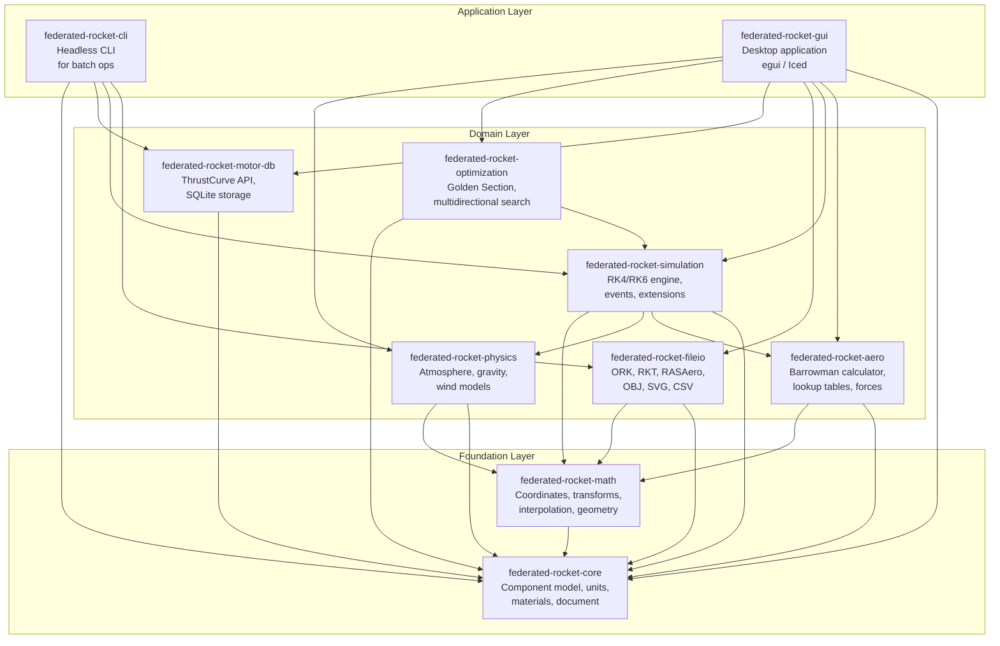
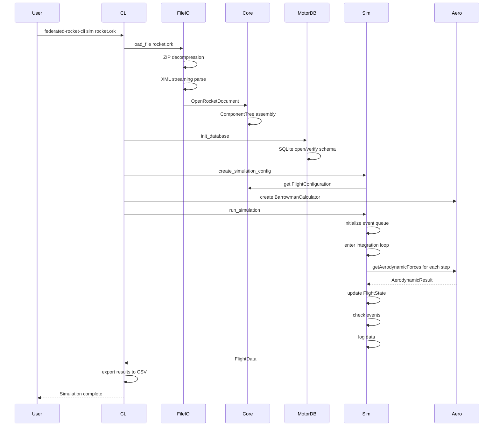
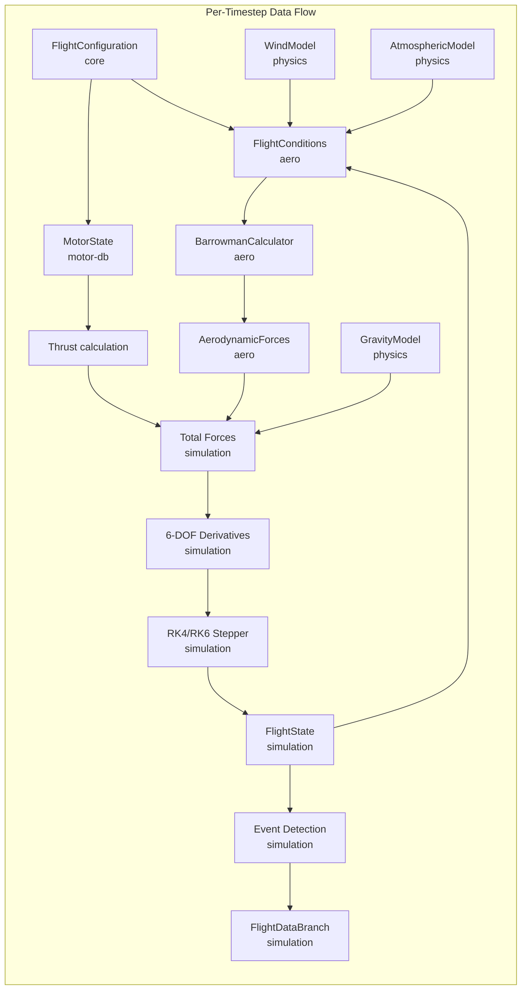
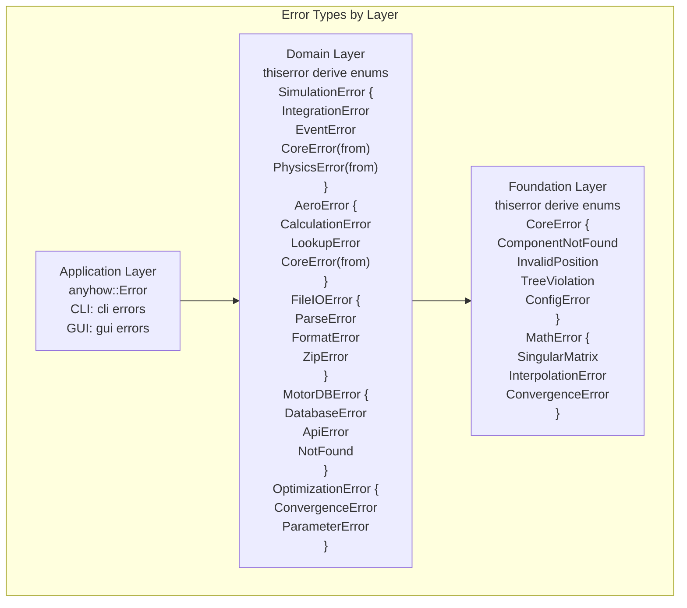

# Software Design Document — federated-rocket

| **Document Version** | 1.0 |
|---|---|
| **Date** | 2026-05-25 |
| **Status** | Draft |
| **Author** | Abhishek Kumar |
| **Project** | federated-rocket — Rust port of OpenRocket |

---

| Revision | Date | Description | Author |
|---|---|---|---|
| 1.0 | 2026-05-25 | Initial SDD draft | Abhishek Kumar |

---

## Table of Contents

1. [Introduction](#1-introduction)
   - 1.1 [Purpose](#11-purpose)
   - 1.2 [Scope](#12-scope)
   - 1.3 [Definitions, Acronyms, Abbreviations](#13-definitions-acronyms-abbreviations)
   - 1.4 [References](#14-references)
2. [System Architecture Overview](#2-system-architecture-overview)
   - 2.1 [Architecture Style](#21-architecture-style)
   - 2.2 [Crate Dependency Graph](#22-crate-dependency-graph)
   - 2.3 [Data Flow Between Crates](#23-data-flow-between-crates)
   - 2.4 [Error Handling Strategy](#24-error-handling-strategy)
3. [Crate: federated-rocket-core](#3-crate-federated-rocket-core)
   - 3.1 [Purpose](#31-purpose)
   - 3.2 [Module Tree](#32-module-tree)
   - 3.3 [Key Traits](#33-key-traits)
   - 3.4 [RocketComponent Enum Design](#34-rocketcomponent-enum-design)
   - 3.5 [Tree Structure](#35-tree-structure)
   - 3.6 [Undo/Redo](#36-undoredo)
4. [Crate: federated-rocket-math](#4-crate-federated-rocket-math)
   - 4.1 [Purpose](#41-purpose)
   - 4.2 [Module Tree](#42-module-tree)
   - 4.3 [Key Algorithms](#43-key-algorithms)
5. [Crate: federated-rocket-physics](#5-crate-federated-rocket-physics)
   - 5.1 [Purpose](#51-purpose)
   - 5.2 [Module Tree](#52-module-tree)
   - 5.3 [Trait Design](#53-trait-design)
6. [Crate: federated-rocket-aero](#6-crate-federated-rocket-aero)
   - 6.1 [Purpose](#61-purpose)
   - 6.2 [Module Tree](#62-module-tree)
   - 6.3 [Algorithm Details — Barrowman Method](#63-algorithm-details--barrowman-method)
7. [Crate: federated-rocket-simulation](#7-crate-federated-rocket-simulation)
   - 7.1 [Purpose](#71-purpose)
   - 7.2 [Module Tree](#72-module-tree)
   - 7.3 [FlightState Design](#73-flightstate-design)
   - 7.4 [Integration Loop](#74-integration-loop)
   - 7.5 [Event System](#75-event-system)
8. [Crate: federated-rocket-fileio](#8-crate-federated-rocket-fileio)
   - 8.1 [Purpose](#81-purpose)
   - 8.2 [Module Tree](#82-module-tree)
   - 8.3 [XML Strategy](#83-xml-strategy)
   - 8.4 [File Format Specifications](#84-file-format-specifications)
9. [Crate: federated-rocket-motor-db](#9-crate-federated-rocket-motor-db)
   - 9.1 [Purpose](#91-purpose)
   - 9.2 [Module Tree](#92-module-tree)
   - 9.3 [SQLite Schema](#93-sqlite-schema)
10. [Crate: federated-rocket-optimization](#10-crate-federated-rocket-optimization)
    - 10.1 [Purpose](#101-purpose)
    - 10.2 [Module Tree](#102-module-tree)
    - 10.3 [Algorithm Details](#103-algorithm-details)
11. [Crate: federated-rocket-cli](#11-crate-federated-rocket-cli)
    - 11.1 [Purpose](#111-purpose)
    - 11.2 [CLI Command Structure](#112-cli-command-structure)
12. [Data Flow Design](#12-data-flow-design)
    - 12.1 [Startup Flow](#121-startup-flow)
    - 12.2 [Simulation Data Flow](#122-simulation-data-flow)
13. [Error Handling Strategy](#13-error-handling-strategy)
14. [Testing Strategy](#14-testing-strategy)

---

## 1. Introduction

### 1.1 Purpose

This Software Design Document (SDD) provides the detailed technical design specifications for **federated-rocket**, a full port of the [OpenRocket](https://github.com/openrocket/openrocket) model rocket simulator from Java to Rust. It defines the crate architecture, module organization, type system design, algorithm specifications, data flow, file format handling, and API boundaries for each of the eight proposed crates.

This document is intended for:
- **Implementation engineers** who will code the Rust crates
- **Code reviewers** validating design decisions against the original OpenRocket Java source
- **Test engineers** designing integration and regression tests
- **Maintainers** evolving the codebase over time

### 1.2 Scope

The SDD covers the complete design of the federated-rocket core library, including:

- **federated-rocket-core**: Foundation types, component model, unit system, materials
- **federated-rocket-math**: Linear algebra, coordinate transforms, interpolation
- **federated-rocket-physics**: Atmosphere, gravity, wind models
- **federated-rocket-aero**: Barrowman aerodynamics, lookup tables, fin flutter
- **federated-rocket-simulation**: Flight simulation engine, events, listeners, extensions
- **federated-rocket-fileio**: File format import/export for all supported formats
- **federated-rocket-motor-db**: Motor database management, ThrustCurve.org integration
- **federated-rocket-optimization**: Single and multi-parameter design optimization
- **federated-rocket-cli**: Headless command-line interface

The GUI layer (federated-rocket-gui) is described at a high level but detailed UI component design is deferred to a separate GUI design document.

### 1.3 Definitions, Acronyms, Abbreviations

| Term | Definition |
|---|---|
| **6-DOF** | Six Degrees of Freedom — position (3) + orientation (3) |
| **Barrowman method** | Semi-empirical method for calculating rocket CP and aerodynamic coefficients |
| **CG / CP** | Center of Gravity / Center of Pressure |
| **DOF** | Degrees of Freedom |
| **GUI** | Graphical User Interface |
| **ISA** | International Standard Atmosphere |
| **MSL / AGL** | Mean Sea Level / Above Ground Level |
| **RK4 / RK6** | 4th-order / 6th-order Runge-Kutta numerical integration |
| **SDD** | Software Design Document |
| **SRS** | Software Requirements Specification |
| **WGS84** | World Geodetic System 1984 |
| **.ork** | OpenRocket file format (ZIP-compressed XML) |
| **.rkt** | RockSim file format |
| **.CDX1** | RASAero II file format |
| **CNa** | Normal force coefficient derivative |
| **CD / Cd** | Drag coefficient |
| **CP** | Center of Pressure |

### 1.4 References

| Reference | Description |
|---|---|
| [SRS — federated-rocket](./srs.md) | Software Requirements Specification for this project |
| [OpenRocket Source](https://github.com/openrocket/openrocket) | Original Java source code |
| [OpenRocket Technical Document](openrocket/doc/techdoc/techdoc.pdf) | Theoretical foundations: Barrowman method, wind models, simulation |
| [OpenRocket File Format Spec](openrocket/docs/source/dev_guide/file_specification.rst) | `.ork` XML schema documentation |
| [OpenRocket Motor DB Schema](openrocket/docs/source/dev_guide/motor_database_schema.rst) | SQLite schema for motor database |
| [OpenRocket RocketComponent.java](openrocket/core/src/main/java/info/openrocket/core/rocketcomponent/RocketComponent.java) | Base class for all rocket components (3312 lines) |
| [OpenRocket NoseCone.java](openrocket/core/src/main/java/info/openrocket/core/rocketcomponent/NoseCone.java) | Nose cone component implementation |
| [OpenRocket FinSet.java](openrocket/core/src/main/java/info/openrocket/core/rocketcomponent/FinSet.java) | Abstract fin set base class |
| [OpenRocket BarrowmanCalculator.java](openrocket/core/src/main/java/info/openrocket/core/aerodynamics/BarrowmanCalculator.java) | Main aerodynamics orchestrator |
| [OpenRocket BasicEventSimulationEngine.java](openrocket/core/src/main/java/info/openrocket/core/simulation/BasicEventSimulationEngine.java) | Core simulation engine (844 lines) |
| [OpenRocket FlightEvent.java](openrocket/core/src/main/java/info/openrocket/core/simulation/FlightEvent.java) | Flight event type definitions |
| [OpenRocket SimulationStatus.java](openrocket/core/src/main/java/info/openrocket/core/simulation/SimulationStatus.java) | Dynamic simulation state (723 lines) |
| [OpenRocket OpenRocketDocument.java](openrocket/core/src/main/java/info/openrocket/core/document/OpenRocketDocument.java) | Document model with undo/redo (1069 lines) |
| [OpenRocket AerodynamicForces.java](openrocket/core/src/main/java/info/openrocket/core/aerodynamics/AerodynamicForces.java) | Aerodynamic force data structure |
| [OpenRocket GoldenSectionSearchOptimizer.java](openrocket/core/src/main/java/info/openrocket/core/optimization/general/onedim/GoldenSectionSearchOptimizer.java) | Golden Section search optimizer |
| [ThrustCurve.org API](https://www.thrustcurve.org/) | REST API for motor search/download |
| [nalgebra](https://nalgebra.org/) | Linear algebra crate (candidate) |
| [quick-xml](https://github.com/tafia/quick-xml) | XML parser (candidate) |
| [rusqlite](https://github.com/rusqlite/rusqlite) | SQLite bindings (candidate) |
| [uom](https://github.com/iliekturtles/uom) | Type-safe units of measurement (candidate) |

---

## 2. System Architecture Overview

### 2.1 Architecture Style

federated-rocket uses a **modular layered architecture** enforced by Rust's crate system. Crates form a directed acyclic dependency graph with strict compile-time boundaries. The architecture follows three tiers:

1. **Foundation Layer** (bottom): `federated-rocket-core` and `federated-rocket-math` — no dependencies on other project crates.
2. **Domain Layer** (middle): `federated-rocket-physics`, `federated-rocket-aero`, `federated-rocket-simulation`, `federated-rocket-fileio`, `federated-rocket-motor-db`, `federated-rocket-optimization` — depend on foundation crates.
3. **Application Layer** (top): `federated-rocket-cli`, `federated-rocket-gui` — depend on domain crates.

**Key design principles:**

- **Crate boundaries as module boundaries**: Each crate is a separately compilable unit with a well-defined public API. Internal module structure within a crate is implementation detail.
- **Trait-based polymorphism**: The Java class hierarchy (abstract classes and interfaces) maps to Rust traits and enum-based dispatch. Strategy pattern (common in OpenRocket) maps naturally to trait objects.
- **Data-oriented design**: Flight data, simulation state, and aerodynamic results are plain structs with value semantics, passed through the system without complex reference counting.
- **Compile-time dependency direction**: Lower-level crates never depend on higher-level crates. The dependency graph is acyclic.

### 2.2 Crate Dependency Graph



### 2.3 Data Flow Between Crates

**Compile-time (trait/type) dependencies:**

| Source Crate | Target Crate | Data Transferred |
|---|---|---|
| `core` | `math` | `Coordinate`, `Transformation` for geometry operations |
| `aero` | `core` | `RocketComponent` tree for aerodynamic analysis |
| `aero` | `math` | `Vector3d` for force/moment calculations |
| `physics` | `core` | `FlightConfiguration` for atmospheric conditions |
| `simulation` | `core` | `RocketComponent` tree, `FlightConfiguration`, `FlightEvent` |
| `simulation` | `aero` | `FlightConditions` → `AerodynamicForces` |
| `simulation` | `physics` | `FlightState` → `AtmosphericConditions`, `WindVelocity` |
| `fileio` | `core` | `OpenRocketDocument` ↔ serialized XML |
| `motor-db` | `core` | `Motor`, `ThrustCurve` types |
| `optimization` | `simulation` | `OptimizableParameter` → `SimulationConditions` |
| `cli` | all above | CLI args → crate APIs |

**Runtime data flow (simulation hot path):**

```
Component tree (core)
    │
    ▼
FlightConfiguration (core) ──► FlightConditions (aero)
    │                               │
    │                               ▼
    │                        BarrowmanCalculator (aero)
    │                               │
    │                               ▼
    │                        AerodynamicForces (aero)
    │                               │
    ▼                               ▼
SimulationStatus ──► BasicEventSimulationEngine (simulation)
    │                               │
    │                               ▼
    │                     RK4/RK6 Sim Stepper (simulation)
    │                               │
    │                               ▼
    │                         FlightState update
    │                               │
    ▼                               ▼
FlightDataBranch ◄─────── Event detection + logging
```

### 2.4 Error Handling Strategy

federated-rocket uses a **layered error handling** approach:

| Layer | Approach | Crate |
|---|---|---|
| Foundation types | `thiserror` derive macros, crate-specific error enums | `core`, `math` |
| Domain logic | Crate-specific error types with `?` propagation | `aero`, `physics`, `simulation`, `fileio`, `motor-db`, `optimization` |
| Application | `anyhow::Error` for top-level error aggregation | `cli`, `gui` |

**Core error type pattern:**

```rust
// In federated-rocket-core:
#[derive(Debug, thiserror::Error)]
pub enum CoreError {
    #[error("Component not found: {0}")]
    ComponentNotFound(String),
    #[error("Invalid position: {0}")]
    InvalidPosition(String),
    #[error("Tree structure violation: {0}")]
    TreeViolation(String),
    #[error("Configuration error: {0}")]
    ConfigError(String),
}

// In federated-rocket-simulation:
#[derive(Debug, thiserror::Error)]
pub enum SimulationError {
    #[error("Integration failed: {0}")]
    IntegrationError(String),
    #[error("Event handling error: {0}")]
    EventError(String),
    #[error("Core error: {0}")]
    CoreError(#[from] CoreError),
    #[error("Physics error: {0}")]
    PhysicsError(#[from] PhysicsError),
}
```

**Error propagation across crate boundaries:** Each domain crate defines a public error enum with `#[from]` conversions for errors from crates it depends on. Application crates use `anyhow::Error` to wrap these into a unified error type using `.context()` for rich error messages.

**Result type aliases:** Each crate defines a public `Result<T>` alias:

```rust
// In each crate's lib.rs:
pub type Result<T> = std::result::Result<T, CrateError>;
```

---

## 3. Crate: `federated-rocket-core`

### 3.1 Purpose

The `federated-rocket-core` crate is the **foundation of the entire system**. It provides:

- The unit system (SI storage + display unit conversion)
- The material system (bulk/surface/line materials with predefined registry)
- The rocket component model (all component types, tree structure, positioning)
- Flight configuration mapping (motor-to-mount assignments)
- The document model (undo/redo, file metadata, simulation list)

This crate has **zero dependencies** on other federated-rocket crates and minimal external dependencies.

### 3.2 Module Tree

```
core/
├── lib.rs
├── units/
│   ├── mod.rs
│   ├── types.rs              -- UnitType enum (Length, Mass, Angle, Temperature, etc.)
│   ├── converter.rs          -- SI to/from display unit conversion
│   └── groups.rs             -- Predefined unit groups matching UnitGroup.java
├── material/
│   ├── mod.rs
│   ├── material.rs           -- MaterialType enum (Bulk, Surface, Line), Material struct
│   └── registry.rs           -- MaterialRegistry with predefined materials
├── component/
│   ├── mod.rs
│   ├── component.rs          -- RocketComponent trait (core trait with ~20 methods)
│   ├── symmetric/            -- BodyComponent, Transition, Tube
│   ├── external/             -- FinSet (4 variants), LaunchLug, RailButton
│   ├── internal/             -- InnerTube, RingComponent, MassComponent, ShockCord
│   ├── recovery/             -- Parachute, Streamer
│   ├── assembly/             -- AxialStage, ParallelStage, PodSet, Sleeve
│   ├── rocket.rs             -- Rocket (root of tree, implements RocketComponent)
│   ├── position.rs           -- AxialMethod, RadiusMethod, AngleMethod
│   └── visitor.rs            -- ComponentVisitor trait for tree traversal
├── flight_config/
│   ├── mod.rs
│   ├── config.rs             -- FlightConfiguration
│   └── config_id.rs          -- FlightConfigurationID
└── document/
    ├── mod.rs
    └── document.rs           -- OpenRocketDocument (top-level document)
```

### 3.3 Key Traits

**`RocketComponent` trait** — The central abstraction mapped from the Java [`RocketComponent`](openrocket/core/src/main/java/info/openrocket/core/rocketcomponent/RocketComponent.java) abstract class:

```rust
/// Core trait for all rocket components.
/// Corresponds to RocketComponent.java (line 55: abstract class RocketComponent).
pub trait RocketComponent: Any + Debug {
    /// Unique identifier for this component instance
    fn id(&self) -> ComponentId;

    /// Display name of the component
    fn name(&self) -> &str;
    fn set_name(&mut self, name: String);

    /// Parent component in the tree, None for Rocket root
    fn parent(&self) -> Option<ComponentId>;

    /// List of child component IDs
    fn children(&self) -> &[ComponentId];

    // Position methods
    fn axial_method(&self) -> AxialMethod;
    fn axial_offset(&self) -> f64;
    fn radial_method(&self) -> RadiusMethod;
    fn radial_offset(&self) -> f64;
    fn angle_method(&self) -> AngleMethod;
    fn angle_offset(&self) -> f64;

    // Geometric bounds
    fn length(&self) -> f64;
    fn outer_radius(&self) -> f64;
    fn inner_radius(&self) -> f64;

    // Mass properties
    fn mass(&self) -> f64;
    fn cg_position(&self) -> Coordinate;
    fn mass_properties(&self) -> MassProperties;

    // Aerodynamic properties
    fn is_aerodynamic(&self) -> bool;
    fn is_motor_mount(&self) -> bool;
    fn component_type(&self) -> ComponentType;

    /// Clone this component as a trait object
    fn clone_component(&self) -> Box<dyn RocketComponent>;

    /// Component change event subscription
    fn add_change_listener(&mut self, listener: Box<dyn ComponentChangeListener>);
}
```

**`ComponentVisitor` trait** — For tree traversal, mapped from [`RocketComponentVisitor`](openrocket/core/src/main/java/info/openrocket/core/rocketcomponent/RocketComponentVisitor.java):

```rust
pub trait ComponentVisitor {
    /// Called for each component during traversal
    fn visit(&mut self, component: &dyn RocketComponent) -> VisitAction;
}

pub enum VisitAction {
    Continue,       // Continue traversing children
    SkipChildren,   // Skip this node's children
    Stop,           // Stop traversal entirely
}

/// Traversal order
pub enum TraversalOrder {
    PreOrder,   // Parent before children
    PostOrder,  // Children before parent
}
```

**`Positionable` trait** — For components that can be positioned:

```rust
/// Components that support axial positioning relative to parent.
/// Mapped from AxialPositionable interface.
pub trait AxialPositionable {
    fn get_axial_method(&self) -> AxialMethod;
    fn set_axial_method(&mut self, method: AxialMethod);
    fn get_axial_offset(&self) -> f64;
    fn set_axial_offset(&mut self, offset: f64);
}

/// Components that support radial positioning.
/// Mapped from RadiusPositionable.
pub trait RadialPositionable {
    fn get_radial_method(&self) -> RadiusMethod;
    fn set_radial_method(&mut self, method: RadiusMethod);
    fn get_radial_offset(&self) -> f64;
    fn set_radial_offset(&mut self, offset: f64);
}

/// Components that support angular positioning.
/// Mapped from AnglePositionable.
pub trait AnglePositionable {
    fn get_angle_method(&self) -> AngleMethod;
    fn set_angle_method(&mut self, method: AngleMethod);
    fn get_angle_offset(&self) -> f64;
    fn set_angle_offset(&mut self, offset: f64);
}
```

**`Configurable` trait** — For components that accept flight configurations:

```rust
/// Components whose properties vary by flight configuration.
/// Mapped from FlightConfigurableComponent.java.
pub trait Configurable {
    /// Get override CD for a specific flight configuration
    fn get_override_cd(&self, config: &FlightConfigurationId) -> Option<f64>;
    fn set_override_cd(&mut self, config: &FlightConfigurationId, cd: f64);

    /// Get mass override for a specific flight configuration
    fn get_override_mass(&self, config: &FlightConfigurationId) -> Option<f64>;
    fn set_override_mass(&mut self, config: &FlightConfigurationId, mass: f64);

    /// Get CG override for a specific flight configuration
    fn get_override_cg(&self, config: &FlightConfigurationId) -> Option<Coordinate>;
    fn set_override_cg(&mut self, config: &FlightConfigurationId, cg: Coordinate);
}
```

**Position methods** — Mapped from [`AxialMethod`](openrocket/core/src/main/java/info/openrocket/core/rocketcomponent/position/AxialMethod.java):

```rust
/// How a component is positioned axially along the rocket centerline.
#[derive(Debug, Clone, Copy, PartialEq, Eq, Serialize, Deserialize)]
pub enum AxialMethod {
    /// Absolute position from the front of the parent
    Absolute,
    /// Position after the previous sibling component
    After,
    /// Top of the parent component
    Top,
    /// Middle of the parent component
    Middle,
    /// Bottom of the parent component
    Bottom,
}

#[derive(Debug, Clone, Copy, PartialEq, Eq, Serialize, Deserialize)]
pub enum RadiusMethod {
    Absolute,   // Absolute radial distance
    Relative,   // Relative to parent component radius
    Surface,    // On the surface of the parent
    Outside,    // Outside surface
    Midpoint,   // Midpoint of wall thickness
}

#[derive(Debug, Clone, Copy, PartialEq, Eq, Serialize, Deserialize)]
pub enum AngleMethod {
    Absolute,   // Absolute angle
    Relative,   // Relative to parent
}
```

### 3.4 RocketComponent Enum Design

The Java class hierarchy (abstract `RocketComponent` base class with ~25 concrete subclasses) maps to a **tagged enum** in Rust. This provides:
- **Stack-allocated tag dispatch**: No vtable overhead for component type identification
- **Exhaustive matching**: `match` arms cover all component types (no downcasting)
- **Cache-friendly**: Data for each variant is stored inline in the enum

```rust
/// Tagged enum representing all rocket component types.
/// Replaces the Java class hierarchy rooted at RocketComponent.java.
#[derive(Debug, Clone)]
pub enum RocketComponent {
    // --- Assembly types ---
    Rocket(RocketData),
    AxialStage(AxialStageData),
    ParallelStage(ParallelStageData),
    PodSet(PodSetData),
    Sleeve(SleeveData),

    // --- Symmetric body components ---
    NoseCone(NoseConeData),
    Transition(TransitionData),
    BodyTube(BodyTubeData),

    // --- External components ---
    TrapezoidFinSet(TrapezoidFinSetData),
    EllipticalFinSet(EllipticalFinSetData),
    FreeformFinSet(FreeformFinSetData),
    TubeFinSet(TubeFinSetData),
    LaunchLug(LaunchLugData),
    RailButton(RailButtonData),

    // --- Internal components ---
    InnerTube(InnerTubeData),
    CenteringRing(CenteringRingData),
    Bulkhead(BulkheadData),
    EngineBlock(EngineBlockData),
    TubeCoupler(TubeCouplerData),
    MassComponent(MassComponentData),
    MassObject(MassObjectData),
    ShockCord(ShockCordData),

    // --- Recovery devices ---
    Parachute(ParachuteData),
    Streamer(StreamerData),
}
```

**Variant data struct example:** `NoseConeData` mapped from [`NoseCone.java`](openrocket/core/src/main/java/info/openrocket/core/rocketcomponent/NoseCone.java):

```rust
/// Data for the NoseCone variant.
/// Mapped from NoseCone.java (extends Transition.java).
#[derive(Debug, Clone)]
pub struct NoseConeData {
    // Shared component fields (from RocketComponent.java base class)
    pub id: ComponentId,
    pub name: String,
    pub parent: Option<ComponentId>,
    pub children: Vec<ComponentId>,

    // Positioning (from RocketComponent.java lines 91-109)
    pub length: f64,
    pub axial_method: AxialMethod,
    pub axial_offset: f64,
    pub radial_method: RadiusMethod,
    pub radial_offset: f64,
    pub angle_method: AngleMethod,
    pub angle_offset: f64,

    // Material (from Material.java)
    pub material: Material,
    pub thickness: f64,

    // Appearance
    pub color: Option<ORColor>,
    pub line_style: Option<LineStyle>,
    pub appearance: Option<Appearance>,

    // Override fields
    pub override_mass: f64,
    pub mass_overridden: bool,
    pub override_cg: Option<Coordinate>,
    pub override_cd: Option<f64>,

    // NoseCone-specific fields (from NoseCone.java)
    pub shape: TransitionShape,   // Ogive, Conical, Elliptical, Parabolic, PowerSeries, Haack
    pub shape_parameter: f64,     // Shape parameter for power series / Haack series
    pub is_flipped: bool,         // True = tail cone (NoseCone.java line 23)
    pub aft_radius: f64,
    pub fore_radius: f64,         // Should be 0 for normal nose cone
    pub aft_radius_automatic: bool,
    pub fore_radius_automatic: bool,
    pub aft_shoulder_enabled: bool,
    pub aft_shoulder_length: f64,
    pub aft_shoulder_thickness: f64,
    pub aft_shoulder_radius: f64,
    pub clipped: bool,

    // Inside color support (InsideColorComponent interface)
    pub inside_color: Option<ORColor>,

    // Display order for 2D rendering
    pub display_order_side: u32,
    pub display_order_back: u32,
}
```

**`TransitionShape` enum** — Mapped from [`Transition.Shape`](openrocket/core/src/main/java/info/openrocket/core/rocketcomponent/Transition.java) inner enum:

```rust
#[derive(Debug, Clone, Copy, PartialEq, Eq, Serialize, Deserialize)]
pub enum TransitionShape {
    Conical,
    Ogive,
    Elliptical,
    Parabolic,
    PowerSeries,    // Shape parameter controls the power
    HaackSeries,    // Shape parameter controls the series
}
```

**`FinSetData` base structure** — Mapped from [`FinSet.java`](openrocket/core/src/main/java/info/openrocket/core/rocketcomponent/FinSet.java):

```rust
/// Shared fields for all fin set types.
/// Mapped from FinSet.java (lines 30-100+).
#[derive(Debug, Clone)]
pub struct FinSetBase {
    pub fin_count: u32,
    pub root_chord: f64,
    pub tip_chord: f64,
    pub sweep_angle: f64,          // radians
    pub span: f64,
    pub thickness: f64,
    pub cant_angle: f64,           // radians
    pub cross_section: FinCrossSection,  // Square, Rounded, Airfoil
    pub first_fin_offset: f64,     // radians
    pub angle_method: AngleMethod,
}

#[derive(Debug, Clone, Copy, PartialEq, Eq, Serialize, Deserialize)]
pub enum FinCrossSection {
    Square,    // Relative volume: 1.00
    Rounded,   // Relative volume: 0.99
    Airfoil,   // Relative volume: 0.85
}
```

### 3.5 Tree Structure

The component tree is stored using a **`slotmap`-based representation** rather than `Vec<Rc<RefCell<>>>`. This avoids runtime borrow-checking overhead and enables O(1) lookup by ID.

```rust
use slotmap::{SlotMap, new_key_type};

new_key_type! {
    /// Opaque key for component lookup in the slot map
    pub struct ComponentId;
}

/// The rocket component tree.
/// Provides O(1) insertion, lookup, and removal for any component.
pub struct ComponentTree {
    /// Slot map storing all components
    components: SlotMap<ComponentId, RocketComponentData>,

    /// The root component (always a Rocket variant)
    root: ComponentId,
}

/// Internal storage wrapper — combines the enum with metadata
struct RocketComponentData {
    variant: RocketComponent,
    /// Modification ID for cache invalidation
    mod_id: u64,
}

impl ComponentTree {
    pub fn new(rocket: RocketData) -> Self { /* ... */ }
    pub fn root(&self) -> ComponentId { self.root }

    pub fn get(&self, id: ComponentId) -> Option<&RocketComponent> {
        self.components.get(id).map(|d| &d.variant)
    }
    pub fn get_mut(&mut self, id: ComponentId) -> Option<&mut RocketComponent> {
        self.components.get_mut(id).map(|d| &mut d.variant)
    }

    pub fn add_child(
        &mut self,
        parent: ComponentId,
        component: RocketComponent,
    ) -> Result<ComponentId> { /* ... */ }

    pub fn remove(&mut self, id: ComponentId) -> Result<RocketComponent> { /* ... */ }

    pub fn parent_of(&self, id: ComponentId) -> Option<ComponentId> { /* ... */ }
    pub fn children_of(&self, id: ComponentId) -> Vec<ComponentId> { /* ... */ }

    /// Traverse the tree with a visitor
    pub fn traverse(&self, visitor: &mut dyn ComponentVisitor, order: TraversalOrder) { /* ... */ }
}
```

**Alternative:** If `slotmap` is not desired, a `Vec<ComponentNode>` with index-based references can be used:

```rust
pub struct ComponentNode {
    pub variant: RocketComponent,
    pub parent: Option<usize>,
    pub children: Vec<usize>,
}

pub struct ComponentTreeVec {
    nodes: Vec<ComponentNode>,
    root: usize,
    free_list: Vec<usize>,    // For reuse of removed indices
}
```

The `Rocket` variant acts as the root of the tree. Key invariants:
- Exactly one root component exists (the `Rocket`)
- No cycles (parent references go upward, children lists go downward)
- Child components are ordered (order is meaningful for axial positioning with `AFTER` method)

### 3.6 Undo/Redo

The undo/redo system uses a **snapshot-based approach** matching the Java [`OpenRocketDocument`](openrocket/core/src/main/java/info/openrocket/core/document/OpenRocketDocument.java) pattern (lines 92-113):

```rust
/// Undo/redo manager for the document.
/// Mapped from OpenRocketDocument.java undo/redo mechanism (lines 92-113).
pub struct UndoManager {
    /// Snapshots of the component tree at each undo point
    undo_stack: Vec<UndoState>,
    /// Snapshots for redo
    redo_stack: Vec<UndoState>,
    /// Maximum number of undo levels (OpenRocket uses 50)
    max_levels: usize,

    /// Whether we're currently in an undo/redo operation
    in_undo_redo: bool,
}

/// Captures the full state at an undo point.
struct UndoState {
    /// Cloned component tree
    tree: ComponentTree,
    /// Cloned flight configurations
    configurations: Vec<FlightConfiguration>,
    /// Cloned simulations
    simulations: Vec<Simulation>,
    /// Human-readable description
    description: String,
}

impl UndoManager {
    pub fn new(max_levels: usize) -> Self { /* ... */ }

    /// Save a snapshot. Called after each user-visible mutation.
    pub fn save_snapshot(&mut self, doc: &OpenRocketDocument, description: &str) {
        self.redo_stack.clear();
        self.undo_stack.push(UndoState {
            tree: doc.component_tree.clone(),
            configurations: doc.flight_configurations.clone(),
            simulations: doc.simulations.clone(),
            description: description.to_string(),
        });
        // Prune if exceeding max_levels + margin
        let max = self.max_levels + 10;
        while self.undo_stack.len() > max {
            self.undo_stack.remove(0);
        }
    }

    pub fn undo(&mut self, doc: &mut OpenRocketDocument) -> Result<String> { /* ... */ }
    pub fn redo(&mut self, doc: &mut OpenRocketDocument) -> Result<String> { /* ... */ }
    pub fn can_undo(&self) -> bool { !self.undo_stack.is_empty() }
    pub fn can_redo(&self) -> bool { !self.redo_stack.is_empty() }
}
```

**Alternative approach:** A **command pattern** using `UndoableAction` trait:

```rust
pub trait UndoableAction {
    fn execute(&self, tree: &mut ComponentTree) -> Result<()>;
    fn undo(&self, tree: &mut ComponentTree) -> Result<()>;
    fn description(&self) -> &str;
}

/// Composite action for batching multiple mutations
pub struct CompoundAction {
    actions: Vec<Box<dyn UndoableAction>>,
    description: String,
}
```

The command pattern is preferred for fine-grained undo and lower memory usage. The snapshot approach is simpler and matches the existing OpenRocket approach. **Recommendation:** Start with command pattern for individual mutations (add, delete, modify property) and snapshot for bulk operations (file import, undo/redo batch).

---

## 4. Crate: `federated-rocket-math`

### 4.1 Purpose

The `federated-rocket-math` crate provides **numerical and geometric utilities** used by the aerodynamics, physics, and simulation crates. It has zero dependency on other federated-rocket crates.

### 4.2 Module Tree

```
math/
├── lib.rs
├── vector.rs              -- Vector3d, Matrix3d (or re-export from nalgebra)
├── coordinate.rs          -- Coordinate, transformation helpers
├── interpolation.rs       -- Linear interpolation, spline interpolation
├── spline.rs              -- Cubic Hermite spline for thrust curve interpolation
├── pink_noise.rs          -- Pink noise generation Voss-McCartney algorithm
└── integrator.rs          -- RK4, RK6 integration templates generic over state type
```

### 4.3 Key Algorithms

**`Vector3d` and `Matrix3d`:**

```rust
/// 3D vector with standard operations.
/// Mapped from Coordinate.java in OpenRocket util package.
#[derive(Debug, Clone, Copy, PartialEq)]
pub struct Vector3d {
    pub x: f64,
    pub y: f64,
    pub z: f64,
}

impl Vector3d {
    pub const ZERO: Vector3d = Vector3d { x: 0.0, y: 0.0, z: 0.0 };
    pub const X_AXIS: Vector3d = Vector3d { x: 1.0, y: 0.0, z: 0.0 };
    pub const Y_AXIS: Vector3d = Vector3d { x: 0.0, y: 1.0, z: 0.0 };
    pub const Z_AXIS: Vector3d = Vector3d { x: 0.0, y: 0.0, z: 1.0 };

    pub fn new(x: f64, y: f64, z: f64) -> Self { Self { x, y, z } }
    pub fn dot(self, other: Vector3d) -> f64 { /* ... */ }
    pub fn cross(self, other: Vector3d) -> Vector3d { /* ... */ }
    pub fn norm(self) -> f64 { /* ... */ }
    pub fn normalize(self) -> Vector3d { /* ... */ }
    pub fn rotate(self, axis: Vector3d, angle: f64) -> Vector3d { /* ... */ }
}

/// 3x3 rotation matrix.
pub struct Matrix3d {
    pub elements: [[f64; 3]; 3],
}
```

**Coordinate transformation:**

```rust
/// Coordinate transformation from body frame to world frame (or vice versa).
/// Mapped from Transformation.java in OpenRocket util package.
#[derive(Debug, Clone, Copy)]
pub struct Transformation {
    pub rotation: Matrix3d,
    pub translation: Vector3d,
}

impl Transformation {
    pub const IDENTITY: Transformation = Transformation {
        rotation: Matrix3d::IDENTITY,
        translation: Vector3d::ZERO,
    };

    pub fn translate(v: Vector3d) -> Self { /* ... */ }
    pub fn rotate_x(angle: f64) -> Self { /* ... */ }
    pub fn rotate_y(angle: f64) -> Self { /* ... */ }
    pub fn rotate_z(angle: f64) -> Self { /* ... */ }

    pub fn transform(&self, point: Vector3d) -> Vector3d { /* ... */ }
    pub fn inverse(&self) -> Self { /* ... */ }
    pub fn then(&self, other: &Transformation) -> Self { /* ... */ }
}
```

**RK4/RK6 Integration Template:**

```rust
/// ODE system trait — implement for any physical system.
/// Mapped from the simulation stepper pattern in OpenRocket.
pub trait System<State: Clone + std::ops::Add<Output = State> + std::ops::Mul<f64, Output = State>> {
    /// Compute the derivative of the state
    fn derivatives(&self, state: &State, time: f64) -> State;
}

/// Generic RK4 integrator.
pub fn rk4_step<State, S: System<State>>(
    system: &S,
    state: &State,
    time: f64,
    dt: f64,
) -> State {
    let k1 = system.derivatives(state, time);
    let k2 = system.derivatives(&(state.clone() + k1.clone() * (dt / 2.0)), time + dt / 2.0);
    let k3 = system.derivatives(&(state.clone() + k2.clone() * (dt / 2.0)), time + dt / 2.0);
    let k4 = system.derivatives(&(state.clone() + k3.clone() * dt), time + dt);
    state.clone()
        + (k1 * (dt / 6.0))
        + (k2 * (dt / 3.0))
        + (k3 * (dt / 3.0))
        + (k4 * (dt / 6.0))
}

/// Generic RK6 integrator (higher-order Runge-Kutta).
/// Mapped from RK6SimulationStepper.java.
pub fn rk6_step<State, S: System<State>>(
    system: &S,
    state: &State,
    time: f64,
    dt: f64,
) -> State {
    // RK6 coefficients (Butcher tableau for 6th-order method)
    // ... implementation with 7 intermediate stages
}
```

**Thrust curve interpolation:**

```rust
/// Cubic Hermite spline interpolation for thrust curves.
/// Provides C1 continuity (smooth first derivative) crucial for accurate
/// simulation of thrust profile discontinuities.
/// Mapped from OpenRocket's thrust curve interpolation logic.
pub fn cubic_hermite_interpolate(
    points: &[(f64, f64)],  // (time, thrust) pairs
    t: f64,
) -> f64 {
    // ... cubic Hermite basis functions
}
```

**Pink noise generation:**

```rust
/// Voss-McCartney algorithm for pink noise (1/f) generation.
/// Used by the wind model PinkNoiseWindModel.java.
/// Mapped from OpenRocket's pink noise implementation.
pub struct PinkNoiseGenerator {
    octaves: usize,
    amplitudes: Vec<f64>,
    values: Vec<f64>,
    last_update: f64,
}

impl PinkNoiseGenerator {
    pub fn new(octaves: usize, sample_rate: f64) -> Self { /* ... */ }
    pub fn sample(&mut self, time: f64) -> f64 {
        // Sum of octaves of white noise, each at half the frequency
        // When a random number is updated depends on the octave
        // ... Voss-McCartney algorithm
    }
}
```

**Dependency decision:** The crate should provide custom minimal `Vector3d` and `Matrix3d` types by default (to minimize dependencies) and optionally re-export from `nalgebra` via a feature flag:

```toml
[features]
default = []
nalgebra = ["dep:nalgebra"]

[dependencies]
nalgebra = { version = "0.33", optional = true }
```

---

## 5. Crate: `federated-rocket-physics`

### 5.1 Purpose

The `federated-rocket-physics` crate provides **physical environment models** for simulation: atmosphere, gravity, and wind. It uses a **Strategy pattern** (via traits) to allow runtime model selection.

### 5.2 Module Tree

```
physics/
├── lib.rs
├── atmosphere/
│   ├── mod.rs
│   ├── model.rs          -- AtmosphericModel trait
│   ├── isa.rs            -- ExtendedISAModel implementation
│   ├── interpolating.rs  -- InterpolatingAtmosphericModel implementation
│   └── conditions.rs     -- AtmosphericConditions struct
├── gravity/
│   ├── mod.rs
│   ├── model.rs          -- GravityModel trait
│   ├── constant.rs       -- ConstantGravityModel 9.80665 m/s^2
│   └── wgs84.rs          -- WGSGravityModel ellipsoid gravity
└── wind/
    ├── mod.rs
    ├── model.rs           -- WindModel trait
    └── pink_noise.rs      -- PinkNoiseWindModel, MultiLevelPinkNoiseWindModel
```

### 5.3 Trait Design

**`AtmosphericModel` trait** — Mapped from [`AtmosphericModel.java`](openrocket/core/src/main/java/info/openrocket/core/models/atmosphere/AtmosphericModel.java):

```rust
/// Strategy trait for atmospheric models.
/// Mapped from AtmosphericModel.java interface.
pub trait AtmosphericModel: Debug + Send + Sync {
    /// Temperature at altitude, in Kelvin
    fn get_temperature(&self, altitude_msl: f64) -> f64;

    /// Pressure at altitude, in Pascals
    fn get_pressure(&self, altitude_msl: f64) -> f64;

    /// Density at altitude, in kg/m^3
    fn get_density(&self, altitude_msl: f64) -> f64;

    /// Speed of sound at altitude, in m/s
    fn get_speed_of_sound(&self, altitude_msl: f64) -> f64;
}

/// Results of atmospheric calculations at a given point.
#[derive(Debug, Clone, Copy)]
pub struct AtmosphericConditions {
    pub temperature: f64,       // Kelvin
    pub pressure: f64,          // Pascals
    pub density: f64,           // kg/m^3
    pub speed_of_sound: f64,    // m/s
}

impl AtmosphericConditions {
    pub fn new(model: &dyn AtmosphericModel, altitude_msl: f64) -> Self {
        Self {
            temperature: model.get_temperature(altitude_msl),
            pressure: model.get_pressure(altitude_msl),
            density: model.get_density(altitude_msl),
            speed_of_sound: model.get_speed_of_sound(altitude_msl),
        }
    }
}
```

**ExtendedISAModel** — Mapped from [`ExtendedISAModel.java`](openrocket/core/src/main/java/info/openrocket/core/models/atmosphere/ExtendedISAModel.java):

```rust
/// International Standard Atmosphere extended to 1000 km.
/// Uses the standard lapse rate model:
///   - Troposphere (0-11 km): T = 288.15 - 0.0065 * h, lapse rate -6.5 K/km
///   - Tropopause (11-20 km): T = 216.65 K, isothermal
///   - Stratosphere (20-47 km): T = 216.65 + 0.001 * (h - 20000), lapse rate +1 K/km
///   - ... continues to 1000 km
/// Reference: ISO 2533:1975
pub struct ExtendedISAModel;

impl AtmosphericModel for ExtendedISAModel {
    fn get_temperature(&self, altitude_msl: f64) -> f64 {
        // 7-layer atmosphere model with piecewise linear temperature
        // ... implementation
    }

    fn get_pressure(&self, altitude_msl: f64) -> f64 {
        // Hydrostatic equation integration with local temperature
        // P(h) = P0 * exp(-g * M / (R * T) * h) for each layer
        // ... implementation
    }

    fn get_density(&self, altitude_msl: f64) -> f64 {
        // Ideal gas law: rho = P / (R_specific * T)
        self.get_pressure(altitude_msl) / (287.058 * self.get_temperature(altitude_msl))
    }

    fn get_speed_of_sound(&self, altitude_msl: f64) -> f64 {
        // a = sqrt(gamma * R * T)
        // gamma = 1.4 for air, R = 287.058 J/(kg*K)
        (1.4 * 287.058 * self.get_temperature(altitude_msl)).sqrt()
    }
}
```

**`GravityModel` trait** — Mapped from [`GravityModel.java`](openrocket/core/src/main/java/info/openrocket/core/models/gravity/GravityModel.java):

```rust
/// Strategy trait for gravity models.
pub trait GravityModel: Debug + Send + Sync {
    fn get_gravity_acceleration(&self, altitude_msl: f64, latitude: f64) -> f64;
}

/// Constant gravity at standard value.
/// Mapped from ConstantGravityModel.java.
pub struct ConstantGravityModel;

impl GravityModel for ConstantGravityModel {
    fn get_gravity_acceleration(&self, _altitude_msl: f64, _latitude: f64) -> f64 {
        9.80665  // Standard gravity
    }
}

/// WGS84 ellipsoid gravity model.
/// Mapped from WGSGravityModel.java.
/// Uses the Somigliana formula for latitude-dependent gravity:
///   g(phi) = g_e * (1 + k * sin^2(phi)) / sqrt(1 - e^2 * sin^2(phi))
/// Where:
///   g_e = 9.7803253359 m/s^2 (equatorial gravity)
///   k = 0.00193185265241
///   e^2 = 0.00669437999013
///   phi = latitude
pub struct WGSGravityModel;

impl GravityModel for WGSGravityModel {
    fn get_gravity_acceleration(&self, altitude_msl: f64, latitude: f64) -> f64 {
        let sin_phi = latitude.sin();
        let sin2 = sin_phi * sin_phi;
        let g_0 = 9.7803253359 * (1.0 + 0.00193185265241 * sin2)
            / (1.0 - 0.00669437999013 * sin2).sqrt();
        // Free-air correction: gh = g0 / (1 + h/R)^2
        g_0 / (1.0 + altitude_msl / 6378137.0).powi(2)
    }
}
```

**`WindModel` trait** — Mapped from [`WindModel.java`](openrocket/core/src/main/java/info/openrocket/core/models/wind/WindModel.java):

```rust
/// Strategy trait for wind models.
/// Returns 3D wind velocity vector at a given position and time.
pub trait WindModel: Debug + Send + Sync {
    fn get_wind_velocity(&mut self, time: f64, altitude_msl: f64, altitude_agl: f64) -> Vector3d;
}

/// Pink noise wind model with configurable average speed and turbulence.
/// Mapped from PinkNoiseWindModel.java.
pub struct PinkNoiseWindModel {
    /// Average wind speed at reference altitude (m/s)
    average_speed: f64,
    /// Turbulence intensity (0.0 to 1.0)
    turbulence_intensity: f64,
    /// Wind direction (radians, 0 = North, pi/2 = East)
    direction: f64,
    /// Pink noise generator for turbulence
    generator: PinkNoiseGenerator,
    /// Wind speed profile exponent (for altitude scaling)
    profile_exponent: f64,     // Typically 0.2 for open terrain
}

impl WindModel for PinkNoiseWindModel {
    fn get_wind_velocity(&mut self, time: f64, _altitude_msl: f64, altitude_agl: f64) -> Vector3d {
        // 1. Scale average speed by altitude (power law profile)
        let altitude_factor = (altitude_agl / 10.0).powf(self.profile_exponent);
        let base_speed = self.average_speed * altitude_factor.min(1.0);

        // 2. Add turbulence as pink noise
        let turbulence = self.generator.sample(time) * self.turbulence_intensity * base_speed;

        // 3. Compute wind vector (wind is horizontal: x = East, y = North)
        let total_speed = base_speed + turbulence;
        Vector3d::new(
            total_speed * self.direction.sin(),  // East component
            total_speed * self.direction.cos(),  // North component
            0.0,                                  // No vertical wind
        )
    }
}
```

---

## 6. Crate: `federated-rocket-aero`

### 6.1 Purpose

The `federated-rocket-aero` crate implements **aerodynamic calculations** for model rockets. Core algorithm: the **extended Barrowman method** for subsonic CP and CD calculation, supplemented by **lookup table corrections** for transonic/supersonic regimes.

### 6.2 Module Tree

```
aero/
├── lib.rs
├── barrowman/
│   ├── mod.rs
│   ├── calculator.rs       -- BarrowmanCalculator orchestrator
│   ├── nosecone.rs         -- Nose cone CP and CD
│   ├── body.rs             -- Body tube contributions
│   ├── fin.rs              -- Fin set CP and CD subsonic/supersonic
│   ├── transition.rs       -- Transition/boattail contributions
│   ├── interference.rs     -- Fin-body interference correction
│   └── drag.rs             -- Total drag coefficient breakdown
├── lookup/
│   ├── mod.rs
│   └── table.rs            -- Mach/AoA lookup tables CSV-backed
├── fin_flutter.rs          -- Fin flutter analysis
├── stability.rs            -- CP margin, static margin, dynamic stability
└── results.rs              -- AerodynamicResult CD, CP, CNa, etc.
```

### 6.3 Algorithm Details — Barrowman Method

The Barrowman method, named after Dr. Gordon K. Mandell's student James Barrowman, is a semi-empirical method for calculating the aerodynamic characteristics of model rockets. The federated-rocket implementation mirrors the Java [`BarrowmanCalculator`](openrocket/core/src/main/java/info/openrocket/core/aerodynamics/BarrowmanCalculator.java) architecture but with Rust-idiomatic data flow.

**Overall CP Calculation:**

```
CP_total = sum(CN_i * CP_i) / sum(CN_i)

Where:
  CN_i = normal force coefficient derivative for component i
  CP_i = center of pressure position for component i (relative to nose tip)
```

The calculation proceeds component-by-component through the rocket's active instances ([`InstanceMap`](openrocket/core/src/main/java/info/openrocket/core/rocketcomponent/InstanceMap.java)), delegating to per-component calculators.

**Component CP Positions:**

| Component | CNa Contribution | CP Position |
|---|---|---|
| Nose cone | 2.0 (per radian) for conical, varies by shape | 0.466 × L for conical, varies by shape |
| Body tube (forward) | Negligible (treat as carrying CP from nose) | Not used directly |
| Body tube (aft) | 0 (in Barrowman, tubes between other components contribute no CNa) | N/A |
| Transition | CNa = 2.0 × (r2^2 - r1^2) / r_ref^2 | At centroid of projected area |
| Fin set | CNa = 4n × (s/d)^2 / (1 + sqrt(1 + (2s/CR)^2)) | At quarter-chord of mean aerodynamic chord |
| Launch lug | CNa = 2.0 × A_lug / A_ref | At lug midpoint |

**Fin set CNa calculation** — Mapped from [`FinSetCalc.java`](openrocket/core/src/main/java/info/openrocket/core/aerodynamics/barrowman/FinSetCalc.java):

```rust
/// Calculate fin set normal force coefficient derivative.
/// Uses the extended Barrowman formula:
///   CNa = 4 * n * (s/d)^2 / (1 + sqrt(1 + (2 * s / CR)^2))
/// Where:
///   n = number of fins
///   s = fin semispan
///   d = body diameter at fin position
///   CR = fin root chord
///
/// With interference factor:
///   CNa_total = CNa * (1 + r / (s + r))
/// Where r = body radius at fin position.
fn calculate_fin_cna(fin: &FinSetBase, body_radius: f64) -> f64 {
    let n = fin.fin_count as f64;
    let s = fin.span;
    let d = 2.0 * body_radius;
    let cr = fin.root_chord;

    // Barrowman formula
    let cna = 4.0 * n * (s / d).powi(2)
        / (1.0 + (1.0 + (2.0 * s / cr).powi(2)).sqrt());

    // Interference factor (fin-body junction)
    let interference = 1.0 + body_radius / (s + body_radius);

    cna * interference
}
```

**Nose cone CP calculation** — Mapped from [`SymmetricComponentCalc.java`](openrocket/core/src/main/java/info/openrocket/core/aerodynamics/barrowman/SymmetricComponentCalc.java):

```rust
/// Calculate the CP position for a nose cone based on shape.
/// Returns CP as fraction of nose cone length from tip.
fn nose_cp_fraction(shape: TransitionShape, shape_parameter: f64) -> f64 {
    match shape {
        TransitionShape::Conical => 0.466,                         // 2/3 from base, 1/3 from tip
        TransitionShape::Ogive => 0.534,                           // Tangent ogive
        TransitionShape::Elliptical => 0.500,                      // 1/2 length
        TransitionShape::Parabolic => 0.500,                       // 1/2 length
        TransitionShape::PowerSeries => {
            // Power series: CP position varies with parameter k
            // k = 1.0 is conical (0.466), k -> inf is blunted
            1.0 / (2.0 * (shape_parameter + 1.0))
        }
        TransitionShape::HaackSeries => {
            // Haack series (LD-Haack or LV-Haack)
            // CP near 0.5 + 0.5 for optimal shapes
            0.500 + 0.100 * shape_parameter
        }
    }
}
```

**Drag coefficient breakdown** — Mapped from [`BarrowmanDragCalculator.java`](openrocket/core/src/main/java/info/openrocket/core/aerodynamics/BarrowmanDragCalculator.java):

```
CD_total = CD_pressure + CD_base + CD_friction + CD_interference + CD_override

Where:
  CD_pressure = form drag from nose cone, transitions, body tubes
                CD_p = C_p × S_ref_cross / S_ref_planform
  CD_base     = base drag: CD_base = 0.12 + 0.13 × M^2 for M < 1
                CD_base = 0.15 / M^2 for M >= 1
  CD_friction = skin friction drag (flat plate approximation)
                CD_f = C_f × S_wet / S_ref
                C_f = 0.074 / Re^0.2 (turbulent, Schlichting)
                C_f = 1.328 / sqrt(Re) (laminar)
  CD_interference = fin-body, fin-fin interaction terms
```

**Skin friction calculation:**

```rust
/// Calculate skin friction drag coefficient.
/// Uses flat plate boundary layer theory.
/// Mapped from OpenRocket's drag calculator.
fn skin_friction_drag(
    reynolds_number: f64,
    wetted_area: f64,
    reference_area: f64,
    is_turbulent: bool,
) -> f64 {
    let cf = if is_turbulent {
        // Turbulent skin friction (Schlichting)
        // Cf = 0.074 / Re^(1/5)
        if reynolds_number > 0.0 {
            0.074 / reynolds_number.powf(0.2)
        } else {
            0.0
        }
    } else {
        // Laminar skin friction (Blasius)
        // Cf = 1.328 / sqrt(Re)
        if reynolds_number > 0.0 {
            1.328 / reynolds_number.sqrt()
        } else {
            0.0
        }
    };

    cf * wetted_area / reference_area
}
```

**Supersonic lookup table corrections:**

For Mach > ~0.4, the Barrowman method loses accuracy. The lookup table system corrects CD and CP using pre-computed data tables loaded from CSV files. Mapped from [`LookupTableDragCalculator.java`](openrocket/core/src/main/java/info/openrocket/core/aerodynamics/LookupTableDragCalculator.java) and [`CsvMachAoALookup.java`](openrocket/core/src/main/java/info/openrocket/core/aerodynamics/lookup/CsvMachAoALookup.java):

```rust
/// Mach/AoA lookup table with bilinear interpolation.
/// Mapped from CsvMachAoALookup.java.
pub struct MachAoALookupTable {
    /// Mach number breakpoints (sorted)
    mach_values: Vec<f64>,
    /// Angle of attack breakpoints in radians (sorted)
    aoa_values: Vec<f64>,
    /// CD values [mach_index][aoa_index]
    cd_table: Vec<Vec<f64>>,
    /// CP values [mach_index][aoa_index]
    cp_table: Vec<Vec<f64>>,
}

impl MachAoALookupTable {
    /// Bilinear interpolation over Mach and AoA
    pub fn lookup(&self, mach: f64, aoa: f64) -> (f64, f64) {
        // 1. Find bracketing indices in Mach and AoA
        // 2. Bilinear interpolation: f(m, a) = (1-u)(1-v)*f00 + u*(1-v)*f10
        //                                      + (1-u)*v*f01 + u*v*f11
        // 3. Return (CD, CP)
    }

    /// Load from CSV file. Format:
    ///   Mach, AoA_deg, CD, CP
    ///   one row per (Mach, AoA) pair
    pub fn from_csv(path: &str) -> Result<Self> { /* ... */ }
}
```

**Fin flutter analysis** — Mapped from the fin flutter calculation in OpenRocket:

```rust
/// Fin flutter velocity calculation.
/// Uses the standard aeroelastic flutter formula for a flat plate:
///   V_flutter = sqrt( G * t^3 / (3.5 * (AR + 1) * rho * s^2 * CR ) )
/// Where:
///   G = shear modulus of fin material
///   t = fin thickness
///   AR = aspect ratio = 2 * span^2 / fin_area (for pair of fins)
///   rho = air density
///   s = fin semispan
///   CR = fin root chord
///
/// Material properties lookup by fin material type.
pub fn fin_flutter_velocity(
    fin: &FinSetBase,
    material: &Material,
    air_density: f64,
) -> f64 {
    let g = material.shear_modulus();  // Pa
    let t = fin.thickness;
    let s = fin.span;
    let cr = fin.root_chord;
    let fin_area = fin_planform_area(fin);
    let ar = 2.0 * s * s / fin_area;

    (g * t.powi(3) / (3.5 * (ar + 1.0) * air_density * s.powi(2) * cr)).sqrt()
}
```

**`AerodynamicResult`** — The unified output type, mapped from [`AerodynamicForces.java`](openrocket/core/src/main/java/info/openrocket/core/aerodynamics/AerodynamicForces.java):

```rust
/// Results of aerodynamic calculation for a single component or the whole rocket.
#[derive(Debug, Clone)]
pub struct AerodynamicResult {
    /// Center of Pressure position and CNa (CP as x-component)
    pub cp: Vector3d,
    pub cna: f64,

    /// Normal force coefficient
    pub cn: f64,

    /// Pitching moment coefficient
    pub cm: f64,
    /// Side force coefficient
    pub cside: f64,
    /// Yaw moment coefficient
    pub cyaw: f64,
    /// Roll moment coefficient
    pub croll: f64,
    /// Roll damping coefficient
    pub croll_damp: f64,
    /// Roll forcing coefficient
    pub croll_force: f64,

    /// Drag coefficients
    pub cd_total: f64,      // Total drag coefficient
    pub cd_axial: f64,      // Axial drag coefficient
    pub cd_pressure: f64,   // Pressure/form drag
    pub cd_base: f64,       // Base drag
    pub cd_friction: f64,   // Skin friction drag
    pub cd_override: f64,   // User override

    /// Pitch and yaw damping moments
    pub pitch_damping: f64,
    pub yaw_damping: f64,

    /// Is the component axisymmetric?
    pub axisymmetric: bool,
}
```

---

## 7. Crate: `federated-rocket-simulation`

### 7.1 Purpose

The `federated-rocket-simulation` crate implements the **core flight simulation engine** — numerical integration, event detection and handling, listener/extension system, and flight data storage. This is the most computationally intensive crate.

### 7.2 Module Tree

```
simulation/
├── lib.rs
├── integration/
│   ├── mod.rs
│   ├── stepper.rs        -- SimulationStepper trait
│   ├── rk4.rs            -- RK4SimulationStepper
│   ├── rk6.rs            -- RK6SimulationStepper
│   └── state.rs          -- FlightState
├── event/
│   ├── mod.rs
│   ├── queue.rs          -- SimulationEventQueue priority queue
│   ├── events.rs         -- FlightEvent enum
│   ├── handler.rs        -- EventHandler trait
│   └── scheduler.rs      -- Event scheduling logic
├── listener/
│   ├── mod.rs
│   └── listener.rs       -- SimulationListener trait
├── extension/
│   ├── mod.rs
│   ├── manager.rs        -- ExtensionManager
│   ├── air_start.rs      -- AirStart extension
│   ├── roll_control.rs   -- RollControl extension
│   └── custom_expression.rs -- Custom expression evaluation
├── conditions.rs         -- SimulationConditions
├── results.rs            -- FlightData, FlightDataBranch, DataPoint
└── config.rs             -- SimulationConfig
```

### 7.3 FlightState Design

The 6-DOF state vector is a plain struct that supports the operations required by the generic RK integrator. Mapped from [`SimulationStatus.java`](openrocket/core/src/main/java/info/openrocket/core/simulation/SimulationStatus.java) fields (lines 63-100):

```rust
/// 6-DOF flight state vector.
/// Position and velocity in world frame, orientation as quaternion,
/// angular velocity in body frame.
/// Mapped from SimulationStatus.java fields: position, velocity, orientation, rotationVelocity.
#[derive(Debug, Clone)]
pub struct FlightState {
    // ---- Translational state ----
    /// Position in world frame (meters), x=East, y=North, z=Up
    pub position: Vector3d,

    /// Velocity in world frame (m/s)
    pub velocity: Vector3d,

    // ---- Rotational state ----
    /// Orientation as unit quaternion (body-to-world rotation)
    pub orientation: Quaternion,

    /// Angular velocity in body frame (rad/s), components: roll, pitch, yaw
    pub angular_velocity: Vector3d,

    // ---- Time-varying scalar state ----
    /// Current simulation time (seconds)
    pub time: f64,

    /// Current total rocket mass (kg)
    pub mass: f64,

    /// Current CG position in body frame (meters from nose tip)
    pub cg_position: Vector3d,

    /// Current moment of inertia about CG (kg*m^2)
    pub moment_of_inertia: Vector3d,
}

// Implement operations for generic RK integration:
impl Add<FlightState> for FlightState {
    type Output = FlightState;
    fn add(self, rhs: FlightState) -> FlightState {
        FlightState {
            position: self.position + rhs.position,
            velocity: self.velocity + rhs.velocity,
            orientation: self.orientation + rhs.orientation,
            angular_velocity: self.angular_velocity + rhs.angular_velocity,
            time: self.time + rhs.time,
            mass: self.mass + rhs.mass,
            cg_position: self.cg_position + rhs.cg_position,
            moment_of_inertia: self.moment_of_inertia + rhs.moment_of_inertia,
        }
    }
}

impl Mul<f64> for FlightState {
    type Output = FlightState;
    fn mul(self, scalar: f64) -> FlightState {
        FlightState {
            position: self.position * scalar,
            velocity: self.velocity * scalar,
            orientation: self.orientation * scalar,
            angular_velocity: self.angular_velocity * scalar,
            time: self.time * scalar,
            mass: self.mass * scalar,
            cg_position: self.cg_position * scalar,
            moment_of_inertia: self.moment_of_inertia * scalar,
        }
    }
}
```

**`SimulationStepper` trait** — Mapped from [`AbstractSimulationStepper.java`](openrocket/core/src/main/java/info/openrocket/core/simulation/AbstractSimulationStepper.java) and [`RK4SimulationStepper.java`](openrocket/core/src/main/java/info/openrocket/core/simulation/RK4SimulationStepper.java):

```rust
/// Strategy trait for numerical integration methods.
pub trait SimulationStepper: Debug + Send + Sync {
    /// Take one integration step.
    fn step(&self, status: &mut SimulationStatus, dt: f64) -> Result<()>;

    /// Get the recommended time step for the current state.
    fn get_recommended_step_size(&self, status: &SimulationStatus) -> f64;

    /// Get the name of this stepper method.
    fn name(&self) -> &str;
}
```

**`SimulationStatus`** — The runtime container that the stepper operates on, analogous to the Java [`SimulationStatus`](openrocket/core/src/main/java/info/openrocket/core/simulation/SimulationStatus.java):

```rust
/// Runtime simulation status, containing all state needed for one step.
/// Mapped from SimulationStatus.java (723 lines).
pub struct SimulationStatus {
    pub state: FlightState,
    pub conditions: SimulationConditions,
    pub config: FlightConfiguration,
    pub flight_data_branch: FlightDataBranch,
    pub warnings: WarningSet,
    pub motor_states: Vec<MotorClusterState>,
    pub deployed_recovery_devices: Vec<RecoveryDevice>,
    pub motor_ignited: bool,
    pub liftoff: bool,
    pub launch_rod_cleared: bool,
    pub apogee_reached: bool,
    pub tumbling: bool,
    pub landed: bool,
}
```

#### 7.4 Integration Loop

The main simulation loop is implemented in the `BasicEventSimulationEngine`, mapped from [`BasicEventSimulationEngine.java`](openrocket/core/src/main/java/info/openrocket/core/simulation/BasicEventSimulationEngine.java):

```
while flight_time < max_time AND event_queue not empty:
    1.  Compute current atmospheric conditions
    2.  Compute aerodynamic forces and moments
        a. Calculate flight conditions (Mach, AoA, Reynolds number)
        b. Calculate CP position and CNa for each active component
        c. Calculate drag breakdown (pressure, base, friction)
        d. Assemble total force vector in body frame
        e. Transform to world frame
    3.  Compute gravity force (in world frame)
    4.  Compute motor thrust (if any motors burning)
        a. Interpolate thrust curve at current time
        b. Scale by number of motors in cluster
        c. Apply thrust vector (with cant angle if applicable)
    5.  Compute total forces and moments
        a. Sum aerodynamic + gravity + thrust forces
        b. Sum aerodynamic moments + thrust misalignment moments
        c. Apply damping moments
    6.  Compute 6-DOF equations of motion derivatives
        a. dx/dt = velocity
        b. dq/dt = 0.5 * omega * q  (quaternion derivative)
        c. dv/dt = F_total / mass
        d. domega/dt = I^-1 * (M_total - omega × (I * omega))
        e. dm/dt = -mass_flow_rate (if motor burning)
    7.  RK4/RK6 step to advance FlightState by dt
    8.  Update mass properties (mass, CG, MoI) if motor configuration changed
    9.  Check event queue for crossed thresholds
        a. Altitude threshold (apogee: vz crosses zero)
        b. Time threshold (burnout: motor time exceeded)
        c. Acceleration threshold (liftoff: net upward force > 0)
        d. Position threshold (launch rod cleared)
    10. Fire event handlers for triggered events
        a. Execute event callbacks
        b. Update simulation configuration (stage separation, recovery deploy)
        c. Create new data branches if needed
    11. Notify simulation listeners (post-step)
    12. Log flight data to FlightDataBranch
    13. Check simulation end conditions (ground hit, max time)
```

#### 7.5 Event System

The event system is mapped from [`FlightEvent.java`](openrocket/core/src/main/java/info/openrocket/core/simulation/FlightEvent.java) and [`EventQueue.java`](openrocket/core/src/main/java/info/openrocket/core/simulation/EventQueue.java):

```rust
/// Flight event types sorted by order of occurrence.
/// Mapped from FlightEvent.java inner enum Type (lines 26-112).
#[derive(Debug, Clone, Copy, PartialEq, Eq, PartialOrd, Ord)]
pub enum FlightEventType {
    Launch,
    Ignition,
    Liftoff,
    Launchrod,
    Burnout,
    EjectionCharge,
    StageSeparation,
    Apogee,
    RecoveryDeviceDeployment,
    GroundHit,
    Tumble,
    SimulationEnd,
    Altitude,
    SimWarn,
    SimAbort,
    Exception,
}

/// A single flight event with timestamp and source.
/// Mapped from FlightEvent.java (lines 18-120).
#[derive(Debug, Clone)]
pub struct FlightEvent {
    pub id: Uuid,
    pub event_type: FlightEventType,
    pub time: f64,
    pub source: ComponentId,
    pub data: Option<Box<dyn Any + Send>>,
}

impl FlightEvent {
    pub fn new(event_type: FlightEventType, time: f64, source: ComponentId) -> Self {
        Self {
            id: Uuid::new_v4(),
            event_type,
            time,
            source,
            data: None,
        }
    }
}

impl Ord for FlightEvent {
    fn cmp(&self, other: &Self) -> Ordering {
        // Order by time (earliest first), then by event type priority
        self.time.partial_cmp(&other.time)
            .unwrap_or(Ordering::Equal)
            .then_with(|| self.event_type.cmp(&other.event_type))
    }
}

impl PartialOrd for FlightEvent {
    fn partial_cmp(&self, other: &Self) -> Option<Ordering> {
        Some(self.cmp(other))
    }
}

/// Priority queue of flight events sorted by time.
/// Mapped from EventQueue.java.
pub struct SimulationEventQueue {
    events: BinaryHeap<Reverse<FlightEvent>>,
}

impl SimulationEventQueue {
    pub fn new() -> Self { Self { events: BinaryHeap::new() } }

    pub fn push(&mut self, event: FlightEvent) { self.events.push(Reverse(event)); }
    pub fn pop(&mut self) -> Option<FlightEvent> { self.events.pop().map(|r| r.0); }
    pub fn peek(&self) -> Option<&FlightEvent> { self.events.peek().map(|r| &r.0); }
    pub fn is_empty(&self) -> bool { self.events.is_empty() }

    /// Schedule standard events from simulation configuration
    pub fn schedule_standard_events(&mut self, config: &FlightConfiguration) {
        // LAUNCH at t=0
        self.push(FlightEvent::new(FlightEventType::Launch, 0.0, config.rocket_id()));
        // IGNITION at t=0 (or configured delay)
        self.push(FlightEvent::new(FlightEventType::Ignition, 0.0, config.rocket_id()));
        // SIMULATION_END at max_time
        self.push(FlightEvent::new(FlightEventType::SimulationEnd, config.max_time(), config.rocket_id()));
    }
}

/// Event handler trait — each event type may have one or more handlers.
pub trait EventHandler: Debug + Send + Sync {
    fn handle(&self, event: &FlightEvent, status: &mut SimulationStatus) -> Result<()>;
    fn handled_types(&self) -> &[FlightEventType];
}
```

**`SimulationListener` trait** — Mapped from [`SimulationListener.java`](openrocket/core/src/main/java/info/openrocket/core/simulation/listeners/SimulationListener.java):

```rust
/// Listener for simulation events with pre/post hooks.
/// Allows listeners to modify state or abort simulation.
pub trait SimulationListener: Debug + Send + Sync {
    /// Called before a flight event is processed
    fn pre_event(&mut self, event: &FlightEvent, status: &mut SimulationStatus) -> Result<()>;
    /// Called after a flight event is processed
    fn post_event(&mut self, event: &FlightEvent, status: &SimulationStatus) -> Result<()>;
    /// Called after each integration step
    fn post_step(&mut self, status: &SimulationStatus) -> Result<()>;
    /// Called when simulation is complete
    fn simulation_end(&mut self, data: &FlightData) -> Result<()>;
}
```

**`SimulationExtension` trait** — Mapped from [`SimulationExtension.java`](openrocket/core/src/main/java/info/openrocket/core/simulation/extension/SimulationExtension.java):

```rust
/// An extension modifies simulation behavior, registered before simulation start.
pub trait SimulationExtension: Debug + Send + Sync {
    fn name(&self) -> &str;
    /// Called to initialize extension at simulation start
    fn initialize(&mut self, status: &mut SimulationStatus) -> Result<()>;
    /// Called during the force/moment assembly to modify forces
    fn apply_forces(&mut self, status: &mut SimulationStatus, forces: &mut TotalForces) -> Result<()>;
    /// Called during event processing
    fn process_event(&mut self, event: &FlightEvent, status: &mut SimulationStatus) -> Result<()>;
}

/// Built-in extensions (mapped from OpenRocket extension examples):
/// - AirStart: Ignite a motor at specified altitude/velocity/time
/// - RollControl: Active roll damping
/// - DampingMoment: Configurable pitch/yaw damping
/// - StopSimulation: Stop at specified condition
/// - CsvSave: Auto-export simulation data
```

**`FlightData` and `FlightDataBranch`** — Mapped from [`FlightData.java`](openrocket/core/src/main/java/info/openrocket/core/simulation/FlightData.java) and [`FlightDataBranch.java`](openrocket/core/src/main/java/info/openrocket/core/simulation/FlightDataBranch.java):

```rust
/// All flight data for one simulation run.
/// Contains one or more branches (e.g., after stage separation).
/// Mapped from FlightData.java.
#[derive(Debug, Clone)]
pub struct FlightData {
    pub branches: Vec<FlightDataBranch>,
    pub events: Vec<FlightEvent>,
    pub warnings: WarningSet,
    /// Calculated summary values
    pub max_altitude: f64,
    pub max_velocity: f64,
    pub max_acceleration: f64,
    pub max_mach: f64,
    pub time_to_apogee: f64,
    pub total_flight_time: f64,
    pub ground_hit_velocity: f64,
    pub launch_rod_velocity: f64,
}

/// A single branch of time-series flight data.
/// Each DataPoint contains values for all FlightDataType variables.
/// Mapped from FlightDataBranch.java.
#[derive(Debug, Clone)]
pub struct FlightDataBranch {
    pub name: String,
    pub data_points: Vec<DataPoint>,
    pub events: Vec<FlightEvent>,
}

/// A single data point at one simulation time step.
#[derive(Debug, Clone)]
pub struct DataPoint {
    pub time: f64,
    pub altitude_agl: f64,
    pub altitude_msl: f64,
    pub velocity: Vector3d,
    pub velocity_total: f64,
    pub acceleration: Vector3d,
    pub acceleration_total: f64,
    pub mach: f64,
    pub drag_coefficient: f64,
    pub orientation: Quaternion,
    pub position: Vector3d,
    pub thrust: f64,
    pub mass: f64,
    pub cg: Vector3d,
    pub cp: Vector3d,
    pub stability_margin: f64,
    pub reynolds_number: f64,
    pub temperature: f64,
    pub pressure: f64,
    pub density: f64,
    pub wind_velocity: Vector3d,
    pub event_flags: u32,
}

/// Enumeration of all available flight data types.
/// Mapped from FlightDataType.java and FlightDataTypeGroup.java.
#[derive(Debug, Clone, Copy, PartialEq, Eq, Hash)]
pub enum FlightDataType {
    Time,
    Altitude,
    AltitudeAGL,
    VelocityVertical,
    VelocityTotal,
    VelocityHorizontal,
    AccelerationVertical,
    AccelerationTotal,
    AccelerationHorizontal,
    MachNumber,
    DragCoefficient,
    AxialDragCoefficient,
    NormalForceCoefficient,
    Thrust,
    Mass,
    CGLocation,
    CPLocation,
    StabilityMargin,
    ReynoldsNumber,
    OrientationRoll,
    OrientationPitch,
    OrientationYaw,
    PositionLatitude,
    PositionLongitude,
    Temperature,
    Pressure,
    Density,
    WindVelocity,
    EventFlags,
    Custom(String),   // User-defined via CustomExpression
}
```

---

## 8. Crate: `federated-rocket-fileio`

### 8.1 Purpose

The `federated-rocket-fileio` crate handles **all file format import and export** for the application. It supports bidirectional OpenRocket `.ork`, legacy RockSim `.rkt`, RASAero II `.CDX1`, and various export formats (OBJ, SVG, CSV, PDF).

### 8.2 Module Tree

```
fileio/
├── lib.rs
├── openrocket/
│   ├── mod.rs
│   ├── import.rs          -- OpenRocketLoader .ork file reader
│   ├── export.rs          -- OpenRocketSaver .ork file writer
│   ├── handler/           -- One handler per component type ~30 handlers
│   │   ├── mod.rs
│   │   ├── nosecone.rs    -- NoseConeHandler
│   │   ├── body_tube.rs   -- BodyTubeHandler
│   │   ├── transition.rs  -- TransitionHandler
│   │   ├── fin_set.rs     -- FinSetHandler
│   │   ├── trapezoid_fin.rs
│   │   ├── elliptical_fin.rs
│   │   ├── freeform_fin.rs
│   │   ├── tube_fin.rs
│   │   ├── parachute.rs
│   │   ├── streamer.rs
│   │   ├── launch_lug.rs
│   │   ├── rail_button.rs
│   │   ├── inner_tube.rs
│   │   ├── centering_ring.rs
│   │   ├── bulkhead.rs
│   │   ├── engine_block.rs
│   │   ├── tube_coupler.rs
│   │   ├── mass_component.rs
│   │   ├── mass_object.rs
│   │   ├── shock_cord.rs
│   │   ├── sleeve.rs
│   │   ├── pod_set.rs
│   │   ├── axial_stage.rs
│   │   ├── parallel_stage.rs
│   │   └── rocket.rs      -- Rocket root handler
│   └── saver/             -- One saver per component type ~20 savers
│       ├── mod.rs
│       ├── nosecone.rs
│       ├── body_tube.rs
│       ├── transition.rs
│       ├── fin_set.rs
│       ├── parachute.rs
│       ├── streamer.rs
│       ├── launch_lug.rs
│       ├── rail_button.rs
│       ├── inner_tube.rs
│       ├── centering_ring.rs
│       ├── bulkhead.rs
│       ├── engine_block.rs
│       ├── tube_coupler.rs
│       ├── mass_component.rs
│       ├── mass_object.rs
│       ├── shock_cord.rs
│       ├── sleeve.rs
│       └── stage.rs
├── rocksim/
│   ├── mod.rs
│   ├── import.rs          -- RockSim .rkt reader
│   └── export.rs          -- RockSim .rkt writer
├── rasaero/
│   ├── mod.rs
│   ├── import.rs          -- RASAero II .cdx1 reader
│   └── export.rs          -- RASAero II .cdx1 writer
├── obj_export.rs          -- Wavefront OBJ exporter
├── svg_export.rs          -- SVG exporter
├── csv_export.rs          -- CSV exporter simulation data
└── pdf_export.rs          -- PDF exporter fin guide, parts list
```

### 8.3 XML Strategy

The `.ork` format uses ZIP-compressed XML. The Rust implementation uses a streaming approach:

**XML parsing pipeline:**

```rust
/// OpenRocket .ork file format reader.
/// Uses quick-xml streaming (event-based) parsing.
/// Mapped from OpenRocketLoader.java.
pub struct OpenRocketLoader {
    /// Stack of parse context (current XML path)
    context_stack: Vec<String>,
    /// Current component handler being built
    current_handler: Option<Box<dyn ComponentHandler>>,
    /// Assembly state
    document: OpenRocketDocument,
    /// Material database from file
    materials: Vec<Material>,
}

impl OpenRocketLoader {
    pub fn load<R: Read>(reader: R) -> Result<OpenRocketDocument> {
        // 1. Read ZIP container
        // 2. Find the XML entry
        // 3. Stream-parse XML with quick-xml
        // 4. Dispatch elements to component handlers
        // 5. Assemble component tree
        // 6. Load simulation configurations
        // 7. Return document
    }
}

/// Handler trait for parsing a single component type from XML.
/// Mapped from ComponentHandler.java pattern in OpenRocket.
pub trait ComponentHandler: Debug {
    /// Called when an XML element opens
    fn open(&mut self, attrs: &[(&str, &str)]) -> Result<()>;
    /// Called for character data within an element
    fn text(&mut self, text: &str) -> Result<()>;
    /// Called when an XML element closes
    fn close(&mut self) -> Result<RocketComponent>;
    /// The XML element name this handler handles
    fn element_name(&self) -> &str;
}

/// Registry mapping XML element names to handler constructors.
pub struct HandlerRegistry {
    handlers: HashMap<String, Box<dyn Fn() -> Box<dyn ComponentHandler>>>,
}

impl HandlerRegistry {
    pub fn new() -> Self {
        let mut reg = HashMap::new();
        reg.insert("nosecone".into(), Box::new(|| Box::new(NoseConeHandler::new())));
        reg.insert("bodytube".into(), Box::new(|| Box::new(BodyTubeHandler::new())));
        reg.insert("transition".into(), Box::new(|| Box::new(TransitionHandler::new())));
        reg.insert("finset".into(), Box::new(|| Box::new(TrapezoidFinHandler::new())));
        reg.insert("ellipticalfinset".into(), Box::new(|| Box::new(EllipticalFinHandler::new())));
        reg.insert("freeformfinset".into(), Box::new(|| Box::new(FreeformFinHandler::new())));
        reg.insert("tubefinset".into(), Box::new(|| Box::new(TubeFinHandler::new())));
        reg.insert("parachute".into(), Box::new(|| Box::new(ParachuteHandler::new())));
        reg.insert("streamer".into(), Box::new(|| Box::new(StreamerHandler::new())));
        reg.insert("launchlug".into(), Box::new(|| Box::new(LaunchLugHandler::new())));
        reg.insert("railbutton".into(), Box::new(|| Box::new(RailButtonHandler::new())));
        reg.insert("innertube".into(), Box::new(|| Box::new(InnerTubeHandler::new())));
        reg.insert("centeringring".into(), Box::new(|| Box::new(CenteringRingHandler::new())));
        reg.insert("bulkhead".into(), Box::new(|| Box::new(BulkheadHandler::new())));
        reg.insert("engineblock".into(), Box::new(|| Box::new(EngineBlockHandler::new())));
        reg.insert("tubecoupler".into(), Box::new(|| Box::new(TubeCouplerHandler::new())));
        reg.insert("masscomponent".into(), Box::new(|| Box::new(MassComponentHandler::new())));
        reg.insert("massobject".into(), Box::new(|| Box::new(MassObjectHandler::new())));
        reg.insert("shockcord".into(), Box::new(|| Box::new(ShockCordHandler::new())));
        reg.insert("sleeve".into(), Box::new(|| Box::new(SleeveHandler::new())));
        reg.insert("podset".into(), Box::new(|| Box::new(PodSetHandler::new())));
        reg.insert("axialstage".into(), Box::new(|| Box::new(AxialStageHandler::new())));
        reg.insert("parallelstage".into(), Box::new(|| Box::new(ParallelStageHandler::new())));
        Self { handlers: reg }
    }
}
```

### 8.4 File Format Specifications

**OpenRocket .ork format:**

```
.ork file (ZIP archive):
├── [Content_Types].xml       (optional, for OPC compatibility)
├── rocket.ork                (XML file containing the rocket design)
│   └── XML structure:
│       <openrocket>
│           <rocket>
│               <stage> ... </stage>             (component tree)
│               <material> ... </material>       (shared materials)
│           </rocket>
│           <simulations>
│               <simulation> ... </simulation>   (simulation configs)
│           </simulations>
│           <materials> ... </materials>          (materials)
│           <customdata> ... </customdata>       (custom expressions)
└── attachments/
    ├── decal1.png             (embedded decal images)
    └── motor1.eng             (embedded motor files)
```

- XML is stored uncompressed within the ZIP (the ZIP provides compression).
- The ZIP may use no compression for the XML entry (stored method).
- The root XML element is `<openrocket>`.
- Component elements follow the naming convention: `<nosecone>`, `<bodytube>`, `<finset>`, etc.
- Each component element contains child elements for each property: `<length>`, `<radius>`, `<shape>`, etc.
- Position is specified via `<axialmethod>`, `<axialoffset>`, `<radialmethod>`, `<radialoffset>`, `<anglemethod>`, `<angleoffset>`.

**RockSim .rkt format:**

- Legacy format: fixed-field ASCII or binary depending on version.
- Modern format: XML based.
- Component type mapping requires conversion of RockSim-specific properties to OpenRocket equivalents.
- See [`RockSimCommonConstants`](openrocket/core/src/main/java/info/openrocket/core/file/rocksim/RockSimCommonConstants.java) for mapping tables.

**RASAero II .CDX1 format:**

- XML-based format specific to RASAero II software.
- Different component classification system — needs mapping to OpenRocket types.
- Only rocket geometry imported; RASAero uses its own simulation model.

**Export formats:**

| Format | Library | Notes |
|---|---|---|
| Wavefront OBJ | Custom mesh generation | Tessellated geometry for all visible components |
| SVG | Custom path generation | Fin templates, profile views, ring templates |
| CSV | `csv` crate | Simulation time-series data |
| PDF | `printpdf` or `genpdf` | Fin marking guide, parts list |

---

## 9. Crate: `federated-rocket-motor-db`

### 9.1 Purpose

The `federated-rocket-motor-db` crate manages **motor data**: local SQLite database, ThrustCurve.org API integration, thrust curve interpolation and scaling.

### 9.2 Module Tree

```
motor-db/
├── lib.rs
├── thrust_curve.rs        -- ThrustCurve struct time/thrust data points
├── motor.rs               -- Motor struct manufacturer, designation, type, delays
├── motor_set.rs           -- ThrustCurveMotorSet grouping of related motors
├── database.rs            -- MotorDatabase SQLite-backed storage
├── interpolation.rs       -- Thrust curve interpolation
├── scaling.rs             -- Motor thrust scaling
└── api_client.rs          -- ThrustCurve.org REST API client
```

### 9.3 SQLite Schema

The SQLite database schema is compatible with the [OpenRocket motor database schema](openrocket/docs/source/dev_guide/motor_database_schema.rst):

```sql
CREATE TABLE IF NOT EXISTS motors (
    motor_id        INTEGER PRIMARY KEY AUTOINCREMENT,
    manufacturer    TEXT NOT NULL,
    designation     TEXT NOT NULL,
    motor_type      TEXT NOT NULL,    -- SINGLE, RELOAD, HYBRID
    diameter        REAL,             -- mm
    length          REAL,             -- mm
    total_impulse   REAL,             -- Ns
    burn_time       REAL,             -- seconds
    peak_thrust     REAL,             -- N
    avg_thrust      REAL,             -- N
    propellant      TEXT,
    delays          TEXT,             -- comma-separated, e.g. "0,3,5,7"
    case_info       TEXT,
    data_source     TEXT,             -- "thrustcurve", "user", "file"
    file_format     TEXT,             -- "RASP", "RockSim", "OpenRocket"
    UNIQUE(manufacturer, designation, diameter, length)
);

CREATE TABLE IF NOT EXISTS thrust_curves (
    curve_id        INTEGER PRIMARY KEY AUTOINCREMENT,
    motor_id        INTEGER NOT NULL,
    time_point      REAL NOT NULL,    -- seconds
    thrust_value    REAL NOT NULL,    -- N
    FOREIGN KEY (motor_id) REFERENCES motors(motor_id) ON DELETE CASCADE
);

CREATE TABLE IF NOT EXISTS manufacturers (
    manufacturer_id INTEGER PRIMARY KEY AUTOINCREMENT,
    name            TEXT NOT NULL UNIQUE,
    abbreviation    TEXT
);

CREATE INDEX idx_thrust_curves_motor ON thrust_curves(motor_id);
CREATE INDEX idx_motors_manufacturer ON motors(manufacturer);
CREATE INDEX idx_motors_designation ON motors(designation);

-- Full-text search for motor lookup
CREATE VIRTUAL TABLE IF NOT EXISTS motor_fts USING fts5(
    manufacturer, designation, propellant,
    content='motors',
    content_rowid='motor_id'
);
```

**Key types:**

```rust
/// A thrust curve defined by time/thrust data points.
/// Mapped from ThrustCurveMotor.java.
#[derive(Debug, Clone)]
pub struct ThrustCurve {
    pub motor_id: MotorId,
    pub time_points: Vec<f64>,    // seconds
    pub thrust_points: Vec<f64>,  // Newtons
}

impl ThrustCurve {
    /// Interpolate thrust at a given time.
    /// Uses linear interpolation between data points.
    pub fn interpolate(&self, time: f64) -> f64 {
        // ... linear interpolation
    }

    /// Total impulse (integral of thrust over time)
    pub fn total_impulse(&self) -> f64 {
        self.time_points.windows(2).enumerate()
            .map(|(i, w)| (w[1] - w[0]) * (self.thrust_points[i] + self.thrust_points[i+1]) / 2.0)
            .sum()
    }

    /// Average thrust over burn time
    pub fn average_thrust(&self) -> f64 {
        self.total_impulse() / self.burn_time()
    }

    /// Burn time (last time point - first time point)
    pub fn burn_time(&self) -> f64 {
        self.time_points.last().unwrap_or(&0.0) - self.time_points.first().unwrap_or(&0.0)
    }

    /// Peak thrust
    pub fn peak_thrust(&self) -> f64 {
        self.thrust_points.iter().cloned().fold(0.0_f64, f64::max)
    }
}

/// A motor instance with metadata.
/// Mapped from Motor.java and ThrustCurveMotor.java.
#[derive(Debug, Clone)]
pub struct Motor {
    pub motor_id: MotorId,
    pub manufacturer: Manufacturer,
    pub designation: String,
    pub motor_type: MotorType,          // Single, Reload, Hybrid
    pub diameter_mm: f64,
    pub length_mm: f64,
    pub delays: Vec<Delay>,             // e.g., 0, 3, 5, 7, 10 seconds
    pub propellant: Option<String>,
    pub case_info: Option<String>,
    pub thrust_curve: ThrustCurve,
}

/// Motor type classification.
#[derive(Debug, Clone, Copy, PartialEq, Eq, Serialize, Deserialize)]
pub enum MotorType {
    Single,    // Single-use motor
    Reload,    // Reloadable motor casing
    Hybrid,    // Hybrid motor
    Unknown,
}

/// Motor delay (time between burnout and ejection charge firing).
pub type Delay = f64;   // seconds, 0 = no delay, negative = plugged

/// Manufacturer information.
/// Mapped from Manufacturer.java.
#[derive(Debug, Clone)]
pub struct Manufacturer {
    pub id: ManufacturerId,
    pub name: String,
    pub abbreviation: String,
}

/// ThrustCurve.org REST API client.
/// Mapped from ThrustCurveAPI.java, SearchRequest.java, SearchResponse.java,
/// DownloadRequest.java, DownloadResponse.java.
pub struct ThrustCurveApiClient {
    pub base_url: String,    // https://www.thrustcurve.org/api/v1
    pub client: reqwest::Client,
}

impl ThrustCurveApiClient {
    pub async fn search(&self, request: &SearchRequest) -> Result<SearchResponse> {
        // GET /search?manufacturer=Estes&impulse_class=D&diameter=24
    }

    pub async fn download(&self, request: &DownloadRequest) -> Result<DownloadResponse> {
        // GET /download?motor_id=12345&format=eng
    }
}
```

---

## 10. Crate: `federated-rocket-optimization`

### 10.1 Purpose

The `federated-rocket-optimization` crate provides **design optimization algorithms** for finding optimal rocket parameters. Single-parameter (Golden Section) and multi-parameter (multidirectional search) are supported.

### 10.2 Module Tree

```
optimization/
├── lib.rs
├── golden_section.rs      -- GoldenSectionSearchOptimizer
├── multi_search.rs        -- MultidirectionalSearchOptimizer
├── parameter.rs           -- OptimizableParameter trait
├── goal.rs                -- OptimizationGoal trait
└── results.rs             -- OptimizationResult
```

### 10.3 Algorithm Details

**Golden Section Search** — Mapped from [`GoldenSectionSearchOptimizer.java`](openrocket/core/src/main/java/info/openrocket/core/optimization/general/onedim/GoldenSectionSearchOptimizer.java):

```rust
/// Golden section search for 1D optimization.
/// Finds minimum of a unimodal function f(x) on interval [a, b].
/// Algorithm:
///   1. Place two interior points: x1 = b - (b-a)/phi, x2 = a + (b-a)/phi
///      where phi = (1 + sqrt(5)) / 2 ≈ 1.618 (golden ratio)
///   2. Evaluate f(x1) and f(x2)
///   3. If f(x1) < f(x2): new interval is [a, x2]; x2 becomes new boundary
///   4. Else: new interval is [x1, b]; x1 becomes new boundary
///   5. Repeat until interval width < tolerance
///      or function value change < tolerance
///
/// Constant: ALPHA = (sqrt(5) - 1) / 2 ≈ 0.618 (from Java source line 29)
pub struct GoldenSectionSearchOptimizer {
    function_executor: Box<dyn FunctionExecutor>,
    tolerance: f64,
    max_iterations: usize,
}

impl GoldenSectionSearchOptimizer {
    const ALPHA: f64 = 0.618033988749895;   // (sqrt(5) - 1) / 2

    pub fn optimize<F: Fn(f64) -> f64>(
        &self,
        f: F,
        a: f64,
        b: f64,
    ) -> OptimizationResult {
        let mut a = a;
        let mut b = b;
        let mut x1 = b - Self::ALPHA * (b - a);
        let mut x2 = a + Self::ALPHA * (b - a);
        let mut f1 = f(x1);
        let mut f2 = f(x2);

        for iteration in 0..self.max_iterations {
            if (b - a).abs() < self.tolerance {
                break;
            }

            if f1 < f2 {
                b = x2;
                x2 = x1;
                f2 = f1;
                x1 = b - Self::ALPHA * (b - a);
                f1 = f(x1);
            } else {
                a = x1;
                x1 = x2;
                f1 = f2;
                x2 = a + Self::ALPHA * (b - a);
                f2 = f(x2);
            }
        }

        let x_opt = (a + b) / 2.0;
        OptimizationResult {
            optimal_value: x_opt,
            optimal_f: f(x_opt),
            iterations: self.max_iterations,
            converged: (b - a).abs() < self.tolerance,
        }
    }
}
```

**Multidirectional Search** — Mapped from [`MultidirectionalSearchOptimizer.java`](openrocket/core/src/main/java/info/openrocket/core/optimization/general/multidim/MultidirectionalSearchOptimizer.java):

```rust
/// Multidirectional search for n-dimensional optimization.
/// A direct search method that uses a simplex (n+1 points in n dimensions).
///
/// Algorithm:
///   1. Start with initial simplex around the starting point
///   2. At each iteration:
///      a. Reflect the worst point through the centroid of the others
///      b. If reflected point is better: expand further in that direction
///      c. If reflected point is worse: contract toward centroid
///      d. If contraction fails: shrink the simplex around the best point
///   3. Stop when simplex size < tolerance or max iterations reached
pub struct MultidirectionalSearchOptimizer {
    tolerance: f64,
    max_iterations: usize,
}

impl MultidirectionalSearchOptimizer {
    const REFLECTION_COEFF: f64 = 1.0;
    const EXPANSION_COEFF: f64 = 2.0;
    const CONTRACTION_COEFF: f64 = 0.5;
    const SHRINK_COEFF: f64 = 0.5;

    pub fn optimize<F: Fn(&[f64]) -> f64>(
        &self,
        f: F,
        initial: &[f64],
        lower_bounds: &[f64],
        upper_bounds: &[f64],
    ) -> OptimizationResult {
        // ... n-dimensional simplex optimization
    }
}
```

**`OptimizableParameter` trait** — Mapped from [`GenericComponentModifier.java`](openrocket/core/src/main/java/info/openrocket/core/optimization/rocketoptimization/modifiers/GenericComponentModifier.java):

```rust
/// A parameter that can be optimized.
pub trait OptimizableParameter: Debug + Send + Sync {
    fn name(&self) -> &str;
    fn min_value(&self) -> f64;
    fn max_value(&self) -> f64;
    fn current_value(&self) -> f64;
    fn set_value(&mut self, value: f64) -> Result<()>;
    /// Optional: discrete values for categorical parameters (e.g., motor selection)
    fn discrete_values(&self) -> Option<&[f64]> { None }
}

/// Built-in optimizable parameters:
pub struct NoseConeLength(pub ComponentId);       // Optimize nose cone length
pub struct BodyTubeLength(pub ComponentId);       // Optimize body tube length
pub struct FinSpan(pub ComponentId);              // Optimize fin span
pub struct FinRootChord(pub ComponentId);         // Optimize fin root chord
pub struct ComponentPosition(pub ComponentId);    // Optimize axial position
pub struct MassOverride(pub ComponentId, pub FlightConfigurationId); // Optimize mass override
```

**`OptimizationGoal` trait** — Mapped from OpenRocket's optimization goal pattern:

```rust
/// Optimization goal — defines what to optimize.
pub trait OptimizationGoal: Debug + Send + Sync {
    fn name(&self) -> &str;
    fn direction(&self) -> GoalDirection;   // Maximize, Minimize, TargetValue
    fn target_value(&self) -> Option<f64>;
    fn evaluate(&self, simulation_results: &FlightData) -> f64;
}

pub enum GoalDirection {
    Maximize,
    Minimize,
    TargetValue(f64),
}

/// Built-in optimization goals:
pub struct MaxAltitude;                                                  // Maximize apogee
pub struct MaxVelocity;                                                 // Maximize peak velocity
pub struct StabilityMargin(pub f64);                                    // Target stability
pub struct MinGroundHitVelocity;                                        // Minimize landing speed
pub struct MinDeploymentVelocity;                                       // Minimize deployment speed
pub struct MaxFlightTime;                                               // Maximize total flight time
```

**`OptimizationResult`:**

```rust
#[derive(Debug, Clone)]
pub struct OptimizationResult {
    pub optimal_value: f64,       // For 1D: the optimal x. For nD: first parameter.
    pub optimal_values: Vec<f64>, // All parameter values at optimum
    pub optimal_f: f64,           // Objective function value at optimum
    pub iterations: usize,
    pub converged: bool,
}
```

---

## 11. Crate: `federated-rocket-cli`

### 11.1 Purpose

The `federated-rocket-cli` crate provides a **headless command-line interface** for batch operations. It depends on all domain crates but NOT on the GUI crate. It uses `clap` for argument parsing.

### 11.2 CLI Command Structure

```rust
/// CLI command hierarchy using clap derive API.
#[derive(Parser)]
#[command(name = "federated-rocket-cli")]
#[command(about = "Model rocket simulation and design tool")]
pub struct Cli {
    #[command(subcommand)]
    pub command: Command,
}

#[derive(Subcommand)]
pub enum Command {
    /// Run simulations on a rocket file
    Sim {
        /// Path to .ork file
        file: String,
        /// Specific simulation configuration to run
        #[arg(short, long)]
        config: Option<String>,
        /// Output format (csv, json)
        #[arg(short, long, default_value = "csv")]
        format: String,
        /// Output file path
        #[arg(short, long)]
        output: Option<String>,
    },
    /// Convert between file formats
    Convert {
        /// Input file path
        input: String,
        /// Output file path (auto-detect format from extension)
        output: Option<String>,
    },
    /// Export rocket geometry
    Export {
        /// Input .ork file
        file: String,
        /// Export format (obj, svg)
        #[arg(short, long)]
        format: String,
        /// Output directory
        #[arg(short, long)]
        output: Option<String>,
    },
    /// Print rocket information
    Info {
        /// Path to .ork file
        file: String,
        /// Show detailed component info
        #[arg(short, long)]
        verbose: bool,
    },
    /// Motor database operations
    Motor {
        #[command(subcommand)]
        action: MotorCommand,
    },
}

#[derive(Subcommand)]
pub enum MotorCommand {
    /// Search motor database
    Search {
        /// Search query (manufacturer or designation)
        query: String,
    },
    /// Download motor from ThrustCurve.org
    Download {
        /// Motor ID on ThrustCurve.org
        motor_id: String,
    },
    /// Import motor from .eng or .rse file
    Import {
        /// Path to motor file
        file: String,
    },
    /// List all manufacturers
    ListManufacturers,
}
```

---

## 12. Data Flow Design

### 12.1 Startup Flow



### 12.2 Simulation Data Flow



**Data flow for forces and moments assembly:**

```
Forces in body frame:
  F_body = F_aero + F_thrust + F_gravity(body)

Moments in body frame:
  M_body = M_aero + M_thrust_off + M_damping

Transform to world frame:
  F_world = R(q) * F_body
  M_world = R(q) * M_body

6-DOF equations of motion:
  dx/dt   = v                              (position derivative)
  dv/dt   = F_world / m                    (velocity derivative)
  dq/dt   = 0.5 * omega_body * q           (quaternion derivative)
  domega/dt = I^-1 * (M - omega × I*omega) (angular acceleration)
  dm/dt   = -mdot                          (mass derivative, motor burning)
```

---

## 13. Error Handling Strategy

federated-rocket uses a **layered error handling** approach aligned with the crate architecture:



**Error conversion pattern:**

```rust
// In each domain crate, errors from lower crates are converted via #[from]:

#[derive(Debug, thiserror::Error)]
pub enum SimulationError {
    #[error("Integration failed: {0}")]
    IntegrationError(String),

    #[error("Event handling failed: {0}")]
    EventError(#[from] EventError),

    #[error("Core component error: {0}")]
    CoreError(#[from] CoreError),

    #[error("Physics model error: {0}")]
    PhysicsError(#[from] PhysicsError),

    #[error("Aerodynamic calculation error: {0}")]
    AeroError(#[from] AeroError),
}

// Result type alias:
pub type SimResult<T> = Result<T, SimulationError>;

// In application crates, use anyhow for aggregation:
pub fn run_simulation(file_path: &str) -> anyhow::Result<FlightData> {
    let doc = FileIO::load(file_path)
        .context("Failed to load rocket file")?;
    let sim = SimulationEngine::new()
        .context("Failed to initialize simulation engine")?;
    let result = sim.simulate(doc.active_config())
        .context("Simulation failed")?;
    Ok(result)
}
```

**Error propagation across crate boundaries:**

| Crate Boundary | Error Type | Propagation |
|---|---|---|
| `core` → `aero` | `CoreError` | `#[from]` conversion into `AeroError` |
| `core` → `sim` | `CoreError` | `#[from]` conversion into `SimulationError` |
| `core` → `fileio` | `CoreError` | `#[from]` conversion into `FileIOError` |
| `core` → `motor-db` | `CoreError` | `#[from]` conversion into `MotorDBError` |
| `math` → `aero` | `MathError` | `#[from]` conversion into `AeroError` |
| `math` → `physics` | `MathError` | `#[from]` conversion into `PhysicsError` |
| `aero` → `sim` | `AeroError` | `#[from]` conversion into `SimulationError` |
| `physics` → `sim` | `PhysicsError` | `#[from]` conversion into `SimulationError` |
| `sim` → `opt` | `SimulationError` | `#[from]` conversion into `OptimizationError` |
| Any → CLI | All errors | `anyhow::Error` + `.context()` for rich messages |

**Key design decisions:**

1. **Foundation crates define their own errors** with `thiserror` — minimal, focused error types.
2. **Domain crates wrap lower errors** with `#[from]` for automatic `?` propagation.
3. **Application crates use `anyhow`** for top-level error formatting and user reporting.
4. **No panics in library code** — all error conditions are captured in the type system.
5. **`Result<T>` type aliases** are defined in each crate's public API.

---

## 14. Testing Strategy

### 14.1 Unit Tests

Unit tests are co-located with source code using Rust's `#[cfg(test)] mod tests` convention:

```rust
#[cfg(test)]
mod tests {
    use super::*;

    #[test]
    fn test_nose_cone_cp_conical() {
        let cp = nose_cp_fraction(TransitionShape::Conical, 0.0);
        assert!((cp - 0.466).abs() < 0.001);
    }

    #[test]
    fn test_vector3d_cross_product() {
        let v1 = Vector3d::new(1.0, 0.0, 0.0);
        let v2 = Vector3d::new(0.0, 1.0, 0.0);
        assert_eq!(v1.cross(v2), Vector3d::new(0.0, 0.0, 1.0));
    }

    #[test]
    fn test_thrust_curve_interpolation() {
        let curve = ThrustCurve {
            time_points: vec![0.0, 1.0, 2.0],
            thrust_points: vec![0.0, 100.0, 0.0],
        };
        assert!((curve.interpolate(0.5) - 50.0).abs() < 0.001);
        assert!((curve.interpolate(1.5) - 50.0).abs() < 0.001);
    }
}
```

### 14.2 Integration Tests

Integration tests reside in `tests/` directories at each crate root. Key integration scenarios:

```rust
#[cfg(test)]
pub mod integration {
    // Example: load .ork → simulate → compare with Java reference

    #[test]
    fn test_simulate_simple_rocket() {
        // 1. Load reference .ork file
        let doc = OpenRocketLoader::load("test_data/simplerocket.ork").unwrap();

        // 2. Run simulation
        let engine = BasicEventSimulationEngine::new();
        let result = engine.simulate(doc.active_config()).unwrap();

        // 3. Compare with reference data (generated from Java OpenRocket)
        let reference = load_reference_data("test_data/simplerocket_ref.csv");
        for (actual, expected) in result.data_points.iter().zip(reference.iter()) {
            assert!((actual.altitude_agl - expected.altitude).abs() < expected.altitude * 0.001);
            assert!((actual.velocity_total - expected.velocity).abs() < expected.velocity * 0.001);
        }
    }

    #[test]
    fn test_ork_round_trip() {
        // 1. Load .ork file
        let doc1 = OpenRocketLoader::load("test_data/complex_rocket.ork").unwrap();

        // 2. Save to bytes
        let mut buffer = Vec::new();
        OpenRocketSaver::save(&doc1, &mut buffer).unwrap();

        // 3. Re-load from bytes
        let doc2 = OpenRocketLoader::load_reader(&buffer[..]).unwrap();

        // 4. Compare component trees
        assert_eq!(doc1.component_count(), doc2.component_count());
        // ... deep comparison of all properties within floating-point tolerance
    }
}
```

### 14.3 Property-Based Testing

Use `proptest` for invariant checking:

```rust
use proptest::prelude::*;

proptest! {
    #[test]
    fn test_unit_conversion_roundtrip(
        value_mm in 0.0..10000.0f64
    ) {
        // Convert mm to inches, then back to mm
        let inches = UnitConverter::mm_to_inches(value_mm);
        let back_to_mm = UnitConverter::inches_to_mm(inches);
        assert!((value_mm - back_to_mm).abs() < 1e-10);
    }

    #[test]
    fn test_quaternion_rotation_inverse(
        angle in 0.0..std::f64::consts::TAU,
        x in -10.0..10.0f64,
        y in -10.0..10.0f64,
        z in -10.0..10.0f64,
    ) {
        let q = Quaternion::from_axis_angle(Vector3d::new(1.0, 0.0, 0.0), angle);
        let v = Vector3d::new(x, y, z);
        let rotated = q.rotate(v);
        let restored = q.inverse().rotate(rotated);
        assert!((v - restored).norm() < 1e-10);
    }

    #[test]
    fn test_golden_section_convex(
        a in -10.0..0.0f64,
        b in 0.0..10.0f64,
    ) {
        let opt = GoldenSectionSearchOptimizer::default();
        // Minimize f(x) = x^2 (convex, minimum at 0)
        let result = opt.optimize(|x| x * x, a, b);
        assert!(result.optimal_value.abs() < 0.001);
    }
}
```

### 14.4 Golden File Tests

For file I/O round-trips, use golden files (reference files checked into version control):

```rust
#[test]
fn test_ork_golden_files() {
    let golden_dir = std::path::Path::new("test_data/golden/");

    for entry in std::fs::read_dir(golden_dir).unwrap() {
        let path = entry.unwrap().path();
        if path.extension().map_or(false, |e| e == "ork") {
            // Load golden file
            let doc = OpenRocketLoader::load(&path).unwrap();

            // Re-save
            let mut exported = Vec::new();
            OpenRocketSaver::save(&doc, &mut exported).unwrap();

            // Re-load round-tripped data
            let doc2 = OpenRocketLoader::load_reader(&exported[..]).unwrap();

            // Compare components
            assert_eq!(doc.component_tree(), doc2.component_tree(),
                "Golden file round-trip failed: {}", path.display());
        }
    }
}
```

### 14.5 Performance Benchmarks

Use `criterion` for CI-tracked benchmarks:

```rust
use criterion::{black_box, criterion_group, criterion_main, Criterion};

pub fn bench_barrowman_calculation(c: &mut Criterion) {
    let rocket = load_test_rocket();
    let config = rocket.default_config();

    c.bench_function("barrowman_cp_calculation", |b| {
        b.iter(|| {
            let aero = BarrowmanCalculator::new();
            let result = aero.get_cp(black_box(&config), black_box(&Default::default()));
            black_box(result);
        })
    });
}

pub fn bench_simulation(c: &mut Criterion) {
    let rocket = load_test_rocket();
    let config = rocket.default_config();
    let engine = BasicEventSimulationEngine::new();

    c.bench_function("simulate_100s_flight", |b| {
        b.iter(|| {
            let result = engine.simulate(black_box(&config));
            black_box(result);
        })
    });
}

criterion_group!(benches, bench_barrowman_calculation, bench_simulation);
criterion_main!(benches);
```

### 14.6 Test Coverage Targets

| Module | Line Coverage | Branch Coverage | Notes |
|---|---|---|---|
| `core/units` | ≥ 80% | ≥ 70% | Conversion accuracy, boundary cases |
| `core/component` | ≥ 70% | ≥ 60% | Tree operations, positioning, serialization |
| `core/document` | ≥ 60% | ≥ 50% | Undo/redo edge cases |
| `math` | ≥ 85% | ≥ 75% | Numerical accuracy critical |
| `physics` | ≥ 70% | ≥ 60% | ISA table values, WGS84 formula |
| `aero` | ≥ 75% | ≥ 65% | CP/CD comparison with Java reference |
| `simulation` | ≥ 65% | ≥ 55% | Event handling, branching, edge cases |
| `fileio` | ≥ 70% | ≥ 60% | Golden file tests, malformed input |
| `motor-db` | ≥ 60% | ≥ 50% | SQLite operations, API mocking |
| `optimization` | ≥ 70% | ≥ 60% | Convergence testing |

**Test execution command:**

```bash
# Run all tests
cargo test --workspace

# Run tests with nocapture for debugging
cargo test --workspace -- --nocapture

# Run benchmarks
cargo bench --workspace

# Run with code coverage (using cargo-tarpaulin)
cargo tarpaulin --workspace --out Html
```