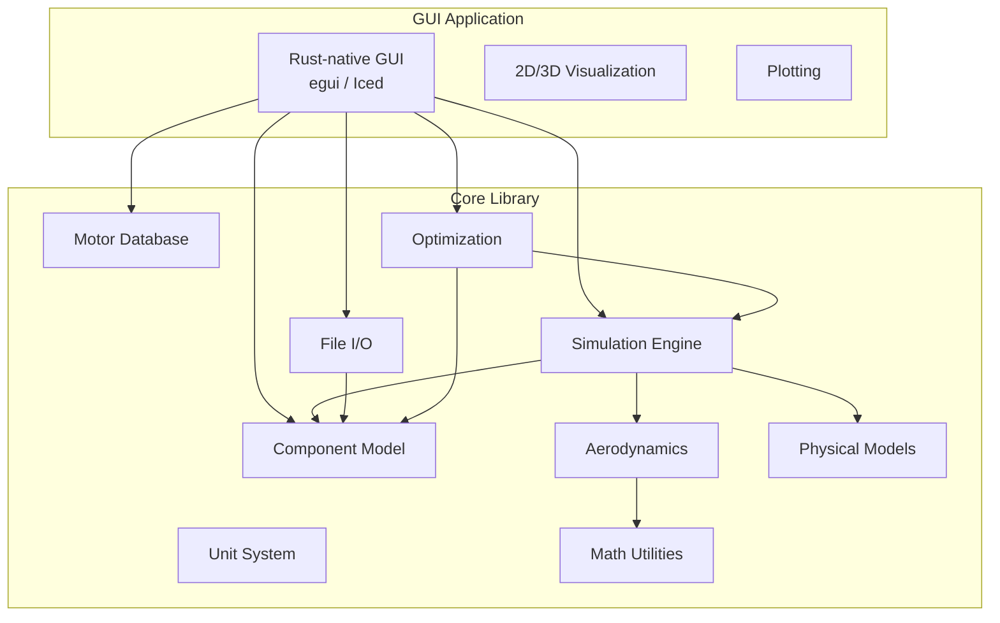

# Software Requirements Specification — federated-rocket

| **Document Version** | 1.0 |
|---|---|
| **Date** | 2026-05-25 |
| **Status** | Draft |
| **Author** | Architect Mode |
| **Project** | federated-rocket — Rust port of OpenRocket |

---

| Revision | Date | Description | Author |
|---|---|---|---|
| 1.0 | 2026-05-25 | Initial SRS draft | Abhishek Kumar |

---

## Table of Contents

1. [Introduction](#1-introduction)
   - 1.1 [Purpose](#11-purpose)
   - 1.2 [Document Conventions](#12-document-conventions)
   - 1.3 [Intended Audience](#13-intended-audience)
   - 1.4 [Product Scope](#14-product-scope)
   - 1.5 [References](#15-references)
2. [General Description](#2-general-description)
   - 2.1 [Product Perspective](#21-product-perspective)
   - 2.2 [Product Functions](#22-product-functions)
   - 2.3 [User Characteristics](#23-user-characteristics)
   - 2.4 [Assumptions and Dependencies](#24-assumptions-and-dependencies)
3. [Functional Requirements](#3-functional-requirements)
   - [FR-1: Rocket Component Model](#fr-1-rocket-component-model)
   - [FR-2: Unit System](#fr-2-unit-system)
   - [FR-3: Material System](#fr-3-material-system)
   - [FR-4: Physical Models](#fr-4-physical-models)
   - [FR-5: Aerodynamics](#fr-5-aerodynamics)
   - [FR-6: File I/O](#fr-6-file-io)
   - [FR-7: Motor Database](#fr-7-motor-database)
   - [FR-8: Simulation Engine](#fr-8-simulation-engine)
   - [FR-9: Design Optimization](#fr-9-design-optimization)
   - [FR-10: Plugin System](#fr-10-plugin-system)
   - [FR-11: GUI](#fr-11-gui)
4. [Non-Functional Requirements](#4-non-functional-requirements)
5. [External Interface Requirements](#5-external-interface-requirements)
6. [Rust Crate Architecture (Preliminary)](#6-rust-crate-architecture-preliminary)

---

## 1. Introduction

### 1.1 Purpose

The purpose of this Software Requirements Specification (SRS) is to define the functional and non-functional requirements for **federated-rocket**, a full port of the [OpenRocket](https://github.com/openrocket/openrocket) model rocket simulator from Java to Rust. OpenRocket is a mature, ~800-file application spanning a core library (~450+ files) and a Swing-based GUI (~350+ files). This SRS captures the complete domain model, simulation engine, aerodynamics, file I/O, and UI requirements needed to achieve feature parity while leveraging Rust's safety guarantees, performance characteristics, and modern tooling.

The port is motivated by:

- **Memory safety**: Rust's ownership model eliminates entire classes of bugs (null pointer dereferences, buffer overflows, use-after-free) without requiring a garbage collector.
- **Performance**: Zero-cost abstractions, LLVM-backed optimizations, and fine-grained control over memory layout enable simulations at or exceeding Java speeds.
- **Cross-platform distribution**: Rust compiles to native binaries for Windows, macOS, and Linux with minimal runtime dependencies.
- **Modern tooling**: Cargo build system, integrated testing, documentation generation, and a rich crate ecosystem.
- **Concurrency without fear**: The type system guarantees thread safety, critical for responsive GUI + background simulation threading.

### 1.2 Document Conventions

- Requirement IDs follow the pattern `FR-N.M` (Functional Requirement, Section N, Item M) and `NFR-N` (Non-Functional Requirement).
- Keywords **MUST**, **MUST NOT**, **REQUIRED**, **SHALL**, **SHALL NOT**, **SHOULD**, **SHOULD NOT**, **RECOMMENDED**, **MAY**, and **OPTIONAL** are interpreted as described in RFC 2119.
- Code references use inline backticks for Rust identifiers and file paths.
- Cross-references to the original OpenRocket source code are provided where relevant for traceability.

### 1.3 Intended Audience

This document is intended for:

- **Development team**: Architects, engineers, and contributors implementing the federated-rocket codebase.
- **Maintainers**: Individuals responsible for long-term upkeep, release management, and community contributions.
- **Technical reviewers**: Domain experts validating that the port accurately reproduces OpenRocket's behavior.
- **Test engineers**: QA personnel designing test suites to verify correctness and feature parity.

### 1.4 Product Scope

**federated-rocket** is a Rust-native model rocket simulation application that provides:

- A full-featured **rocket design workspace** supporting all OpenRocket component types with component tree navigation, 2D/3D visualization, and configuration panels.
- A **6-DOF flight simulation engine** with RK4 and RK6 numerical integrators, event-based simulation framework, and full data logging.
- **Aerodynamic calculations** using the Barrowman method with supersonic lookup table corrections.
- **File format compatibility** with OpenRocket `.ork`, RockSim `.rkt`, and RASAero II `.CDX1` formats, plus export to OBJ, SVG, and CSV.
- A **motor database** integrated with ThrustCurve.org, backed by SQLite for local storage.
- **Design optimization** capabilities for single and multi-parameter optimization.
- A **plugin and scripting system** for extensibility.

The product is a **direct replacement** for OpenRocket, targeting feature parity for all core simulation and design capabilities. The GUI layer replaces Swing with a Rust-native GUI framework.

### 1.5 References

| Reference | Description |
|---|---|
| [OpenRocket Source](https://github.com/openrocket/openrocket) | Original Java source code, commit history, and documentation |
| [OpenRocket Technical Document](openrocket/doc/techdoc/techdoc.pdf) | Theoretical foundations: Barrowman method, wind models, simulation algorithms |
| [OpenRocket File Format Specification](openrocket/docs/source/dev_guide/file_specification.rst) | `.ork` XML schema documentation |
| [OpenRocket Motor Database Schema](openrocket/docs/source/dev_guide/motor_database_schema.rst) | SQLite schema for motor database |
| [ThrustCurve.org API](https://www.thrustcurve.org/) | REST API for motor search and download |
| Rust RFCs | rust-lang RFCs for language evolution |
| [egui](https://github.com/emilk/egui) | Immediate-mode GUI crate (candidate) |
| [Iced](https://github.com/iced-rs/iced) | Elm-architecture GUI crate (candidate) |
| [Rhai](https://rhai.rs/) | Rust-native scripting language (candidate) |
| [uom](https://github.com/iliekturtles/uom) | Type-safe units of measurement (candidate) |
| [nalgebra](https://nalgebra.org/) | Linear algebra crate (candidate) |
| [rusqlite](https://github.com/rusqlite/rusqlite) | SQLite bindings (candidate) |
| [quick-xml](https://github.com/tafia/quick-xml) | XML parser (candidate) |

---

## 2. General Description

### 2.1 Product Perspective

federated-rocket is a **standalone replacement** for OpenRocket. It is not a wrapper or binding around the Java codebase; it is a clean-slate Rust implementation that reproduces the same behavior. The product comprises:

- A **core library** (`federated-rocket-core` and associated sub-crates) that contains all domain logic, simulation engine, aerodynamics calculations, file I/O, and database access. This library can be used independently in headless/CI environments.
- A **GUI application** that provides the interactive design and analysis experience.

The relationship between components can be illustrated as follows:



### 2.2 Product Functions

The following table lists the major functional areas of the product:

| Functional Area | Description |
|---|---|
| **Rocket Design** | Create, edit, and visualize model rocket designs through a component tree with drag-and-drop, configuration panels, and undo/redo. |
| **Component Modeling** | Define all physical rocket components (nose cones, body tubes, fins, parachutes, etc.) with precise positioning and material properties. |
| **Flight Simulation** | Run 6-DOF simulations using RK4/RK6 integration with full event handling (launch, motor ignition, staging, apogee, deployment, landing). |
| **Aerodynamic Analysis** | Calculate drag coefficients, center of pressure, stability margins, and fin flutter velocities using the Barrowman method with supersonic corrections. |
| **Design Optimization** | Optimize rocket parameters (dimensions, positions, mass) against goals (max altitude, max velocity, stability margin) using single/multi-parameter search. |
| **File Import/Export** | Read and write OpenRocket `.ork`, RockSim `.rkt`, RASAero II `.CDX1` formats; export to OBJ, SVG, and CSV. |
| **Motor Management** | Browse, search, and download motor thrust curves from ThrustCurve.org; manage a local SQLite-backed motor database. |
| **Custom Expressions** | Define user-specified simulation output variables using mathematical expressions. |
| **Simulation Extensions** | Extend simulation behavior through plugins (air start, roll control, custom events). |
| **Reporting** | Generate PDF documents (fin marking guides, parts lists) and CSV data exports. |

### 2.3 User Characteristics

| User Group | Description | Key Needs |
|---|---|---|
| **Hobbyist rocketeers** | Enthusiasts building and flying model rockets (low-power through high-power). | Intuitive design tools, realistic simulation, motor selection, flight prediction. |
| **Competition teams** | Students and teams in rocketry competitions (e.g., TARC, IREC, Spaceport America Cup). | Accurate simulation, optimization, detailed analysis data, export capabilities. |
| **Educators** | Teachers using rocketry to teach physics, engineering, and mathematics. | Clear visualization, simplified interface, educational documentation. |
| **Motor manufacturers** | Companies producing rocket motors. | Motor data upload, thrust curve dissemination. |
| **Software developers** | Contributors extending federated-rocket or integrating the core library. | Well-documented API, plugin system, scripting support, open-source codebase. |

### 2.4 Assumptions and Dependencies

**Assumptions:**

1. The user has a working Rust toolchain (rustc, cargo) for building from source.
2. Binary distributions will be provided for Windows (x86_64), macOS (x86_64, aarch64), and Linux (x86_64).
3. The original OpenRocket `.ork` file format evolves slowly; the implementation targets the current format as of the time of development.
4. ThrustCurve.org API remains available and backwards-compatible.
5. Users have basic understanding of model rocketry concepts (center of pressure, center of gravity, stability margin, motor impulse classes).
6. GPU acceleration for 3D rendering is available (through the target GUI framework or dedicated graphics crate).
7. SQLite is available or compiled in as a static library.

**Dependencies:**

| Dependency | Purpose | Candidate |
|---|---|---|
| **Rust compiler** | Language toolchain | rustc 1.80+ |
| **GUI framework** | Desktop UI | egui or Iced |
| **3D rendering** | Rocket figure visualization | `three-d`, `wgpu`, or built into GUI framework |
| **Plotting** | Simulation results charting | `plotters` or `egui_plot` |
| **SQLite** | Motor database storage | `rusqlite` |
| **XML parsing** | `.ork` and `.rkt` file format parsing | `quick-xml` |
| **CSV parsing** | Motor thrust curve data | `csv` |
| **Math/linear algebra** | 3D transformations, coordinates | `nalgebra` |
| **Units of measure** | Type-safe unit conversions | `uom` or custom |
| **HTTP client** | ThrustCurve.org API calls | `reqwest` |
| **PDF generation** | Fin marking guide, parts list | `printpdf` or `genpdf` |
| **Scripting engine** | User-defined simulation scripts | `Rhai` |
| **Serialization** | Configuration/settings persistence | `serde` + `ron` or `toml` |
| **CLI argument parsing** | Command-line interface | `clap` |
| **Logging** | Application diagnostics | `log` + `env_logger` |
| **Testing** | Property-based testing | `proptest` or `quickcheck` |

---

## 3. Functional Requirements

### FR-1: Rocket Component Model

The component model is the central domain model of the application. Rockets are represented as a tree structure with [`Rocket`](openrocket/core/src/main/java/info/openrocket/core/rocketcomponent/Rocket.java) as the root, composed of stages and individual components, each with positioning relative to its parent.

```mermaid
classDiagram
    class RocketComponent {
        <<abstract>>
        +String name
        +Material material
        +double axialOffset
        +double radialOffset
        +double angleOffset
        +boolean isAerodynamic()
        +boolean isMotorMount()
        +Coordinate toAbsolute(Coordinate)
    }
    class Rocket {
        +FlightConfiguration selectedConfiguration
        +AxialStage[] stages
        +addComponent()
        +removeComponent()
    }
    class ComponentAssembly {
        <<abstract>>
    }
    class AxialStage {
        +int stageNumber
    }
    class ParallelStage
    class PodSet
    class SymmetricComponent {
        <<abstract>>
        +double length
        +double outerRadius
        +double innerRadius
    }
    class NoseCone {
        +Shape shape
        +double thickness
        +boolean aftShoulder
    }
    class Transition {
        +double aftRadius
        +double foreRadius
        +Shape shape
    }
    class BodyTube
    class FinSet {
        <<abstract>>
        +int finCount
        +double rootChord
        +double tipChord
        +double sweepAngle
        +double span
        +double thickness
    }
    class TrapezoidFinSet
    class EllipticalFinSet
    class FreeformFinSet
    class TubeFinSet
    class LaunchLug
    class RailButton
    class InnerTube
    class CenteringRing
    class Bulkhead
    class EngineBlock
    class TubeCoupler
    class MassComponent
    class MassObject
    class ShockCord
    class Parachute
    class Streamer
    class Sleeve
    class InternalComponent
    class RingComponent
    class ExternalComponent
    class StructuralComponent
    class ThicknessRingComponent
    class RadiusRingComponent
    class RecoveryDevice
    class MotorMount

    Rocket --> RocketComponent : root
    RocketComponent --> RocketComponent : parent/children
    RocketComponent <|-- ComponentAssembly
    ComponentAssembly <|-- AxialStage
    ComponentAssembly <|-- ParallelStage
    ComponentAssembly <|-- PodSet
    ComponentAssembly <|-- Sleeve
    ComponentAssembly <|-- Rocket
    RocketComponent <|-- SymmetricComponent
    SymmetricComponent <|-- NoseCone
    SymmetricComponent <|-- Transition
    SymmetricComponent <|-- BodyTube
    RocketComponent <|-- FinSet
    FinSet <|-- TrapezoidFinSet
    FinSet <|-- EllipticalFinSet
    FinSet <|-- FreeformFinSet
    FinSet <|-- TubeFinSet
    RocketComponent <|-- InternalComponent
    InternalComponent <|-- InnerTube
    InternalComponent <|-- CenteringRing
    InternalComponent <|-- Bulkhead
    InternalComponent <|-- EngineBlock
    InternalComponent <|-- TubeCoupler
    RocketComponent <|-- ExternalComponent
    ExternalComponent <|-- LaunchLug
    ExternalComponent <|-- RailButton
    ExternalComponent <|-- MassObject
    RocketComponent <|-- RingComponent
    RingComponent <|-- CenteringRing
    RingComponent <|-- TubeCoupler
    RingComponent <|-- EngineBlock
    RocketComponent <|-- MassComponent
    RocketComponent <|-- ShockCord
    RocketComponent <|-- RecoveryDevice
    RecoveryDevice <|-- Parachute
    RecoveryDevice <|-- Streamer
    RocketComponent <|-- StructuralComponent
    StructuralComponent <|-- MassComponent
    StructuralComponent <|-- MassObject
    StructuralComponent <|-- ShockCord
    RocketComponent <|-- RadiusRingComponent
    RadiusRingComponent <|-- Sleeve
    RocketComponent <|-- MotorMount
    MotorMount <|-- InnerTube
    MotorMount <|-- BodyTube
```



#### FR-1.1: Component Tree Hierarchy

The root of every rocket model **MUST** be a `Rocket` instance. The component tree **MUST** support:
- Arbitrary nesting of stage components (`AxialStage`, `ParallelStage`) within the root.
- `PodSet` containing any component types (pods attached radially to a parent stage).
- `Sleeve` components wrapping around body tubes.
- All recovery devices (`Parachute`, `Streamer`) placed within stages.
- `InternalComponent` types (`InnerTube`, `CenteringRing`, `Bulkhead`, `EngineBlock`, `TubeCoupler`) positioned inside body tubes.
- `ExternalComponent` types (`LaunchLug`, `RailButton`, `MassObject`) attached to the outside of body tubes.

#### FR-1.2: Component Types

The following component types **MUST** be implemented with exact geometric and behavioral parity to OpenRocket. Each type **SHOULD** include the key parameters listed:

| Component | Key Parameters | Source File |
|---|---|---|
| **NoseCone** | Shape (ogive, conical, elliptical, parabollic, power series, haack), length, outer radius, thickness, aft shoulder enabled, shape parameter | [`NoseCone.java`](openrocket/core/src/main/java/info/openrocket/core/rocketcomponent/NoseCone.java) |
| **BodyTube** | Length, outer radius, inner radius/thickness | [`BodyTube.java`](openrocket/core/src/main/java/info/openrocket/core/rocketcomponent/BodyTube.java) |
| **Transition** | Fore radius, aft radius, length, shape, thickness | [`Transition.java`](openrocket/core/src/main/java/info/openrocket/core/rocketcomponent/Transition.java) |
| **TrapezoidFinSet** | Fin count, root chord, tip chord, sweep angle, span, thickness, cant angle, cross-section shape (rounded, square, airfoil) | [`TrapezoidFinSet.java`](openrocket/core/src/main/java/info/openrocket/core/rocketcomponent/TrapezoidFinSet.java) |
| **EllipticalFinSet** | Fin count, root chord, span, thickness, cant angle | [`EllipticalFinSet.java`](openrocket/core/src/main/java/info/openrocket/core/rocketcomponent/EllipticalFinSet.java) |
| **FreeformFinSet** | Fin count, user-defined polygon points, thickness, cant angle | [`FreeformFinSet.java`](openrocket/core/src/main/java/info/openrocket/core/rocketcomponent/FreeformFinSet.java) |
| **TubeFinSet** | Tube count, tube length, tube outer radius, tube thickness, cant angle, radial pattern | [`TubeFinSet.java`](openrocket/core/src/main/java/info/openrocket/core/rocketcomponent/TubeFinSet.java) |
| **Parachute** | Diameter, drag coefficient, deployment altitude, spill hole diameter | [`Parachute.java`](openrocket/core/src/main/java/info/openrocket/core/rocketcomponent/Parachute.java) |
| **Streamer** | Length, width, drag coefficient, deployment altitude | [`Streamer.java`](openrocket/core/src/main/java/info/openrocket/core/rocketcomponent/Streamer.java) |
| **LaunchLug** | Outer radius, inner radius, length, position | [`LaunchLug.java`](openrocket/core/src/main/java/info/openrocket/core/rocketcomponent/LaunchLug.java) |
| **RailButton** | Outer radius, inner radius, length, height, position | [`RailButton.java`](openrocket/core/src/main/java/info/openrocket/core/rocketcomponent/RailButton.java) |
| **InnerTube** | Length, outer radius, inner radius | [`InnerTube.java`](openrocket/core/src/main/java/info/openrocket/core/rocketcomponent/InnerTube.java) |
| **CenteringRing** | Outer radius, inner radius, length, thickness | [`CenteringRing.java`](openrocket/core/src/main/java/info/openrocket/core/rocketcomponent/CenteringRing.java) |
| **Bulkhead** | Outer radius, thickness | [`Bulkhead.java`](openrocket/core/src/main/java/info/openrocket/core/rocketcomponent/Bulkhead.java) |
| **EngineBlock** | Outer radius, inner radius, length | [`EngineBlock.java`](openrocket/core/src/main/java/info/openrocket/core/rocketcomponent/EngineBlock.java) |
| **TubeCoupler** | Length, outer radius, inner radius | [`TubeCoupler.java`](openrocket/core/src/main/java/info/openrocket/core/rocketcomponent/TubeCoupler.java) |
| **MassComponent** | Mass, position, radius | [`MassComponent.java`](openrocket/core/src/main/java/info/openrocket/core/rocketcomponent/MassComponent.java) |
| **MassObject** | Mass, position, radius, length, shape (cylindrical, parabolic, custom) | [`MassObject.java`](openrocket/core/src/main/java/info/openrocket/core/rocketcomponent/MassObject.java) |
| **ShockCord** | Length, mass, cord thickness | [`ShockCord.java`](openrocket/core/src/main/java/info/openrocket/core/rocketcomponent/ShockCord.java) |
| **Sleeve** | Length, outer radius, inner radius | [`Sleeve.java`](openrocket/core/src/main/java/info/openrocket/core/rocketcomponent/Sleeve.java) |
| **PodSet** | Booster count, radial position, angular spacing | [`PodSet.java`](openrocket/core/src/main/java/info/openrocket/core/rocketcomponent/PodSet.java) |
| **AxialStage** | Stage number, separation configuration | [`AxialStage.java`](openrocket/core/src/main/java/info/openrocket/core/rocketcomponent/AxialStage.java) |
| **ParallelStage** | Separation configuration, drop-off configuration | [`ParallelStage.java`](openrocket/core/src/main/java/info/openrocket/core/rocketcomponent/ParallelStage.java) |

#### FR-1.3: Component Positioning

Each component **MUST** support three positioning axes relative to its parent:

- **Axial position**: Position along the rocket centerline, specified via an [`AxialMethod`](openrocket/core/src/main/java/info/openrocket/core/rocketcomponent/position/AxialMethod.java) (ABSOLUTE, AFTER, TOP, MIDDLE, BOTTOM) and an axial offset distance.
- **Radial position**: Distance from the centerline, specified via a [`RadiusMethod`](openrocket/core/src/main/java/info/openrocket/core/rocketcomponent/position/RadiusMethod.java) and radial offset.
- **Angular position**: Rotation angle around the centerline, specified via an [`AngleMethod`](openrocket/core/src/main/java/info/openrocket/core/rocketcomponent/position/AngleMethod.java).

The coordinate system **MUST** use SI units internally (meters, radians) and **MUST** support conversion to/from the `Coordinate` and `Transformation` types used by the aerodynamic and simulation subsystems.

#### FR-1.4: Flight Configuration Mapping

A [`FlightConfiguration`](openrocket/core/src/main/java/info/openrocket/core/rocketcomponent/FlightConfiguration.java) maps motor instances to motor mounts across a rocket. The system **MUST** support:

- Multiple named flight configurations per rocket document.
- Assignment of a motor (from the motor database) to any motor mount component.
- Saving and loading of flight configurations in `.ork` files.
- A single **default configuration** auto-generated from the rocket.

Each motor mount (identified by `FlightConfigurationId`) **MUST** allow selection of a specific motor instance, and the configuration **MUST** be independent of the component tree structure (i.e., configurations survive component reordering).

#### FR-1.5: Undo/Redo Support

The component model **MUST** integrate with a global undo/redo system:

- **SHOULD** use a command pattern where every mutation (add component, remove component, modify property) generates an undoable command.
- **MUST** support at minimum 50 undo levels ([`OpenRocketDocument.UNDO_LEVELS`](openrocket/core/src/main/java/info/openrocket/core/document/OpenRocketDocument.java:68)).
- **MUST** fire `ComponentChangeEvent` on each mutation to notify listeners (GUI panels, visualization, aerodynamic cache validator).
- **MUST** support freezing/thawing of change events to batch related mutations (e.g., during file import).

### FR-2: Unit System

#### FR-2.1: SI Internal Storage

All physical quantities **MUST** be stored internally in SI base units:
- Length: meters
- Mass: kilograms
- Angle: radians
- Temperature: Kelvin
- Pressure: Pascals
- Velocity: meters/second
- Acceleration: meters/second²
- Force: Newtons
- Density: kilograms/meter³
- Frequency: Hertz
- Impulse: Newton-seconds

#### FR-2.2: Display Unit Conversion

The system **MUST** provide bidirectional conversion between SI and all commonly used display units for model rocketry:

| Quantity | Supported Display Units |
|---|---|
| Length | m, cm, mm, in, ft, yd |
| Mass | kg, g, oz, lb |
| Angle | deg, rad |
| Temperature | K, °C, °F |
| Pressure | Pa, kPa, atm, psi, inHg |
| Velocity | m/s, km/h, ft/s, mph, knot |
| Force | N, lbf, kgf |
| Density | kg/m³, g/cm³, lb/in³ |
| Frequency | Hz, kHz |
| Impulse | Ns, lbf·s |
| Diameter/Caliber | mm, in (caliber as multiple of reference diameter) |

#### FR-2.3: User-Configurable Display Units

The user **MUST** be able to independently select the display unit for each measurement type via the preferences/settings UI. The system **MUST** persist these preferences across sessions.

### FR-3: Material System

#### FR-3.1: Material Types

Three material types **MUST** be supported, matching the original OpenRocket [`Material`](openrocket/core/src/main/java/info/openrocket/core/material/Material.java) model:

| Type | Description | Density Application |
|---|---|---|
| **BULK** | Solid materials (wood, plastic, metal, fiberglass) | Density × volume = mass |
| **SURFACE** | Finishing materials (paint, primer) | Density × surface area = mass |
| **LINE** | Linear materials (shock cord, wire) | Linear density × length = mass |

#### FR-3.2: Predefined and User-Defined Materials

- **Predefined materials** **MUST** be shipped with the application, organized into groups (e.g., "Woods", "Metals", "Plastics", "Fiberglass & Composites", "Paper & Cardboard", "Finishing").
- **User-defined materials** **MUST** be addable, editable, and persistable. The user **MUST** be able to specify material name, type, and density.
- Material storage **MUST** be compatible with the `.ork` file format for exchange.

#### FR-3.3: Material Properties

Each material instance **MUST** store:
- **Name** (unique identifier string)
- **Type** (BULK | SURFACE | LINE)
- **Density** in SI units (kg/m³ for bulk, kg/m² for surface, kg/m for line)
- **Group membership** (optional, for UI organization)

### FR-4: Physical Models

#### FR-4.1: Atmosphere Models

The simulation **MUST** support the following atmospheric models:

- **Extended ISA (International Standard Atmosphere)**: The standard atmospheric model used as the default ([`ExtendedISAModel`](openrocket/core/src/main/java/info/openrocket/core/models/atmosphere/ExtendedISAModel.java)). Computes temperature, pressure, and density as functions of altitude above mean sea level.
- **Interpolating atmosphere model**: Reads atmospheric data from a user-provided table (altitude, temperature, pressure) and interpolates ([`InterpolatingAtmosphericModel`](openrocket/core/src/main/java/info/openrocket/core/models/atmosphere/InterpolatingAtmosphericModel.java)).

Each model **MUST** implement the [`AtmosphericModel`](openrocket/core/src/main/java/info/openrocket/core/models/atmosphere/AtmosphericModel.java) interface providing:
- `getTemperature(double altitudeMSL) -> Kelvin`
- `getPressure(double altitudeMSL) -> Pascals`
- `getDensity(double altitudeMSL) -> kg/m³`

#### FR-4.2: Gravity Models

The simulation **MUST** support:

- **Constant gravity model**: Fixed acceleration of 9.80665 m/s² downward ([`ConstantGravityModel`](openrocket/core/src/main/java/info/openrocket/core/models/gravity/ConstantGravityModel.java)).
- **WGS84 ellipsoid gravity model**: Latitude-dependent gravity based on the World Geodetic System 1984 ellipsoid ([`WGSGravityModel`](openrocket/core/src/main/java/info/openrocket/core/models/gravity/WGSGravityModel.java)).

The user **SHOULD** be able to select between models in simulation options.

#### FR-4.3: Wind Models

The simulation **MUST** support:

- **Pink noise wind model**: Generates realistic wind variations using pink noise (1/f) spectral characteristics as a function of time ([`PinkNoiseWindModel`](openrocket/core/src/main/java/info/openrocket/core/models/wind/PinkNoiseWindModel.java)). Configurable parameters: average speed, turbulence intensity, and direction.
- **Multi-level pink noise wind model**: Combines multiple pink noise layers with different time constants to produce more complex wind profiles ([`MultiLevelPinkNoiseWindModel`](openrocket/core/src/main/java/info/openrocket/core/models/wind/MultiLevelPinkNoiseWindModel.java)).
- **User-defined wind model**: Users **MAY** supply a custom wind profile.

All wind models **MUST** implement the [`WindModel`](openrocket/core/src/main/java/info/openrocket/core/models/wind/WindModel.java) interface providing `getWindVelocity(time, altitudeMSL, altitudeAGL) -> CoordinateIF` (3D wind vector).

### FR-5: Aerodynamics

#### FR-5.1: Barrowman Method

The system **MUST** implement the extended Barrowman method for subsonic aerodynamic calculations ([`BarrowmanCalculator`](openrocket/core/src/main/java/info/openrocket/core/aerodynamics/BarrowmanCalculator.java)), which delegates to separate calculators for stability and drag:

- **Stability calculation** ([`BarrowmanStabilityCalculator`](openrocket/core/src/main/java/info/openrocket/core/aerodynamics/BarrowmanStabilityCalculator.java)): Computes the center of pressure (CP) location and normal force coefficient (C_N) for each component using component-specific calculators:
  - [`SymmetricComponentCalc`](openrocket/core/src/main/java/info/openrocket/core/aerodynamics/barrowman/SymmetricComponentCalc.java) — Nose cones, transitions, body tubes (nose CP at calculated position, tube CP at midpoint)
  - [`FinSetCalc`](openrocket/core/src/main/java/info/openrocket/core/aerodynamics/barrowman/FinSetCalc.java) — Fins with interference factor from body diameter
  - [`LaunchLugCalc`](openrocket/core/src/main/java/info/openrocket/core/aerodynamics/barrowman/LaunchLugCalc.java)
  - [`RailButtonCalc`](openrocket/core/src/main/java/info/openrocket/core/aerodynamics/barrowman/RailButtonCalc.java)
  - [`TubeCalc`](openrocket/core/src/main/java/info/openrocket/core/aerodynamics/barrowman/TubeCalc.java)
  - [`TubeFinSetCalc`](openrocket/core/src/main/java/info/openrocket/core/aerodynamics/barrowman/TubeFinSetCalc.java)

- **Drag calculation** ([`BarrowmanDragCalculator`](openrocket/core/src/main/java/info/openrocket/core/aerodynamics/BarrowmanDragCalculator.java)): Computes component-level drag contributions (pressure drag, base drag, skin friction drag) and sums to total drag coefficient.

- **Force analysis** ([`AerodynamicForces`](openrocket/core/src/main/java/info/openrocket/core/aerodynamics/AerodynamicForces.java)): Returns per-component and per-assembly force breakdown including lift, drag, pitch moment, and CP location.

#### FR-5.2: Supersonic Corrections

For transonic and supersonic flight regimes, the system **MUST** supplement the Barrowman method with lookup table corrections:

- **Lookup table drag calculator** ([`LookupTableDragCalculator`](openrocket/core/src/main/java/info/openrocket/core/aerodynamics/LookupTableDragCalculator.java)): Uses Mach/AoA tables (loaded from CSV files by [`CsvMachAoALookup`](openrocket/core/src/main/java/info/openrocket/core/aerodynamics/lookup/CsvMachAoALookup.java)) to provide drag coefficient corrections above Mach ~0.4.
- **Lookup table stability calculator** ([`LookupTableStabilityCalculator`](openrocket/core/src/main/java/info/openrocket/core/aerodynamics/LookupTableStabilityCalculator.java)): Provides CP position corrections at supersonic speeds.
- The lookup tables **MUST** implement the [`MachAoALookup`](openrocket/core/src/main/java/info/openrocket/core/aerodynamics/lookup/MachAoALookup.java) interface, supporting interpolation over Mach number and angle of attack.

#### FR-5.3: Component-Level Drag Calculation

The system **MUST** compute drag contributions for each aerodynamic component:

| Drag Component | Applicable To |
|---|---|
| **Pressure (form) drag** | Nose cones, transitions, body tubes (function of shape, fineness ratio) |
| **Base drag** | Base of rocket, staging transitions |
| **Skin friction drag** | All exposed surfaces (body tubes, fins) — laminar and turbulent based on Reynolds number |
| **Interference drag** | Fin-body junction, between stacked components |
| **Fin drag** | Profile drag of fin cross-section (subsonic/supersonic regime) |

#### FR-5.4: Fin Flutter Analysis

The system **MUST** compute the fin flutter velocity for each fin set using standard aeroelastic analysis. This calculation considers:
- Fin material properties (Young's modulus, density)
- Fin geometry (aspect ratio, thickness ratio, sweep)
- Speed of sound at current altitude
- The result is a critical velocity above which fin flutter may occur.

#### FR-5.5: Dynamic Stability Computation

The system **MUST** compute static stability margin as the distance between CG and CP divided by the reference diameter (in calibers). The **recommended** stability margin is 1.0–2.0 calibers.

### FR-6: File I/O

#### FR-6.1: OpenRocket .ork Import

The system **MUST** import `.ork` files with the following characteristics:

- Format: ZIP-compressed XML with optional embedded attachments (decal images, motor files).
- XML structure: The document root is `<openrocket>` containing `<rocket>` (component tree), `<simulations>` (simulation configurations), `<materials>` (material database), and `<customdata>` (custom expressions).
- Component XML elements **MUST** be deserialized into the corresponding Rust component types with all properties (dimensions, positioning, colors, materials, appearances) preserved exactly.
- The importer **MUST** handle the full complement of component types listed in FR-1.2.
- The default [`GeneralRocketLoader`](openrocket/core/src/main/java/info/openrocket/core/file/GeneralRocketLoader.java) SAX-based parsing approach **SHOULD** be translated to an equivalent Rust XML reader (e.g., `quick-xml` event-based parsing).

#### FR-6.2: OpenRocket .ork Export

The system **MUST** export `.ork` files that are **110% binary-identical** to the files produced by OpenRocket for the same rocket design (i.e., fully backwards-compatible). The exporter **MUST**:

- Reconstruct the same ZIP structure (ZIP with compressed XML entry + optional attachments).
- Use the same XML schema, element ordering, and attribute naming.
- Preserve all simulation configurations, custom expressions, and material data.
- Use the per-component [`saver` pattern](openrocket/core/src/main/java/info/openrocket/core/file/openrocket/savers/) for serialization.

#### FR-6.3: RockSim .rkt Import

The system **MUST** import legacy RockSim `.rkt` files:

- Parse the fixed-format or XML RockSim file structure.
- Map RockSim component types to the closest OpenRocket equivalents.
- Handle RockSim-specific properties (finish codes, density types, location modes) via the mapping infrastructure in [`RockSimCommonConstants`](openrocket/core/src/main/java/info/openrocket/core/file/rocksim/RockSimCommonConstants.java), [`RockSimDensityType`](openrocket/core/src/main/java/info/openrocket/core/file/rocksim/RockSimDensityType.java), etc.
- Support both body-mounted and pod-mounted components.
- Log warnings for any features that cannot be perfectly translated.

#### FR-6.4: RASAero II Import/Export

The system **MUST** import and export RASAero II `.CDX1` files:

- Implement the XML-based RASAero II format handlers for both import ([`RASAeroLoader`](openrocket/core/src/main/java/info/openrocket/core/file/rasaero/importt/RASAeroLoader.java)) and export ([`RASAeroSaver`](openrocket/core/src/main/java/info/openrocket/core/file/rasaero/export/RASAeroSaver.java)).
- Map between RASAero II component types and OpenRocket component types.
- RASAero II uses a different simulation model — import the rocket geometry only.

#### FR-6.5: Wavefront OBJ Export

The system **MUST** export rocket geometry as Wavefront `.obj` files with associated `.mtl` material files:

- Generate mesh geometry for all visible components (nose cones, transitions, body tubes, fins, launch lugs, rail buttons).
- Apply appearance properties (colors, textures) to the material file.
- Support configurable tessellation quality and reference frame orientation.

#### FR-6.6: SVG Export

The system **MUST** export the following as SVG:

- **Fin templates**: Full-scale fin outline with dimensions for cutting from sheet material. Uses [`FinSvgExporter`](openrocket/core/src/main/java/info/openrocket/core/file/svg/export/FinSvgExporter.java).
- **Rocket profile**: Side-view silhouette of the entire rocket. Uses [`ProfileSvgExporter`](openrocket/core/src/main/java/info/openrocket/core/file/svg/export/ProfileSvgExporter.java).
- **Component templates**: Ring components, tubes. Uses [`RingSvgExporter`](openrocket/core/src/main/java/info/openrocket/core/file/svg/export/RingSvgExporter.java), [`TubeSvgExporter`](openrocket/core/src/main/java/info/openrocket/core/file/svg/export/TubeSvgExporter.java).
- **Transition templates**: Nose cone and transition outlines.

#### FR-6.7: CSV Export

The system **MUST** export simulation data as CSV files:

- Export all `FlightDataType` columns recorded during a simulation.
- Support selection of which data branches to export.
- Use configurable delimiter (default comma) and decimal separator.

### FR-7: Motor Database

#### FR-7.1: ThrustCurve.org Integration

The system **MUST** integrate with the ThrustCurve.org REST API for motor search and download:

- **Search**: Send a [`SearchRequest`](openrocket/core/src/main/java/info/openrocket/core/thrustcurve/SearchRequest.java) (by manufacturer, impulse class, diameter, length) and parse the [`SearchResponse`](openrocket/core/src/main/java/info/openrocket/core/thrustcurve/SearchResponse.java) JSON.
- **Download**: Download motor thrust curve files (`.eng`, `.rse` formats) via [`DownloadRequest`](openrocket/core/src/main/java/info/openrocket/core/thrustcurve/DownloadRequest.java) and parse the response.
- **Metadata**: Parse motor metadata from ThrustCurve.org including manufacturer, designation, diameter, length, total impulse, burn time, and delay options.

#### FR-7.2: Local Motor Storage

The system **MUST** maintain a local SQLite database for caching downloaded motors and managing user-added motors:

- Store motor metadata (manufacturer, designation, type, diameter, length, delays, propellant info).
- Store thrust curve data as time/thrust point arrays.
- Support full-text search by manufacturer name and motor designation.
- The database schema **MUST** be compatible with the existing [OpenRocket schema](openrocket/docs/source/dev_guide/motor_database_schema.rst).
- Support for importing motors from `.eng` (RASP) and `.rse` (RockSim) files.

#### FR-7.3: Thrust Curve Interpolation and Scaling

- Thrust curve data (discrete time/thrust points) **MUST** be interpolated at simulation timesteps using linear interpolation.
- Motors **SHOULD** support scaling: a motor's thrust curve can be scaled by a user-defined factor to approximate different propellant loads.
- The system **MUST** compute total impulse, average thrust, burn time, and peak thrust from the curve data.

#### FR-7.4: Manufacturer and Designation Management

- The system **MUST** maintain a list of motor manufacturers ([`Manufacturer`](openrocket/core/src/main/java/info/openrocket/core/motor/Manufacturer.java)) with name and abbreviation.
- Motor designations **MUST** be sortable using natural sort order (alphanumeric comparison via [`DesignationComparator`](openrocket/core/src/main/java/info/openrocket/core/motor/DesignationComparator.java)).
- Each motor **MUST** have a type classification: SINGLE, RELOAD, HYBRID, or UNKNOWN.

### FR-8: Simulation Engine

#### FR-8.1: 6-DOF Flight Simulation

The simulation engine ([`BasicEventSimulationEngine`](openrocket/core/src/main/java/info/openrocket/core/simulation/BasicEventSimulationEngine.java)) **MUST** perform 6-degree-of-freedom flight simulation:

- **State vector**: Position (x, y, z), velocity (vx, vy, vz), orientation (quaternion or Euler angles), angular velocity (p, q, r).
- **Forces**: Thrust (from motor), aerodynamic forces (drag, lift, normal), gravity.
- **Moments**: Aerodynamic pitch and yaw moments, damping moments, thrust misalignment.
- **Integration methods**:
  - **RK4** (4th-order Runge-Kutta) — [`RK4SimulationStepper`](openrocket/core/src/main/java/info/openrocket/core/simulation/RK4SimulationStepper.java)
  - **RK6** (6th-order Runge-Kutta) — [`RK6SimulationStepper`](openrocket/core/src/main/java/info/openrocket/core/simulation/RK6SimulationStepper.java)
  - Both integrators **MUST** use adaptive or fixed-step integration with configurable time step (default step size from OpenRocket ~0.001s during powered flight, adjustable).

#### FR-8.2: Event-Based Simulation Framework

The simulation **MUST** be driven by an event queue ([`EventQueue`](openrocket/core/src/main/java/info/openrocket/core/simulation/EventQueue.java)). The following flight events **MUST** be detected and handled:

| Event Type | Trigger Condition | Handling |
|---|---|---|
| LAUNCH | Simulation starts | Initialize state, configure rocket |
| IGNITION | Motor ignites (at t=0 or configured delay) | Begin thrust application |
| LIFTOFF | Net upward force > 0 | Record liftoff time |
| LAUNCHROD | Rocket clears launch rod | Transition to free flight |
| BURNOUT | Motor thrust drops near zero | End thrust phase |
| EJECTION_CHARGE | Motor delay charge fires | Trigger recovery deployment |
| STAGE_SEPARATION | Booster separates | Update rocket mass/geometry |
| APOGEE | Vertical velocity crosses zero | Record apogee, deploy recovery if configured |
| RECOVERY_DEVICE_DEPLOYMENT | Recovery device opens | Update drag area |
| GROUND_HIT | Altitude reaches ground | End simulation |
| SIMULATION_END | All events processed | Finalize flight data |

Each event **MUST** be timestamped with simulation time and associated with the source component.

#### FR-8.3: Simulation Event Listeners

The simulation **MUST** support a listener system ([`SimulationListener`](openrocket/core/src/main/java/info/openrocket/core/simulation/listeners/SimulationListener.java)):

- **Registration**: Listeners can be registered before simulation start.
- **Event notifications**: Fired at each flight event (pre-process and post-process hooks).
- **Stepping**: `postStep` notifications after each integration step for data logging.
- **Extensibility**: The listener interface **MUST** allow listeners to modify simulation state or abort the simulation.
- **System listeners** **SHOULD** be provided for standard behaviors (apogee detection, ground hit, recovery deployment, optimum coast calculation).

#### FR-8.4: Simulation Extensions

The simulation **MUST** support extensions ([`SimulationExtension`](openrocket/core/src/main/java/info/openrocket/core/simulation/extension/SimulationExtension.java)):

- Extensions are plugins that can modify simulation behavior.
- Built-in example extensions **SHOULD** include:
  - **Air start**: Ignite a motor at a specified altitude/velocity/time ([`AirStart`](openrocket/core/src/main/java/info/openrocket/core/simulation/extension/example/AirStart.java))
  - **Roll control**: Apply active roll damping during ascent ([`RollControl`](openrocket/core/src/main/java/info/openrocket/core/simulation/extension/example/RollControl.java))
  - **Damping moment**: Apply configurable pitch/yaw damping ([`DampingMoment`](openrocket/core/src/main/java/info/openrocket/core/simulation/extension/example/DampingMoment.java))
  - **Stop simulation**: Stop simulation at specified condition ([`StopSimulation`](openrocket/core/src/main/java/info/openrocket/core/simulation/extension/example/StopSimulation.java))
  - **CSV save**: Auto-export simulation data to CSV ([`CSVSave`](openrocket/core/src/main/java/info/openrocket/core/simulation/extension/example/CSVSave.java))

#### FR-8.5: Custom Expression Support

The system **MUST** support user-defined simulation data types via custom expressions ([`CustomExpression`](openrocket/core/src/main/java/info/openrocket/core/simulation/customexpression/CustomExpression.java)):

- Users can define mathematical expressions using simulation variables (altitude, velocity, acceleration, Mach number, time, etc.) and arithmetic operations.
- Expression parser **MUST** handle: basic arithmetic (+, -, *, /), trigonometric functions (sin, cos, tan), log/exp, min/max, conditional (if-then-else), and unit conversions.
- Custom expressions appear as additional data columns in simulation results.
- Expressions are persisted in the `.ork` file.

#### FR-8.6: Full Flight Data Logging

The simulation **MUST** produce comprehensive flight data stored in [`FlightData`](openrocket/core/src/main/java/info/openrocket/core/simulation/FlightData.java) / [`FlightDataBranch`](openrocket/core/src/main/java/info/openrocket/core/simulation/FlightDataBranch.java) structures:

- **Summary values**: Max altitude, max velocity, max acceleration, max Mach number, time to apogee, total flight time, ground hit velocity, launch rod velocity, deployment velocity, optimum delay.
- **Time-series data** for each `FlightDataType`:
  - Time, altitude (AGL, MSL), velocity (vertical, horizontal, total)
  - Acceleration (vertical, horizontal, total)
  - Mach number, drag coefficient (Cd, Ca, Cn)
  - Orientation (roll, pitch, yaw)
  - Position (latitude, longitude if using geodetic model)
  - Motor thrust, mass, CG location, CP location
  - Stability margin, Reynolds number
  - Atmospheric conditions (temperature, pressure, density)
  - Wind velocity at rocket position
  - Event flags
- **Branches**: Each flight event may spawn a new data branch (e.g., after stage separation, the simulation continues on a new branch).

#### FR-8.7: Multiple Simulation Configurations

The system **MUST** support:

- Storing multiple simulation configurations per rocket document.
- Each configuration specifies: flight configuration (motor assignment), simulation options (launch conditions, wind, atmosphere, integration method), and any associated simulation extensions.
- Running simulations sequentially or in parallel (thread-safe) for batch analysis.

### FR-9: Design Optimization

#### FR-9.1: Single-Parameter Optimization

The system **MUST** implement Golden Section search for single-parameter optimization ([`GoldenSectionSearchOptimizer`](openrocket/core/src/main/java/info/openrocket/core/optimization/general/onedim/GoldenSectionSearchOptimizer.java)):

- Search a user-defined parameter range for the optimal value.
- Convergence criteria: relative tolerance on parameter value and/or function value.

#### FR-9.2: Multi-Parameter Optimization

The system **MUST** implement multidirectional search (a direct search method) for multi-parameter optimization ([`MultidirectionalSearchOptimizer`](openrocket/core/src/main/java/info/openrocket/core/optimization/general/multidim/MultidirectionalSearchOptimizer.java)):

- Configure optimization over 2 or more parameters simultaneously.
- Handle interaction effects between parameters.

#### FR-9.3: Optimizable Parameters

The following parameters **MUST** be optimizable:

| Parameter Type | Examples |
|---|---|
| Component dimension | Nose cone length, body tube length, fin span, fin root chord, transition length, tube diameter |
| Component position | Axial position of any component |
| Mass override | Component mass override value |
| Motor selection | Motor designation (discrete optimization over available motors) |
| Flight configuration | Rail button height, launch rod length |

Parameters **MUST** be configurable with min/max bounds and a number of steps. Implement via [`GenericComponentModifier`](openrocket/core/src/main/java/info/openrocket/core/optimization/rocketoptimization/modifiers/GenericComponentModifier.java) and [`GenericModifier`](openrocket/core/src/main/java/info/openrocket/core/optimization/rocketoptimization/modifiers/GenericModifier.java) patterns.

#### FR-9.4: Optimization Goals

The following optimization goals **MUST** be supported:

| Goal | Description |
|---|---|
| **Maximum altitude** | Maximize apogee altitude ([`MaximumAltitudeParameter`](openrocket/core/src/main/java/info/openrocket/core/optimization/rocketoptimization/parameters/MaximumAltitudeParameter.java)) |
| **Maximum velocity** | Maximize peak velocity ([`MaximumVelocityParameter`](openrocket/core/src/main/java/info/openrocket/core/optimization/rocketoptimization/parameters/MaximumVelocityParameter.java)) |
| **Stability margin** | Achieve a target stability margin ([`StabilityParameter`](openrocket/core/src/main/java/info/openrocket/core/optimization/rocketoptimization/parameters/StabilityParameter.java)) |
| **Minimum ground hit velocity** | Minimize landing speed (maximize recovery effectiveness) |
| **Minimum deployment velocity** | Maximize recovery device opening safety |
| **Maximum flight time** | Extend total flight duration |

Goals can be **maximization**, **minimization**, or **value-seeking** (target a specific value).

### FR-10: Plugin System

#### FR-10.1: Plugin Discovery and Loading

The system **MUST** support a plugin system for extensibility:

- **Plugin discovery**: Scan a designated plugin directory at startup for loadable plugins.
- **Plugin loading**: Dynamically load plugin shared libraries (`.dll`, `.so`, `.dylib`) via a stable ABI or through Rust's `libloading` mechanism.
- **Annotations**: Use a registration mechanism (similar to the Java annotation scanning in [`AnnotationFinder`](openrocket/core/src/main/java/info/openrocket/core/plugin/AnnotationFinder.java)) to discover plugin capabilities.

#### FR-10.2: Plugin API

The plugin API **MUST** support:

| Extension Point | Description |
|---|---|
| **Custom component** | New component types with custom geometry and aerodynamic behavior |
| **Simulation extension** | Custom simulation behavior modifications (see FR-8.4) |
| **Custom data type** | New flight data types computed during simulation |
| **Custom aerodynamic calculator** | Alternative aerodynamic models replacing Barrowman |
| **Custom wind model** | User-defined wind profiles |
| **Custom optimization parameter** | New optimizable parameters |
| **Custom export format** | Additional file export formats |

#### FR-10.3: Scripting Support

The system **MUST** support a Rust-native scripting engine for user-defined behaviors. **Rhai** is the recommended candidate ([Rhai](https://rhai.rs/)):

- **Expression evaluation**: Evaluate user-defined custom expressions (FR-8.5) using the scripting engine.
- **Simulation scripts**: Allow users to write scripts that respond to flight events (e.g., "deploy drogue at Mach < 0.5 and altitude > 500m").
- **Script API**: Expose simulation state variables (altitude, velocity, time, acceleration, orientation) and event hooks to the scripting environment.
- **Sandboxing**: The scripting engine **MUST** execute in a sandboxed/restricted environment with no filesystem or network access.

The current OpenRocket uses [GraalVM JavaScript](openrocket/core/src/main/java/info/openrocket/core/scripting/GraalJSScriptEngineFactory.java); Rust replaces this with a Rust-native alternative.

### FR-11: GUI

**Rationale for GUI Framework Choice**: The target GUI framework **SHOULD** be **egui** (immediate-mode) or **Iced** (Elm-architecture). After evaluation:

- **egui**: Immediate-mode, excellent performance, built-in plotting (`egui_plot`), cross-platform, WebAssembly support, active development, easy to prototype. The primary drawback is the immediate-mode paradigm differs from Swing's retained-mode.
- **Iced**: Elm-architecture, retained-mode closer to Swing, stronger separation of concerns, native look and feel. The primary drawback is a less mature ecosystem and smaller community.

**Recommendation**: **egui** is recommended for initial development due to its rapid prototyping capabilities, rich ecosystem, and excellent cross-platform support. The architecture **SHOULD** separate core logic from GUI rendering to allow future replacement (e.g., if iced matures sufficiently).

#### FR-11.1: Rocket Design Workspace

The main application window **MUST** provide:

- **Component tree panel**: A hierarchical tree view of the rocket, organized by stages, showing all components with their names and icons. Supported operations: add, delete, reorder, duplicate, cut/copy/paste.
- **Rocket figure panel**: 2D side-view and 3D rendered view of the rocket that updates in real-time as components are modified.
- **Configuration panel**: Context-sensitive panel showing editable properties for the selected component.
- **Tab-based document interface**: Multiple open rocket designs in separate tabs.

#### FR-11.2: 2D Rocket Figure Rendering

The 2D rendering **MUST** display:

- Side-view silhouette of the rocket with accurate component shapes (ogive nose cones, fin profiles, transitions).
- Component outlines with fill colors matching assigned appearances.
- CG marker with value display, CP marker with value display, and stability margin indicator.
- Zoom and pan controls.
- Measurement annotations (length, diameter at key positions).
- Grid/scale reference.

#### FR-11.3: 3D Rocket Visualization

The 3D visualization **MUST** support:

- Full 3D rocket model rendered with surface appearances (colors, textures/decals).
- Orbit, rotate, and zoom via mouse/touch.
- Realistic rendering with configurable lighting.
- Optional cutaway/transparency mode to view internal components (inner tubes, centering rings, motor mounts).
- Texture/decal application preview.

#### FR-11.4: Component Configuration Panels

Each component type **MUST** have a dedicated configuration panel displaying and allowing editing of all its parameters:

- Numeric fields with unit selection dropdowns.
- Dropdown selectors for enumerated types (nose cone shapes, fin cross-sections).
- Color pickers for appearance.
- Material selector.
- Position input (axial, radial, angular with method selection).
- Override controls (mass override, CG override, CD override) — see [`FlightConfigurableComponent`](openrocket/core/src/main/java/info/openrocket/core/rocketcomponent/FlightConfigurableComponent.java).

#### FR-11.5: Simulation Configuration and Execution

The simulation UI **MUST** provide:

- **Simulation list**: Table showing all configured simulations with status column.
- **Configuration dialog**: Settings for launch conditions (rod length, angle, direction), atmosphere model selection, wind model configuration, integration method selection, and time step.
- **Run button**: Execute selected simulations with progress indication.
- **Multi-run**: Ability to run all simulations sequentially.

#### FR-11.6: Simulation Results Plotting

The results display **MUST** provide:

- **Summary table**: Shows key numerical results for all simulations (max altitude, velocity, etc.).
- **Interactive plots**: Time-series charts for any selected `FlightDataType`:
  - Altitude vs. time (primary view)
  - Velocity vs. time
  - Acceleration vs. time
  - Drag coefficient vs. Mach number
  - Stability margin vs. time
  - Any custom expression vs. time
- **Multi-trace overlay**: Plot multiple simulations or multiple data branches on the same axes.
- **Zoom/pan**: Interactive chart manipulation.
- **Export**: Save plot as PNG/SVG.

#### FR-11.7: Motor Selection Dialog

The motor selection dialog **MUST** provide:

- Searchable/filterable table of available motors from the local database.
- Columns: Manufacturer, Designation, Type, Diameter, Length, Total Impulse, Burn Time, Delays.
- Thrust curve preview (thrust vs. time plot).
- Search by manufacturer, impulse class, motor diameter.
- Download from ThrustCurve.org directly from the dialog.
- Import from `.eng`/`.rse` file.

#### FR-11.8: Component Preset Browser

The preset browser **MUST** provide:

- Browseable catalog of commercial component dimensions organized by manufacturer.
- Presets for body tubes, nose cones, centering rings, engine blocks, launch lugs, and other standardized components.
- Data sourced from manufacturer CSV files (Estes, Quest, BMS, Public Missiles, etc.) located in the [`datafiles/rocksim_src/`](openrocket/core/src/main/resources/datafiles/rocksim_src/) directory.
- Search and filter by manufacturer, component type, and dimension range.

#### FR-11.9: PDF Printing

The system **MUST** generate printable PDF documents:

- **Fin marking guide**: Full-scale fin position markings for wrapping around the body tube.
- **Parts list**: Tabulated list of all components with dimensions, materials, and mass.
- **Transition template**: Printed transition outlines for cutting.
- **Rocket specifications sheet**: Summary of rocket geometry, mass, CP, CG, and simulation results.

#### FR-11.10: Multi-Language Support (i18n)

The GUI **MUST** support internationalization:

- **Translation mechanism**: Use Rust's `gettext` or `fluent` localization system as a replacement for Java property files.
- **Language files**: All user-visible strings externalized to translation files (`.ftl` or `.po` format).
- **Coverage**: Minimum initial languages: English, with community contributions for German, French, Spanish, Italian, Portuguese, Japanese, Chinese, Russian, and others matching the existing [OpenRocket translations](openrocket/core/src/main/resources/l10n/).
- **Runtime switching**: Language changes apply immediately or on next restart.

#### FR-11.11: Undo/Redo UI Integration

- The undo/redo system **MUST** be exposed through standard UI controls (Edit menu, toolbar buttons, keyboard shortcuts Ctrl+Z / Ctrl+Shift+Z).
- Undo history **MUST** track component operations (add, delete, modify property, reorder), document-level operations (add/delete simulation), and configuration changes.
- The undo stack **MUST** be per-document (each open rocket design has its own undo history).

---

## 4. Non-Functional Requirements

### NFR-1: Performance

- **Simulation speed**: The Rust simulation engine **MUST** execute at least as fast as the Java OpenRocket equivalent when run on equivalent hardware. Target: < 1 second real-time for a typical 100-second flight simulation.
- **Integration step rate**: RK4/RK6 integration **MUST** achieve sufficient step resolution without user-perceivable delay.
- **GUI responsiveness**: The GUI frame rate **MUST** remain above 30 FPS during rocket design interactions. 3D rendering **SHOULD** target 60 FPS.
- **File load time**: Loading a typical `.ork` file (~50 components, ~1 MB) **MUST** complete in under 2 seconds.
- **Memory overhead**: Peak memory usage **SHOULD NOT** significantly exceed the in-memory representation size (target: < 500 MB for a complex multi-simulation project).

### NFR-2: Memory Safety

- **No garbage collection**: All memory management **MUST** rely on Rust's ownership and borrowing model.
- **No data races**: The type system **MUST** guarantee thread safety for concurrent operations.
- **Leak prevention**: Long-lived data structures (document state, motor database cache) **MUST** use appropriate ownership patterns (`Arc`, `Rc` where needed) without leaking.
- **Resource cleanup**: File handles, network connections, and SQLite connections **MUST** be properly closed via RAII.

### NFR-3: Platform Support

| Platform | Minimum Support | Recommended Support |
|---|---|---|
| **Windows** | Windows 10, x86_64 | Windows 11, x86_64 |
| **macOS** | macOS 11 Big Sur, x86_64 | macOS 14 Sonoma+, aarch64 (Apple Silicon) |
| **Linux** | Ubuntu 20.04+, x86_64 | Latest Ubuntu/Fedora, x86_64 |

- Binary distributions **SHOULD** be provided for all three platforms.
- The core library (non-GUI) **MUST** compile on all three platforms via `cargo build`.
- GUI-native look and feel **SHOULD** be adaptive (default OS font, theme integration where possible).

### NFR-4: Thread Safety

- The simulation engine **MUST** run on a dedicated background thread (or thread pool) to keep the GUI responsive.
- The component model **MUST** support concurrent read access from the renderer and write access from the UI thread.
- The motor database **MUST** allow concurrent read access from multiple simulation threads.
- File I/O operations **MUST NOT** block the GUI thread (async or background thread).
- Rust's `Send` and `Sync` traits **MUST** be correctly implemented for all shared data structures.

### NFR-5: Numerical Accuracy

- The simulation engine **MUST** reproduce OpenRocket's Java double-precision flight results within **0.1% relative error** for altitude, velocity, and acceleration time-series data.
- Aerodynamic coefficients (Cd, Cp) **MUST** match within **0.5%** for subsonic regimes.
- The floating-point arithmetic **MUST** use IEEE 754 double-precision (f64).
- Cross-platform numerical consistency **MUST** be verified through CI testing on all target platforms.

### NFR-6: File Format Compatibility

- `.ork` files written by federated-rocket **MUST** be readable by OpenRocket without errors or warnings.
- `.ork` files written by OpenRocket **MUST** be readable by federated-rocket with all data preserved.
- Round-trip testing (load → save → load) **MUST** produce identical numerical values within floating-point tolerance.
- XML namespace and schema compatibility **MUST** be maintained.

### NFR-7: Testability

| Metric | Target |
|---|---|
| **Line coverage** | ≥ 60% for core library crates |
| **Branch coverage** | ≥ 50% for critical modules (simulation, aero) |
| **Unit tests** | Comprehensive tests for each component type, file parser, and simulation stepper |
| **Integration tests** | Full round-trip file format tests, simulation vs. Java reference results |
| **Property-based tests** | Invariant checking for unit conversions, coordinate transformations, and math utilities |
| **Benchmarks** | CI-tracked benchmarks for simulation performance, file loading, and aerodynamic calculation |

**Testing approach**:

- Unit tests **SHOULD** be co-located with source code (Rust convention: `#[cfg(test)] mod tests` in each module).
- Integration tests **SHOULD** reside in `tests/` directories at crate root.
- Reference simulation data **SHOULD** be generated from OpenRocket and checked into version control for regression testing.
- Benchmarks **SHOULD** use `criterion` crate for precise measurement.

---

## 5. External Interface Requirements

### 5.1 File Format Specifications

The system **MUST** implement the following file formats. Detailed specifications are documented in the OpenRocket developer documentation:

| Format | Extension | Specification Source | Direction |
|---|---|---|---|
| **OpenRocket** | `.ork`, `.ork.gz` | [File Specification](openrocket/docs/source/dev_guide/file_specification.rst) | Import + Export |
| **RockSim** | `.rkt`, `.rkt.gz` | Reverse-engineered from OpenRocket source | Import (legacy) |
| **RASAero II** | `.CDX1` | Reverse-engineered from OpenRocket source | Import + Export |
| **RASP motor** | `.eng` | Public RASP motor format specification | Import |
| **RockSim motor** | `.rse` | RockSim motor format | Import |
| **Wavefront OBJ** | `.obj` + `.mtl` | Standard OBJ specification | Export |
| **SVG** | `.svg` | W3C SVG 1.1 | Export |
| **CSV** | `.csv` | RFC 4180 | Export |
| **PDF** | `.pdf` | ISO 32000 | Export |

### 5.2 ThrustCurve.org REST API Integration

The system **MUST** integrate with the ThrustCurve.org REST API:

- **Base URL**: `https://www.thrustcurve.org/api/v1`
- **Authentication**: None required (public API)
- **Endpoints**:
  - `GET /search` — Search motors by parameters (manufacturer, impulse class, diameter, length)
  - `GET /download` — Download motor thrust curve file by motor ID

The current Java implementation uses [`ThrustCurveAPI`](openrocket/core/src/main/java/info/openrocket/core/thrustcurve/ThrustCurveAPI.java), [`SearchRequest`](openrocket/core/src/main/java/info/openrocket/core/thrustcurve/SearchRequest.java), [`SearchResponse`](openrocket/core/src/main/java/info/openrocket/core/thrustcurve/SearchResponse.java), [`DownloadRequest`](openrocket/core/src/main/java/info/openrocket/core/thrustcurve/DownloadRequest.java), and [`DownloadResponse`](openrocket/core/src/main/java/info/openrocket/core/thrustcurve/DownloadResponse.java) — these **MUST** be reimplemented in Rust using `reqwest` for HTTP and `serde` for JSON parsing.

### 5.3 Command-Line Interface

The system **MUST** provide a headless CLI for batch operations:

| Command | Description |
|---|---|
| `federated-rocket-cli sim <file.ork>` | Run all simulations in a rocket file and print/export results |
| `federated-rocket-cli sim <file.ork> -c <config>` | Run a specific configuration |
| `federated-rocket-cli convert <input> [<output>]` | Convert between file formats (detect format from extension) |
| `federated-rocket-cli export <file.ork> --format <format>` | Export rocket geometry (OBJ, SVG) |
| `federated-rocket-cli info <file.ork>` | Print rocket summary: components, dimensions, mass, CP, CG |
| `federated-rocket-cli motor search <query>` | Search motor database |
| `federated-rocket-cli motor download <motor-id>` | Download motor from ThrustCurve.org |

The CLI **MUST** use the `clap` crate for argument parsing and **MUST** be buildable without the GUI dependencies, enabling use in CI and server environments.

---

## 6. Rust Crate Architecture (Preliminary)

The following crate breakdown is proposed for the federated-rocket project. This architecture separates concerns into well-defined crates with clear dependency direction.

```mermaid
flowchart TB
    subgraph "Core Crates"
        CORE["federated-rocket-core<br/>Component model, units,<br/>materials, document"]
        MATH["federated-rocket-math<br/>Coordinates, transforms,<br/>interpolation, geometry"]
    end

    subgraph "Domain Crates"
        AERO["federated-rocket-aero<br/>Barrowman calculator,<br/>lookup tables, forces"]
        SIM["federated-rocket-simulation<br/>RK4/RK6 engine,<br/>events, extensions"]
        FILEIO["federated-rocket-fileio<br/>ORK, RKT, RASAero,<br/>OBJ, SVG, CSV"]
        MOTORDB["federated-rocket-motor-db<br/>ThrustCurve API,<br/>SQLite storage"]
        OPT["federated-rocket-optimization<br/>Golden Section,<br/>multidirectional search"]
        PHYS["federated-rocket-physics<br/>Atmosphere, gravity,<br/>wind models"]
    end

    subgraph "Application"
        CLI["federated-rocket-cli<br/>Headless CLI<br/>for batch ops"]
        GUI_APP["federated-rocket-gui<br/>Desktop application<br/>(egui or Iced)"]
    end

    MATH --> CORE
    AERO --> CORE
    AERO --> MATH
    PHYS --> CORE
    PHYS --> MATH
    SIM --> CORE
    SIM --> AERO
    SIM --> PHYS
    SIM --> MATH
    FILEIO --> CORE
    FILEIO --> MATH
    MOTORDB --> CORE
    OPT --> SIM
    OPT --> CORE
    CLI --> FILEIO
    CLI --> SIM
    CLI --> MOTORDB
    GUI_APP --> CORE
    GUI_APP --> AERO
    GUI_APP --> SIM
    GUI_APP --> FILEIO
    GUI_APP --> MOTORDB
    GUI_APP --> OPT
    GUI_APP --> PHYS